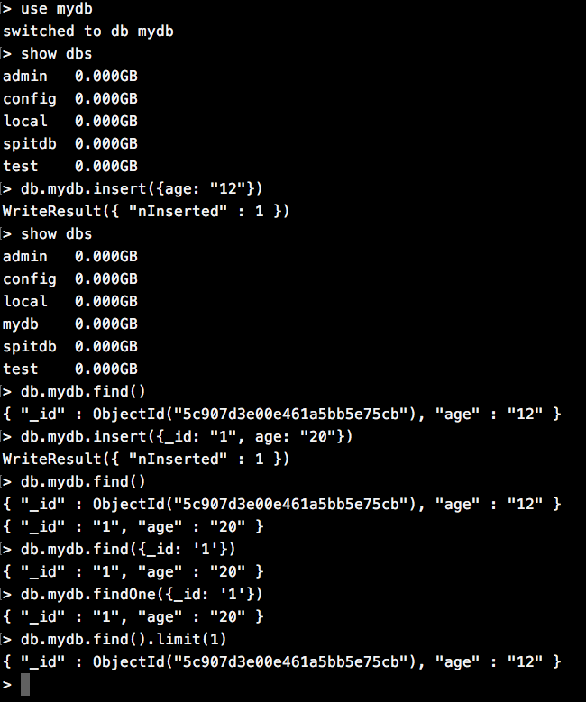

# MongoDB 简介

MongoDB是一个跨平台的面向文档的数据库，他介于关系型数据库和非关系型数据库之间，储存的数据结构较为松散，是类似JSON的BSON格式，可以存放较为复杂的数据。常用MongoDB储存一些结构复杂、交互频繁、不太重要的数据。

## 体系结构

* **document** -- 文档  -- 相当于一条记录
* **collection** -- 多个文档组成一个集合  -- 相当于一张表
* **database** -- 多个文档组成一个数据库 

## 数据类型

* **null:** 用于表示空值或不存在的字段， {"x": null}
* **数值：** 默认使用64位浮点值，即默认储存的数值为浮点类型，若要储存整数：`{"x": NumberInt("3")}`
* **布尔值：** true false
* **数组：**  {"x": ["a", "b"]}
* **内嵌文档：** {"x": {"y": 1}}

# 安装

请查看这篇教程：

[MongoDB安装教程](doc/install/install.md)

上面的教程中讲解了在本地电脑安装Mongodb数据库，并且在远程服务器Docker环境下安装了Mongodb。下面我们总结几个常用命令:

| 命令 | 描述 |
| :--- | :--- |
| `./mongod --dbpath=../data/db` | 指定上级目录的`/data/db`文件件为mongodb存放数据的目录 |
| `./mongo` | 启动服务 |
| `exit` | 退出服务 |
| `docker pull mongo` | 在Docker中拉取mongo镜像 |
| `docker run -di --name=vm_mongo -p 27017:27017 mongo` | 创建`mongo`守护容器，名称为`vm_mongo`，端口27017 |
| `./mongo ip` | 远程登录 |
 
# SQL

作为一个介于关系型和非关系型数据库之间的数据库，`mongodb`有自己独特的SQL语句：

| 命令 | 讲解 |
| :--- | :--- |
| `use 数据库名称` | 选择数据库，若没有改名称的数据库就自动创建 ，有就选择 |
| `show dbs` | 显示所有数据库名称 |
| `db.集合名.find()` | 查询该数据库的所有数据 |
| `db.集合名.insert()` | 插入一条记录，注意要是JSON格式 | 
| `db.mydb.insert({_id: "1", content: "测试"})` | 插入一条记录，并设置id |
| `db.mydb.find({_id: "1"})` | 条件查询 |
| `db.mydb.findOne({_id: "1"})` | 仅查询符合条件的一条记录 | 
| `db.mydb.find().limit(1)` | 限制查询数量 |



注意，如果使用`db.数据库名.insert`就会以该数据库名，创建一个同名的集合，将数据放到该集合下。

如果使用`db.集合名.insert()`就会在该**数据库**下创建一个集合，并将数据放到该集合下。

| 命令 | 详解 |
| :--- | :--- |
| `db.mydb.update({条件}, {修改内容})` | 修改 |
| `db.mydb.remove(条件)` | 删除，`{}`删除所有 |
| `db.mydb.count(条件)` | 统计条数，不加条件统计所有 |

## 模糊查询

使用正则匹配实现：

```
db.mydb.find({content: /测试/})
db.mydb.find({content: /^试/})
```

## 大于 小于 不等于

```
db.mydb.find({"age": { $gt: 12 }}) //age > 12
db.mydb.find({"age": { $lt: 12 }}) //age < 12
db.mydb.find({"age": { $gte: 12 }}) //age >= 12
db.mydb.find({"age": { $lte: 12 }}) //age <= 12
db.mydb.find({"age": { $ne: 12 }}) //age != 12
```

## 包含、不包含

```
db.mydb.find({"age": {$in: ["12", "18"]}}) //包含
db.mydb.find({"age": {$nin: ["12", "18"]}}) //不包含
```

## 条件连接

```
db.mydb.find({$and: [{"age": {$gt: 18}}, {"content": /^测试/}]})
db.mydb.find({$or: [{"age": {$gt: 18}}, {"content": /^测试/}]})
```

## 列值增长

实现某个数值在原有基础上增长：

```
db.mydb.update({_id: "1"}, {$inc: {num: NumberInt(1)}})
```

# Spring Data MongoDB

Spring Data家族也对MongoDB进行了封装支持，如同Spring Data JPA, Spring Data Redis一样，操作MongoDB也变得格外简单。

## 导入依赖

```xml
<dependency>
    <groupId>org.springframework.boot</groupId>
    <artifactId>spring-boot-starter-data-mongodb</artifactId>
</dependency>
```

## 添加配置

```yaml
spring:
  data:
    mongodb:
      host: 192.168.160.128
      database: commentsdb
```

注意，这里的`host`我填写的是远程服务器的主机地址。Spring Data MongoDB会自动连接这个远程地址，使用默认的端口号连接远程主机的MongoDB服务。

# CRUD

## 创建实体

创建mongo数据库并插入数据：

```
> use commentsdb
> db.comments.insert({_id: "1", create_time: new Date(), username: "tycoding", content: "我是第一条留言", visits: NumberInt(12)})
> db.comments.insert({_id: "2", create_time: new Date(), username: "tumo", content: "我是第二条留言", visits: NumberInt(100)})
> db.comments.find()
```

创建`Comments.java`:

```java
@Data
public class Comments implements Serializable {

    @Id
    private Long _id;
    private Date createTime;
    private String username;
    private String content;
    private Long visits;
}
```

## 创建Dao层

Spring Data MongoDB提供了一个接口：`MongoRepository`，这和Spring Data JPA的`JpaRepository`、Spring Data Redis的`RedisRepository`很像，封装的方法都类似：

```java
public interface MongoDbRepository extends MongoRepository<Comments, String> {
}
```

## Service

```java
@Service
public class MongoServiceImpl implements MongoService {

    @Autowired
    private MongoDbRepository mongoDbRepository;

    @Override
    public List<Comments> findAll() {
        return mongoDbRepository.findAll();
    }

    @Override
    public Comments findById(Long id) {
        return mongoDbRepository.findById(id.toString()).get();
    }

    @Override
    public void add(Comments comments) {
        comments.set_id(new Random().nextLong());
        mongoDbRepository.save(comments);
    }

    @Override
    public void update(Comments comments) {
        mongoDbRepository.save(comments);
    }

    @Override
    public void delete(List<Long> ids) {
        ids.forEach(id -> {
            mongoDbRepository.deleteById(id.toString());
        });
    }
}
```

## 测试

```java
@SpringBootTest
@RunWith(SpringRunner.class)
public class MongoServiceImplTest {
    private Logger logger = LoggerFactory.getLogger(this.getClass());

    @Autowired
    private MongoService mongoService;

    @Test
    public void findAll() {
        List<Comments> list = mongoService.findAll();
        list.forEach(comments -> {
            logger.info("comments ==> {}", comments);
        });
    }

    @Test
    public void findById() {
        Comments comments = mongoService.findById(1L);
        logger.info("comments ==> {}", comments);
    }

    @Test
    public void add() {
        Comments comments = new Comments();
        comments.setContent("我是测试类");
        comments.setCreateTime(new Date());
        comments.setUsername("tycoding");
        comments.setVisits(12L);
        mongoService.add(comments);
        this.findAll();
    }

    @Test
    public void update() {
        Comments comments = new Comments();
        comments.set_id(1L);
        comments.setUsername("我是修改的");
        mongoService.update(comments);
        this.findAll();
    }

    @Test
    public void delete() {
        List<Long> ids = new ArrayList<>();
        ids.set(1, 2L);
        mongoService.delete(ids);
        this.findAll();
    }
}
```

通过方法名就能猜到他们的作用，这里就不再解释了。