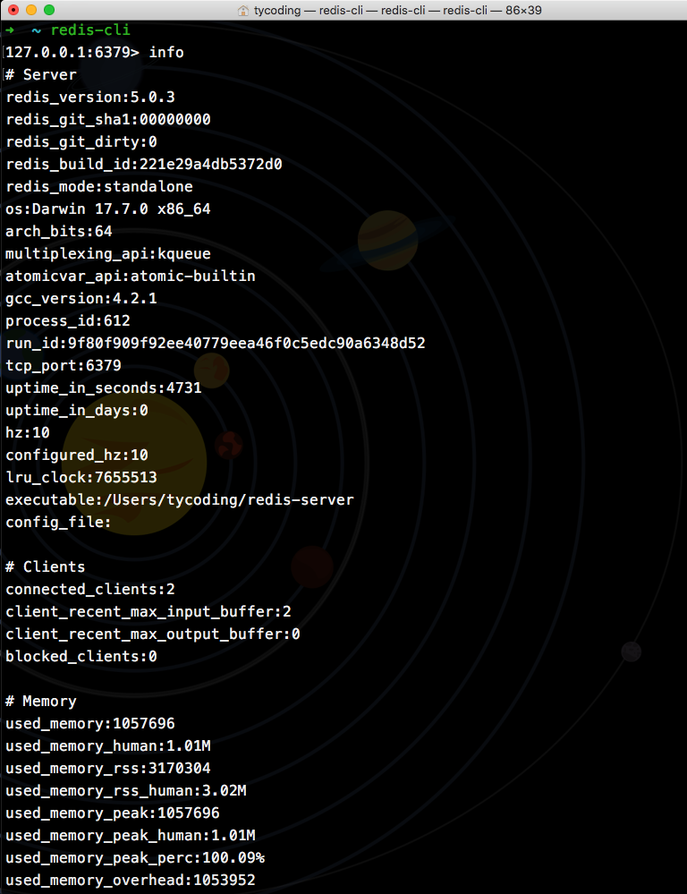
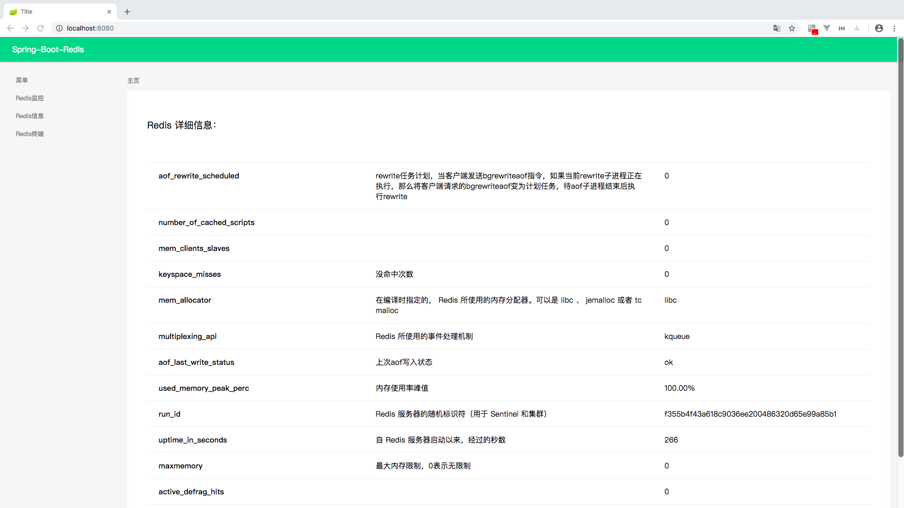

# Spring Boot整合Redis

万能的`spring-boot`也对nosql数据库进行了封装，比如这里要讲的`spring-boot-redis`。

**致谢**

* [mrbird](https://github.com/wuyouzhuguli/)

* [纯洁的微笑](http://www.ityouknow.com/)

# 起步

首先我们需要在本地或者自己的服务器上安装Redis程序，基础教程我推荐阅读我的这篇文章：

[Redis及spring-data-redis入门案例](https://tycoding.cn/2018/09/24/redis/)

这里我们要用Spring Boot整合Redis，首先

## 导入依赖

```xml
<!--redis-->
<dependency>
    <groupId>org.springframework.boot</groupId>
    <artifactId>spring-boot-starter-data-redis</artifactId>
</dependency>
```

可以看到，这也是`spring-boot`官方对redis进行了封装自动化。

## 修改`application.yml`

```yaml
spring:
  redis:
    #redis数据库，默认是0
    database: 1
    #redis服务器地址
    host: 127.0.0.1
    #redis服务端口，默认6379
    port: 6379
    #redis密码，默认为空
    password:
```

如上是本地的redis数据库地址。注意，`database`选项若不配置默认就是`db0`，如上就是`db1`数据库.

## 安装Redis

关于如何安装Redis，请阅读我的这篇文章: [Redis及spring-data-redis入门案例](https://tycoding.cn/2018/09/24/redis/)

本地Redis启动后，可以下载可视化工具：`Redis Desktop Manager`工具查看本地Redis数据库信息：


## 测试

完成了以上步骤，可以在测试类中测试是否配置成功:

```java
@RunWith(SpringRunner.class)
@SpringBootTest
public class SpringBootRedisApplicationTests {

    @Autowired
    private RedisTemplate redisTemplate;

    @Test
    public void contextLoads() {
        redisTemplate.boundValueOps("new_key").set("new_value");
    }
}
```

启动上面测试方法，再次回到`Redis Desktop Manager`可视化工具查看，出现了一条新的记录：


**注**

可以看到，存入到本地Redis数据库中的数据是乱码的（但是，尽管存入Redis数据库中数据是乱码的，但只要用`RedisTemplate`获取数据就还是正常不乱码的数据），其实就是序列化的原因，所以我们要了解`RedisTemplate`的序列化策略：

| name | tips |
| :--- | :--- |
| RedisTemplate | 默认采用JDK的序列化策略，key和value都是用这种序列化策略保存的 |
| StringRedisTemplate | 默认采用String的序列化策略，key和value都是用这种序列化策略保存的 |

而翻看源码，发现`StringRedisTemplate`其实是`RedisTemplate`的一个子类：

```java
public class StringRedisTemplate extends RedisTemplate<String, String> { ... }
```

那么我们可以这样测试添加数据：

```java
@RunWith(SpringRunner.class)
@SpringBootTest
public class SpringBootRedisApplicationTests {

    @Autowired
    private RedisTemplate<String, String> redisTemplate;

    @Autowired
    private StringRedisTemplate stringRedisTemplate;

    @Test
    public void contextLoads() {
        redisTemplate.boundValueOps("new_key4").set("new_value4");
        stringRedisTemplate.boundValueOps("new_key3").set("new_value3");
    }
}
```


可以看到无论是使用`RedisTemplate<String, String>`还是`StringRedisTemplate`，新增的数据都没有乱码。

但是这种方式就必须保证存入的`key`和`value`都是String类型，通过`toString`或`String.valueOf(xx)`转换即可。

# CRUD

经过上面的配置学习，我们可以通过`RedisTemplate`实现一些操作Redis数据库的基本Shell命令。

## RedisService

封装一个`RedisService.java`接口:

```java
public interface RedisService {

    /**
     * 获取Redis基础info列表
     *
     * @return
     */
    List<RedisInfo> getRedisInfo();

    /**
     * 获取Redis内存占用信息
     *
     * @return
     */
    Map<String, Object> getRedisMemory();

    /**
     * 获取Redis key的数量 --dbsize
     *
     * @return
     */
    Map<String, Object> getRedisDbSize();

    /**
     * 通过pattern正则匹配模糊查询Keys列表
     *
     * @param pattern
     * @return
     */
    Set<String> getKeys(String pattern);

    /**
     * 获取key的value
     *
     * @param arg key
     * @return key-value
     */
    String get(String arg);

    /**
     * 添加key-value
     *
     * @param key   key
     * @param value value
     * @return 是否添加成功
     */
    Boolean set(String key, String value);

    /**
     * 删除key
     *
     * @param keys keys数组
     * @return 成功删除key的个数
     */
    Long del(String... keys);

    /**
     * 判断key是否存在
     *
     * @param keys keys数组
     * @return 存在key的个数
     */
    Long exists(String... keys);

    /**
     * 获取key的剩余过期时间
     *
     * @param key key
     * @return 若key不存在返回-2；若key存在但没有设置过期时间返回-1；否则返回该key的剩余过期时间
     */
    Long pttl(String key);

    /**
     * 以毫秒为单位设置key的生成时间
     *
     * @param key  key
     * @param time 毫秒值
     * @return 设置成功的key个数
     */
    Long pexpire(String key, Long time);
}
```

如上，封装了一些操作Redis常用的命令，看名称就大概能猜到其对应的shell命令是什么（可以通过`redis-cli`工具测试）。

## RedisServiceImpl

### getRedisMemory

`redis memory`其实就是Redis `info`命令中的Redis内存占用信息，通过`redis-cli`工具查看：



`info`命令能获取到指定数据库的完整信息（默认是`db0`），其中就有很多`memory`，这里我们直接获取`used_memory`:

```java
@Override
public Map<String, Object> getRedisMemory() {
    return redisTemplate.execute(new RedisCallback() {
        @Override
        public Object doInRedis(RedisConnection redisConnection) throws DataAccessException {
            Map<String, Object> map = new HashMap<>();
            map.put("memory", redisConnection.info("memory").get("used_memory"))
            return map;
        }
    });
}
```

虽然`spring-data-redis`提供了`RedisTemplate`和`StringRedisTemplate`模板类，但还是不能满足我们的需求。因此可以调用`redisTemplate.execute`方法，通过`CallBack`回调机制可以获取到更多redis信息。

因为，可能要多次调用`RedisCallback`，这里就进行简单的封装：（并且对返回值进行简单的封装）

```java
private RedisConnection execute() {
    return (RedisConnection) redisTemplate.execute(new RedisCallback() {
        @Override
        public Object doInRedis(RedisConnection redisConnection) throws DataAccessException {
            return redisConnection;
        }
    });
}

@Override
public Map<String, Object> getRedisMemory() {
    return getData("memory", execute().info("memory").get("used_memory"));
}

private Map<String, Object> getData(String name, Object data) {
    Map<String, Object> map = new HashMap<>();
    map.put("create_time", (new Date()).getTime());
    map.put(name, data);
    return map;
}
```

测试这个方法，可以获取到当前Redis的内存占用信息，如：`memory: 1056696`

## getDbSize

```java
@Override
public Map<String, Object> getRedisDbSize() {
    return getData("dbsize", execute().dbSize());
}
```

通过`dbSize()`方法也可以获取到当前Redis服务的Keys数量。其对应shell命令的`dbsize`命令。

## getRedisInfo

也可以调用`.info()`命令获取到Redis数据库信息：

```java
@Override
public List<RedisInfo> getRedisInfo() {
    try {
        List<RedisInfo> list = new ArrayList<>();
        Properties info = execute().info();
        for (String key : info.stringPropertyNames()) {
            RedisInfo redisInfo = new RedisInfo();
            redisInfo.setKey(key);
            redisInfo.setValue(info.getProperty(key));
            list.add(redisInfo);
        }
        return list;
    } catch (Exception e) {
        e.printStackTrace();
        return new ArrayList<>();
    }
}
```

`redisConnection().info()`返回的是`Properties`对象，它其实实现了`Map<>`接口，因此储存的数据是`key-value`形式。那么下面看一下`RedisInfo`封装的属性：

```java
public class RedisInfo {
    Map<String, Object> map = new HashMap<>();
    static {
            map.put("redis_version", "Redis 服务器版本");
            map.put("redis_git_sha1", "Git SHA1");
            ...
    }
    
    private String key;
    private String value;
    private String description;

    public String getKey() {
        return key;
    }

    public void setKey(String key) {
        this.key = key;
        this.description = map.get(this.key);
    }

    public String getValue() {
        return value;
    }

    public void setValue(String value) {
        this.value = value;
    }

    public String getDescription() {
        return description;
    }

    public void setDescription(String description) {
        this.description = description;
    }
}
```

以上，获取到Redis的info信息，并按照key-value的形式储存到List集合中。同时我们可以向Map中储存`map.put("key", "value")`，匹配Redis info中对应的key-value就可以将每个key对应的中文解释封装进实体类中。

最终，在前端渲染出来的数据就是：


## getKeys

在`redis-cli`中我们常用`keys pattern`获取当前数据库中的keys信息，其中的`pattern`是类似正则匹配的值，比如`keys *`就是获取当前Redis数据库中的所有key。

于是，我这样封装一个方法获取keys信息：

```java
@Override
public Set<String> getKeys(String pattern) {
    try {
        return redisTemplate.keys(pattern);
    } catch (Exception e) {
        e.printStackTrace();
        return new HashSet<>();
    }
}
```

这是可以的，通过`redisTemplate.keys(pattern)`模糊查询keys信息，但是之前我这样注入`redisTemplate`:

```java
@Autowired
private RedisTemplate redisTemplate;
```

而这样写调用`getKeys("*")`却获取不到任何数据，这就回到了之前我们说的序列化原因了，于是可以改为这样：

```java
@Autowired
private RedisTemplate<String, String> redisTemplate;
```

就能正确的查询Redis数据库的数据了。

## 其他

操纵Redis还有很多shell命令，因此`RedisTemplate`模板类中也就封装了很多方法用于操作Redis，比如：

```java
    @Override
    public String get(String key) {
        try {
            byte[] bytes = execute().get(key.getBytes());
            if (bytes != null) {
                return new String(bytes, redisCode);
            } else {
                return null;
            }
        } catch (Exception e) {
            e.printStackTrace();
            return null;
        }
    }

    @Override
    public Boolean set(String key, String value) {
        return execute().set(key.getBytes(), value.getBytes());
    }

    @Override
    public Long del(String... keys) {
        long result = 0;
        for (int i = 0; i<keys.length;i++) {
            result += execute().del(keys[i].getBytes());
        }
        return result;
    }

    @Override
    public Long exists(String... keys) {
        long result = 0;
        for (int i =0; i<keys.length; i++) {
            if (execute().exists(keys[i].getBytes())) {
                result ++;
            }
        }
        return result;
    }

    @Override
    public Long pttl(String key) {
        return execute().pTtl(key.getBytes());
    }

    @Override
    public Long pexpire(String key, Long time) {
        if (execute().pExpire(key.getBytes(), time)) {
            return 1L;
        }
        return 0L;
    }
````

其中

| method | means |
| :--- | :--- |
| del | 删除key-value |
| exists | 判断该key是否存在 |
| pttl | 获取该key的剩余过期时间，若key不存在返回-2；若key存在但没有设置过期时间返回-1；否则返回该key的剩余过期时间 |
| pexpire | 为key设置过期时间 |

## 测试

创建`RedisServiceImpl.java`的测试类`RedisServiceImplTest.java`:

```java
@SpringBootTest
@RunWith(SpringRunner.class)
public class RedisServiceImplTest {
    private Logger logger = LoggerFactory.getLogger(this.getClass());

    @Autowired
    private RedisTemplate<String, String> redisTemplate;

    @Autowired
    private StringRedisTemplate stringRedisTemplate;

    @Autowired
    private RedisService redisService;

    @Test
    public void getKeys() {
//        Set<String> keys = stringRedisTemplate.keys("*");
//        logger.info("keys={}", keys);
//        Set<String> keys1 = redisTemplate.keys("*");
//        logger.info("keys1={}", keys1);

        Set<String> keys = redisService.getKeys("*");
        logger.info("keys={}", keys);
    }

    @Test
    public void set() {
        Boolean set = redisService.set("new_key", "new_value");
        logger.info("是否新增={}", set);
        getKeys();
    }

    @Test
    public void get() {
        String key = redisService.get("new_key");
        logger.info("key={}", key);
    }

    @Test
    public void del() {
        redisService.set("new_key2", "new_value2");
        redisService.set("new_key3", "new_value3");
        String[] keys = {"new_key2", "new_key3"};
        Long count = redisService.del(keys);
        logger.info("删除的个数={}", count);
        getKeys();
    }

    @Test
    public void exists() {
        String[] keys = {"new_key"};
        Long exists = redisService.exists(keys);
        logger.info("是否存在={}", exists);
    }

    @Test
    public void pttl() {
        Long time = redisService.pttl("new_key");
        logger.info("剩余过期时间=>{}", time);
    }

    @Test
    public void pexpire() {
        Long result = redisService.pexpire("new_key", 10000000000L);
        logger.info("是否设置成功={}", result);
        pttl();
    }
}
```

# 截图





