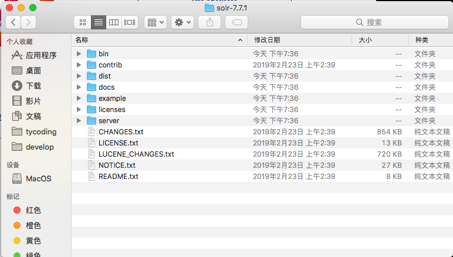
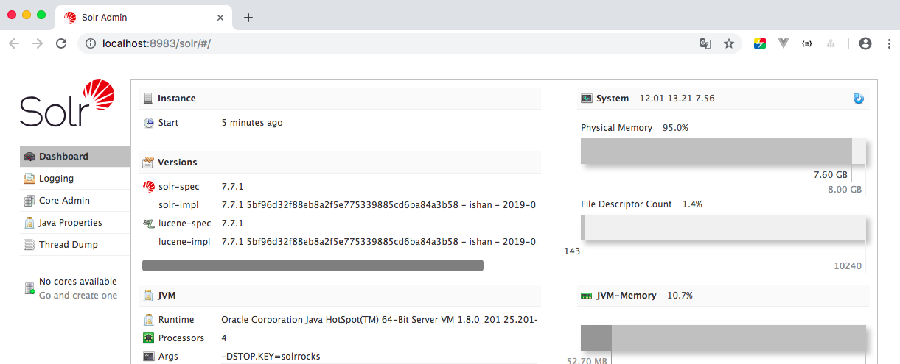
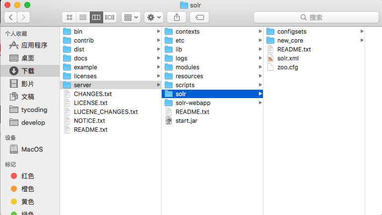
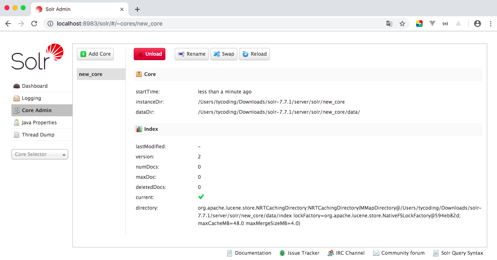
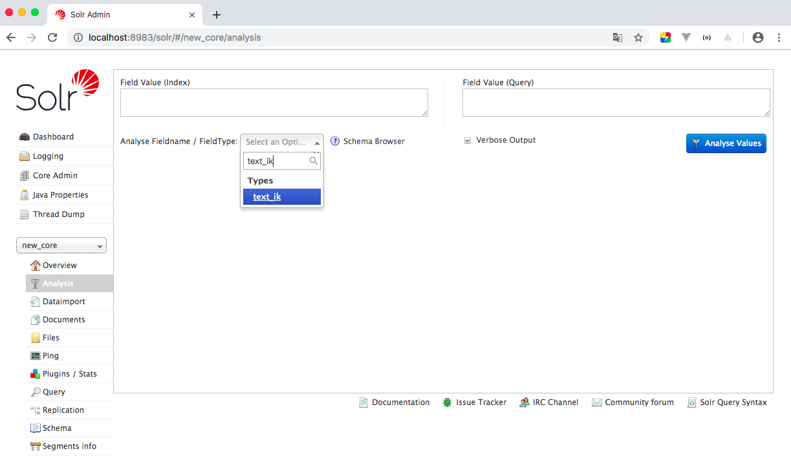
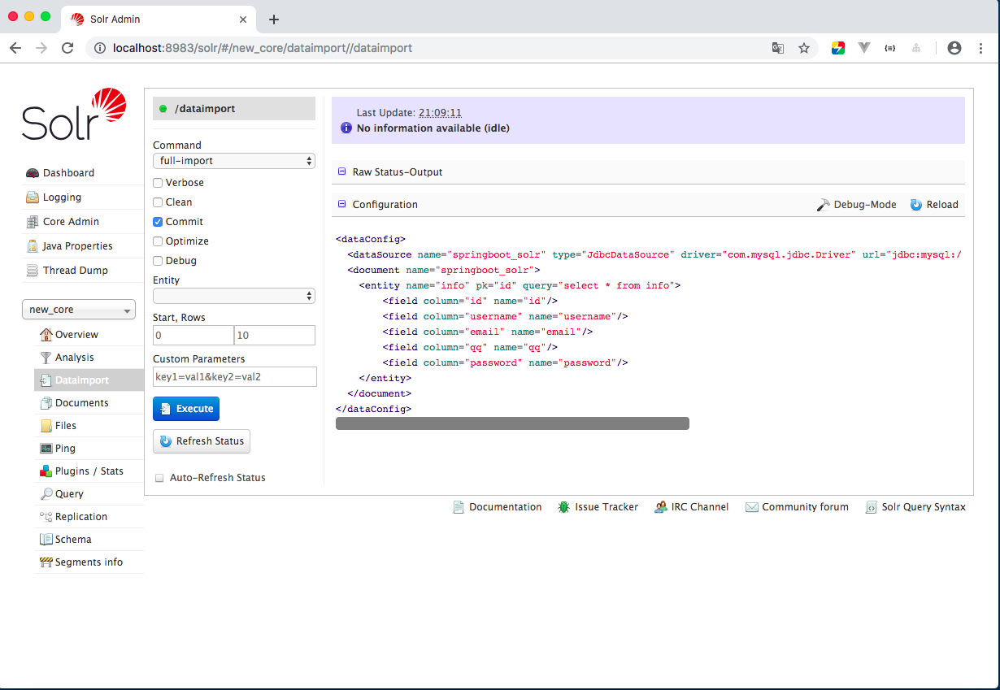
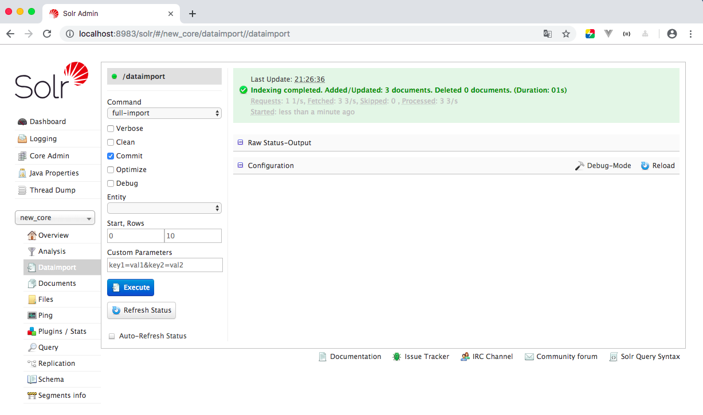
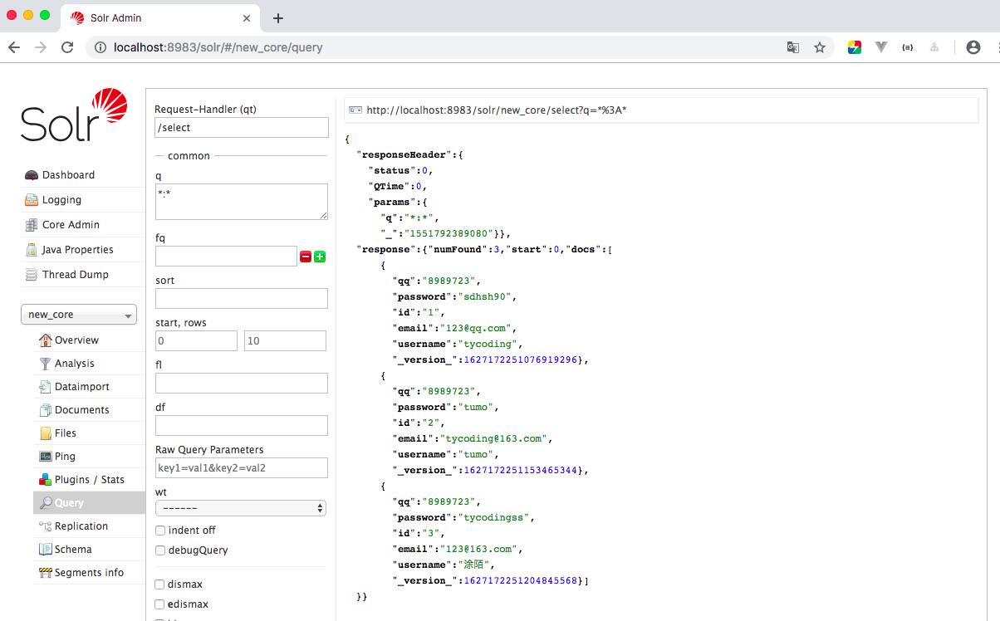

# Solr最新版安装部署教程

**写在前面**

本案例使用Solr默认提供的Jetty容器运行Solr，如果你想将Solr部署到Tomcat容器中，过程稍微复杂些，请看我的这篇文档：

[Solr及Spring-Data-Solr入门](https://tycoding.cn/2018/09/24/solr/)

## 安装

> 首先去官方下载最新版的solr

[http://www.apache.org/dyn/closer.lua/lucene/solr/7.7.1](http://www.apache.org/dyn/closer.lua/lucene/solr/7.7.1)

> 解压文件



其中有如上文件，展开`/bin`文件夹，其中就是直接可运行的脚本程序：


> 运行Solr

上面基本下载完成，由于作者使用的是MacOS系统，所以使用命令行在`/bin`目录下执行`./solr start`命令:


如图就启动了Solr服务器（警告信息忽略，我本地电脑原因）。如果是WIN系统，就双击`solr.cmd`。

> 测试

上面启动了Solr服务器，可以在浏览器上访问：`localhost:8983`：



进入到Solr-Admin管理界面，在这里可以对Solr数据进行CRUD。

> 命令

了解几个常用命令：

```
$ ./solr start  --启动Solr
$ ./solr restart –p 8983  --重启Solr
$ ./solr stop –all  --停止Solr
```

## 新建core

在Solr中有一个core的概念，可以将core理解为一个数据库，我们的数据需要存入到core(数据库)中，然后对core(数据库)进行CRUD。

> 1.在`solr-7.7.1/server/solr/`目录下创建`new_core`文件夹

其中`new_core`就相当于数据库名：



> 2.将`solr-7.7.1/example/example-DIH/solr/db`下的`conf`文件夹copy到`new_core`文件夹下

copy了`conf`文件夹，再手动创建`data`文件夹：


> 3.新建core

重启Solr服务器，刷新页面，点击Core Admin，选择Add Core，名称默认就是`new_core`无需修改：



出现如上页面就证明你新建core成功！

## 配置IK分词器

Solr新版本默认提供了分词器，但是没有IK分词器好使，所以可以配置IK分词器：

* GitHub仓库地址：[传送门](https://github.com/magese/ik-analyzer-solr7)
* jar下载地址： [IK-Analyzer-Solr7](https://search.maven.org/search?q=com.github.magese)

1. 将下载的`ik-analyzer-solr7-7.x.jar`文件copy到`solr-7.7.1/server/solr-webapp/webapp/WEB-INF/lib`文件夹下。

2. 修改`solr-7.7.1/server/solr/new_core/conf/managed-schema`，在`<schema>`节点下copy如下内容：

```xml
<!-- ik分词器 -->
<fieldType name="text_ik" class="solr.TextField">
  <analyzer type="index">
      <tokenizer class="org.wltea.analyzer.lucene.IKTokenizerFactory" useSmart="false" conf="ik.conf"/>
      <filter class="solr.LowerCaseFilterFactory"/>
  </analyzer>
  <analyzer type="query">
      <tokenizer class="org.wltea.analyzer.lucene.IKTokenizerFactory" useSmart="true" conf="ik.conf"/>
      <filter class="solr.LowerCaseFilterFactory"/>
  </analyzer>
</fieldType>
```

3. 重启Solr服务器



在`new_core`的`Analysis`选项中输入`text_ik`如果下拉菜单中显示了就证明IK分词器安装成功。

## 导入数据库数据

Solr提供了一个功能实现将Mysql数据库中的数据一键导入到Solr数据库中。

> 1.新建数据库（或表）

开始之前我们新建一个数据库用于测试：

```sql
create database springboot_solr charset utf8;
use springboot_solr;
DROP TABLE IF EXISTS `info`;
CREATE TABLE `info` (
  `id` bigint(20) NOT NULL AUTO_INCREMENT,
  `username` varchar(255) DEFAULT NULL,
  `email` varchar(255) DEFAULT NULL,
  `qq` varchar(255) DEFAULT NULL,
  `password` varchar(255) DEFAULT NULL,
  PRIMARY KEY (`id`)
) ENGINE=InnoDB AUTO_INCREMENT=33324 DEFAULT CHARSET=utf8;
insert into `info` values (1, 'tycoding', '123@qq.com', '8989723', 'sdhsh90');
insert into `info` values (2, 'tumo', 'tycoding@163.com', '8989723', 'tumo');
insert into `info` values (3, '涂陌', '123@163.com', '8989723', 'tycodingss');
```

> 2.修改`solr-7.7.1/server/solr/new_core/conf/db-data-config.xml`

```xml
<dataConfig>
  <dataSource name="springboot_solr" type="JdbcDataSource" driver="com.mysql.jdbc.Driver" url="jdbc:mysql://127.0.0.1:3306/springboot_solr" user="root" password="password" batchSize="-1" />
  <document name="springboot_solr">
    <entity name="info" pk="id" query="select * from info">
        <field column="id" name="id"/>
        <field column="username" name="username"/>
        <field column="email" name="email"/>
        <field column="qq" name="qq"/>
        <field column="password" name="password"/>
    </entity>
  </document>
</dataConfig>
```

如上，很熟悉，应该是连接数据库的一段配置，其中`<field>`和数据库表字段一一对应即可。注意修改为本机的数据库用户名密码。

> 3.修改`solr-7.7.1/server/solr/new_core/conf/managed-schema`

`managed-schema`其实就是XML文档，在solr5之前的老版本中用`schema.xml`来管理，其实也就是`managed-schema`文件，所以我们直接编辑`managed-schema`文件：

定位到`managed-schema`文件的124行，看到`managed-schema`中默认定义了很多字段信息，为了避免字段重复冲突，可以将其删除：


注意，不要乱删，一些常见的名词，比如：name, age, title, author 这些一看就是示例的字段可以删除，特殊的不要删。当然可以都不删除，报错了再删除也不迟。

并在其中添加如下内容：

```xml
<field name="id" type="string" indexed="true" stored="true" required="true" multiValued="false" />  
<field name="username" type="string" indexed="true" stored="true"/>
<field name="email" type="string" indexed="true" stored="true"/>
<field name="qq" type="string" indexed="true" stored="true"/>
<field name="password" type="string" indexed="true" stored="true"/>

<field name="keyword" type="text_ik" indexed="true" stored="false" multiValued="true"/>
<copyField source="username" dest="keyword"/>
<copyField source="email" dest="keyword"/>
<uniqueKey>id</uniqueKey>
```

注意：

1. `text_ik`指IK分词器的类型。
2. `<copyField>`的`dest`指向了`<field>`的`name`选项。为复制域，目的是实现同时查询复制域中的匹配记录。
3. `<field>`的`type`分别代表不同的数据类型，你会发现定义为不同的类型，查询匹配的数据会受影响。

> 4.copy依赖

去maven仓库找一个`mysql-connector-java-xx.jar`依赖并且将`solr-7.7.1/dist`下的`solr-dataimporthandler-7.7.1.jar`,`solr-dataimporthandler-extras-7.7.1.jar`这三个jar文件全部copy到`solr-7.7.1/server/solr-webapp/webapp/WEB-INF/lib`文件夹下。

> 4.重启服务



在`new_core`的`Dataimport`选项中可以看到连接数据库的配置，它的功能就是通过连接本地的MySQL数据库，依据配置的`db-data-config.xml`查询数据库表中的数据，并根据`managed-schema`中的`<field>`将匹配的字段数据存入到solr中。

执行`Execute`导入数据，可以`Refresh Status`刷新状态。

然后点击Query，如果数据库连接成功、jar文件都导入了且Solr配置正确，那么查询当前`new_core`中的数据：



点击Query查询：



即为数据库中新增的数据，现在导入到了solr数据库中。

## 多core配置

我们可以吧core认为是solr数据库的一个数据库，那么必然可以配置多个数据库，步骤请按照上面创建`new_core`的过程进行重复即可。

# 结束

官网下载的Solr内置了Jetty服务器，所以操作都比较简单了，如果想把Solr部署到Tomcat服务器中，需要配置的地方比较多，请看我的这篇文档：[Solr及Spring-Data-Solr入门](https://tycoding.cn/2018/09/24/solr/)

我在文章中已经把配置好的solr-tomcat上传到了 [Github](https://github.com/TyCoding/solr-tomcat) 仓库，建议直接使用我配置好的。

