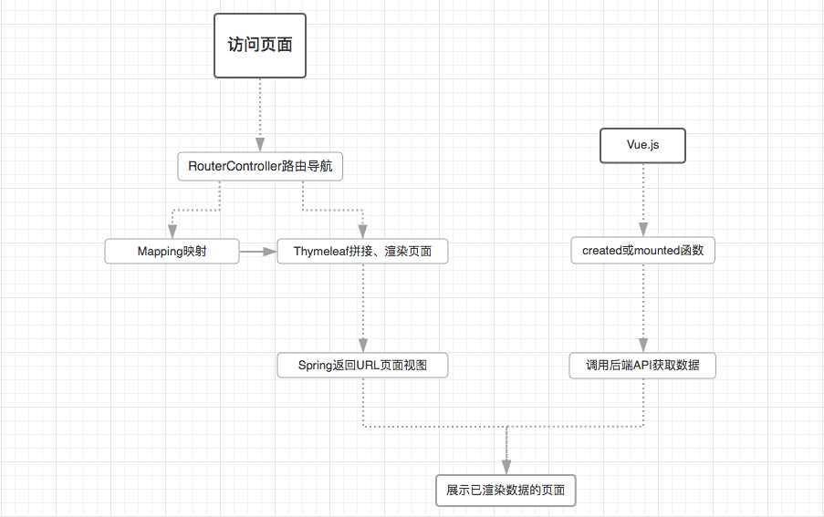
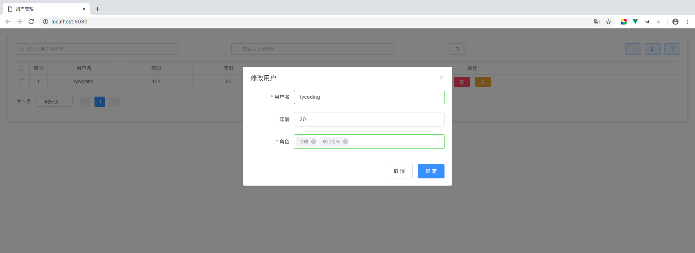

# SpringBoot整合Thymeleaf、Mybatis

## 项目介绍

前面我们学习了 [SpringBoot整合Mybatis](https://github.com/TyCoding/spring-boot-learn/tree/master/spring-boot-mybatis) 基础CRUD，这里我们结合上一篇文章实战CRUD业务。

其实之前我已经写过一个SpringBoot整合Mybatis的案例：[传送门](https://github.com/TyCoding/spring-boot)

## 技术选型

### 后端

* 基础框架：Spring Boot 2.1.3.RELEASE

* 持久层框架：Mybatis 1.3.1

* 模板引擎：Thymeleaf 3.0.11.RELEASE

* 其他：Druid、PageHelper、通用Mapper

### 前端

* 基础框架：ElementUI

* JavaScript框架：Vue.js

### 开发环境

* 语言： JDK1.8

* IDE： IDEA 2018.3

* 依赖管理： Maven

* 数据库： Mysql 5.7.24

## 写在前面

如上，前端完全依赖Vue.js，这和传统依赖Jquery的前端区别还是蛮大的，使用Vue即要用基于Node.js的前后端分离的开发模式，而本项目中仅仅是在HTML中引入了vue.js，虽然不是完全的前后端分离开发，但项目中我尽量使用Vue.js渲染数据，涉及后端的也仅是用到Thymeleaf的`th:replace`拼接页面。看下图：

## 文档

* **[Mybatis通用Mapper(tk.mapper)使用案例](https://github.com/TyCoding/spring-learn/blob/master/boot-thymeleaf-mybatis/doc/Mapper.md)**

**截图**

