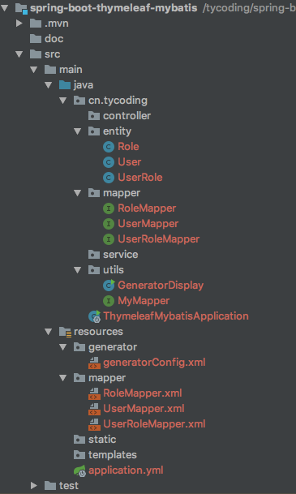

# 通用Mapper

开源地址：[https://github.com/abel533/MyBatis-Spring-Boot](https://github.com/abel533/MyBatis-Spring-Boot)

之前学习了 [SpringBoot整合Mybatis](https://github.com/TyCoding/spring-boot-learn/tree/master/spring-boot-mybatis) 和 [SpringBoot整合JPA](https://github.com/TyCoding/spring-boot-learn/tree/master/spring-boot-jpa) 发现两者各有优缺点，个人而言还是喜欢用Mybatis。

那么虽然Mybatis目前提供了一些注解来简化XML的编写，但是仍需要手动写SQL，相比JPA仍麻烦很多，有没有可以像JPA那样调用Java方法自动生成SQL的办法呢？于是就有了框架：[通用Mapper](https://github.com/abel533/Mapper)

[通用Mapper](https://github.com/abel533/Mapper)内置了很多API供开发者调用，目的是简化SQL编写。

## mapper generator代码生成器

官方文档：[传送门](https://gitee.com/free/Mapper/wikis/4.1.mappergenerator?sort_id=236560)

使用该插件可以方便的生成Entity、Mapper interface、XML

> 初始化表结构

```sql
-- create database springboot_thymeleaf_mybatis charset utf8;

DROP TABLE IF EXISTS `user`;

CREATE TABLE `user` (
  `id` bigint(20) NOT NULL AUTO_INCREMENT COMMENT '主键',
  `username` varchar(255) DEFAULT NULL COMMENT '用户名',
  `password` varchar(255) DEFAULT NULL COMMENT '密码',
  `age` int(11) DEFAULT NULL COMMENT '年龄',
  PRIMARY KEY (`id`)
) ENGINE=InnoDB DEFAULT CHARSET=utf8;

DROP TABLE IF EXISTS `role`;

CREATE TABLE `role` (
  `id` bigint(20) NOT NULL AUTO_INCREMENT COMMENT '主键',
  `name` varchar(255) DEFAULT NULL COMMENT '名称',
  `description` varchar(255) DEFAULT NULL COMMENT '描述',
  PRIMARY KEY (`id`)
) ENGINE=InnoDB DEFAULT CHARSET=utf8;

DROP TABLE IF EXISTS `user_role`;

CREATE TABLE `user_role` (
  `user_id` bigint(20) DEFAULT NULL,
  `role_id` bigint(20) DEFAULT NULL
) ENGINE=InnoDB DEFAULT CHARSET=utf8;
```

> 按照官方文档首先引入依赖：

```xml
<!--mybatis-->
<dependency>
    <groupId>org.mybatis.spring.boot</groupId>
    <artifactId>mybatis-spring-boot-starter</artifactId>
    <version>1.3.1</version>
</dependency>
<!--mapper-->
<dependency>
    <groupId>tk.mybatis</groupId>
    <artifactId>mapper-spring-boot-starter</artifactId>
    <version>1.2.4</version>
</dependency>
<!--pagehelper-->
<dependency>
    <groupId>com.github.pagehelper</groupId>
    <artifactId>pagehelper-spring-boot-starter</artifactId>
    <version>1.2.3</version>
</dependency> 
<!-- mapper生成依赖 -->
<dependency>
    <groupId>org.mybatis.generator</groupId>
    <artifactId>mybatis-generator-core</artifactId>
    <version>1.3.2</version>
    <scope>compile</scope>
    <optional>true</optional>
</dependency>
```

> 创建`MyMapper.java`用于继承`tk.mapper`（通用Mapper）

```java
public interface MyMapper<T> extends Mapper<T>, MySqlMapper<T> {
}
```

> 创建配置文件: `/resources/generator/generatorConfig.xml`

```xml
<?xml version="1.0" encoding="UTF-8"?>
<!DOCTYPE generatorConfiguration
        PUBLIC "-//mybatis.org//DTD MyBatis Generator Configuration 1.0//EN"
        "http://mybatis.org/dtd/mybatis-generator-config_1_0.dtd">

<generatorConfiguration>

    <context id="Mysql" targetRuntime="MyBatis3Simple" defaultModelType="flat">
        <property name="beginningDelimiter" value="`"/>
        <property name="endingDelimiter" value="`"/>

        <plugin type="tk.mybatis.mapper.generator.MapperPlugin">
            <property name="mappers" value="cn.tycoding.utils.MyMapper"/>
        </plugin>

        <jdbcConnection driverClass="com.mysql.cj.jdbc.Driver"
                        connectionURL="jdbc:mysql://localhost:3306/springboot_thymeleaf_mybatis"
                        userId="root"
                        password="root">
            <property name="nullCatalogMeansCurrent" value="true"/>
        </jdbcConnection>

        <!-- 生成的entity -->
        <javaModelGenerator targetPackage="cn.tycoding.entity" targetProject="spring-boot-thymeleaf-mybatis/src/main/java"/>

        <!-- 生成的Mapper XML-->
        <sqlMapGenerator targetPackage="mapper" targetProject="spring-boot-thymeleaf-mybatis/src/main/resources"/>

        <!-- 生成的Mapper映射类 -->
        <javaClientGenerator targetPackage="cn.tycoding.mapper" targetProject="spring-boot-thymeleaf-mybatis/src/main/java"
                             type="XMLMAPPER"/>

        <table tableName="user"></table>
    </context>
</generatorConfiguration>
```

**注意**

* 按照官方文档会遇到：`Table Configuration scheme.table matched more than one table`的错误，因此需要配置`<property name="nullCatalogMeansCurrent" value="true"/>`。 [博文](https://blog.csdn.net/qq_40233736/article/details/83314596)

* 按照官方文档配置遇到：`The specified target project directory src/main/resources does not exist`，要修改所有的`targetProject`地址加上项目名即可。

> 生成代码，创建`GeneratorDisplay.java`

```java
public class GeneratorDisplay {

    public void generator() throws Exception {
        List<String> warnings = new ArrayList<String>();
        boolean overwrite = true;
        ConfigurationParser cp = new ConfigurationParser(warnings);
        File configFile = ResourceUtils.getFile("classpath:generator/generatorConfig.xml");
        Configuration config = cp.parseConfiguration(configFile);
        DefaultShellCallback callback = new DefaultShellCallback(overwrite);
        MyBatisGenerator myBatisGenerator = new MyBatisGenerator(config, callback, warnings);
        myBatisGenerator.generate(null);
        for (String warning : warnings) {
            System.out.println(warning);
        }
    }

    public static void main(String[] args) throws Exception {
        try {
            GeneratorDisplay display = new GeneratorDisplay();
            display.generator();
        } catch (Exception e) {
            e.printStackTrace();
        }
    }
}
```

**注意**

使用`new File("/path")`获取到的仅是项目的根路径地址，用其获取`new File("generator/generatorConfig")`是not found的，要使用Spring提供的`ResourceUtils`工具类获取项目静态文件路径。

### 结

修改`generatorConfig.xml`中`<table>`的名称，执行`GeneratorDisplay.java`就能生成不同的文件：




## 测试

> 首先需要配置Spring扫描Mapper接口

方式一： 在Mapper接口上添加`@Mapper`注解

方式二： 在`Application.java`启动类上添加`@MapperScan()`注解扫描所有Mapper接口。注意这里的`@MapperScan`注解来自`tk.mybatis.spring.annotation.MapperScan`，用spring的会报错。

在`user`表中新增一条记录：

```sql
insert into user values (1, 'tycoding', '123', '19');
```

创建`UserMapper.java`的测试类`UserMapperTest.java`:


可以看到，因为`UserMapper`继承了`MyMapper<User>`，而`MyMapper`又继承了`Mapper<T>, MySqlMapper<T>`。类似Jap中继承`JpaRepository`，`Mapper`接口中提供了很多API用于生成SQL，简化SQL编写。


```java
@SpringBootTest
@RunWith(SpringRunner.class)
public class UserMapperTest {
    private Logger logger = LoggerFactory.getLogger(this.getClass());

    @Autowired
    private UserMapper userMapper;

    @Test
    public void findAll() {
        List<User> list = userMapper.selectAll();
        list.forEach(user -> {
            logger.info("user={}", user);
        });
    }

    @Test
    public void findById() {
        User user = userMapper.selectByPrimaryKey(1L);
        logger.info("user={}", user);
    }

    @Test
    public void save() {
        User user = new User();
        user.setUsername("涂陌");
        user.setPassword("123");
        user.setAge(20);
        userMapper.insert(user);
        findAll();
    }

    @Test
    public void update() {
        User user = new User();
        user.setId(2L);
        user.setUsername("小涂陌");
        userMapper.updateByPrimaryKey(user);
        findAll();
    }

    @Test
    public void delete() {
        userMapper.deleteByPrimaryKey(2L);
        findAll();
    }
}
```

如上，看到这里，感觉和JPA调用接口的方式很像吧，`tk.Mapper`能帮我们简化很多SQL的编写，但是复杂的SQL还是需要手动写，这点和JPA一样的。

这里我也只是测试了几个常用的CRUD操作，`tk.Mapper`提供了很多方法，我们通过方法名就能大概猜到，所以这里不再做更多的测试。
