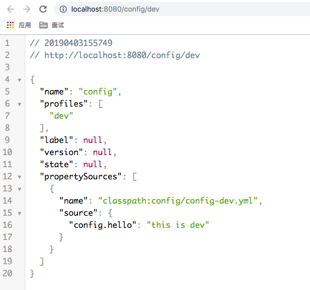
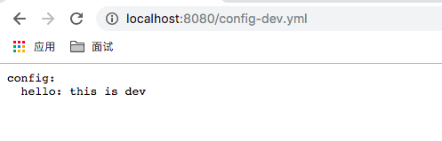

# Spring Cloud Config

之前的学习中，需要在每个项目模块中都写很多配置，维护起来很不方便。**Spring Cloud Config**的出现就解决了这一问题。

Spring Cloud Config项目是一个解决分布式系统的配置管理方案。它包含Client和Server两个部分，Server提供配置文件的储存（储存在本地、git、svn）、以接口的形式将配置文件的内容提供出去；Client通过接口获取数据、并依据此数据初始化自己的应用。

## Server 端

创建模块:`spring-cloud-config-server`

> 导入依赖

```xml
<dependencies>
    <dependency>
        <groupId>org.springframework.cloud</groupId>
        <artifactId>spring-cloud-config-server</artifactId>
    </dependency>

    <dependency>
        <groupId>org.springframework.boot</groupId>
        <artifactId>spring-boot-starter-test</artifactId>
        <scope>test</scope>
    </dependency>
</dependencies>
```

### 本地储存

> 修改`application.yml`

```yaml
server:
  port: 8080

spring:
  application:
    name: spring-cloud-config-server
  # 本地储存配置
  profiles:
    active: native
  cloud:
    config:
      server:
        # 本地储存配置
        native:
          search-locations: classpath:config/
```

`spring.profiles.active: native`使用本地储存方式，Config Server会默认从应用的`src/main/resource`目录下检索配置文件，通过`spring.cloud-config.server.native.search-locations`指定配置文件的相对地址。

> 在`config/`下创建配置文件

这里举例两个配置：`config-dev.yml`（开发环境）和`config-pro.yml`（生产环境）：

`config-dev.yml`:

```yaml
config:
  hello: this is dev
```

`config-pro.yml`:

```yaml
config:
  hello: this is pro
```

> 启动器类

```java
@EnableConfigServer
@SpringBootApplication
public class SpringCloudConfigServerApplication {

	public static void main(String[] args) {
		SpringApplication.run(SpringCloudConfigServerApplication.class, args);
	}
}
```

> 测试

启动`spring-cloud-config-server`模块，浏览器访问`http://localhost:8080/config/dev`



访问`http://localhost:8080/config-dev.yml`，则会实现这个配置文件的数据



Spring Cloud Config会将配置文件转换成Web接口，访问依照以下原则：

* `/{application}/{profile}/{label}`
* `/{application}-{profile}.yml`
* `/{label}/{application}-{profile}.yml`
* `/{application}-{profile}.yml`
* `/{label}/{application}-{profile}.yml`

以`resource/config/config-dev.yml`文件为例，因为我们使用的本地储存的方式。那么`config-dev.yml`文件的`config`就是`application`，`dev`就是`profile`。Spring Cloud Config Client会根据配置文件的名称和你传入的参数读取对应的配置。

### Git 储存

> 修改`application.yml`

```yaml
server:
  port: 8080

spring:
  application:
    name: spring-cloud-config-server
  cloud:
    config:
      server:
        # git储存配置
        git:
          uri:            # git仓库地址
          search-paths:   # git仓库地址下的相对地址，可配置多个
          username:       # git仓库的账号
          password:       # git仓库的密码
```


