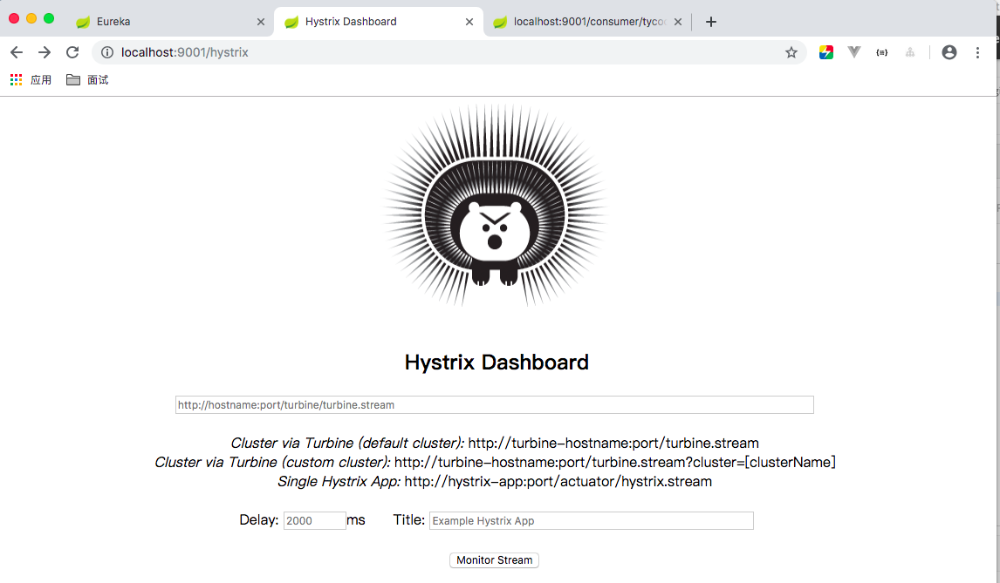
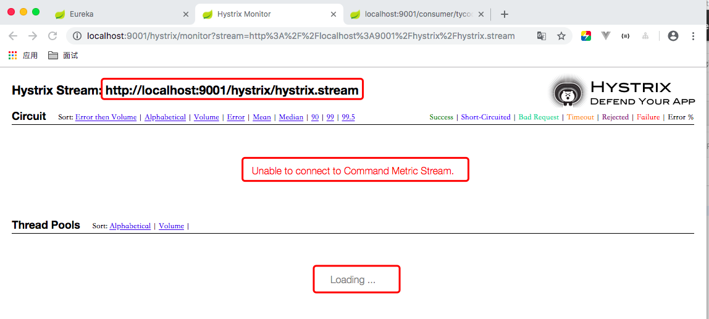
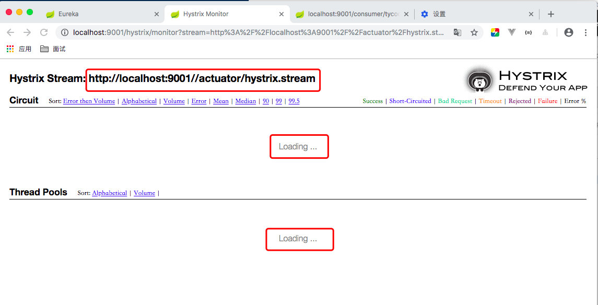
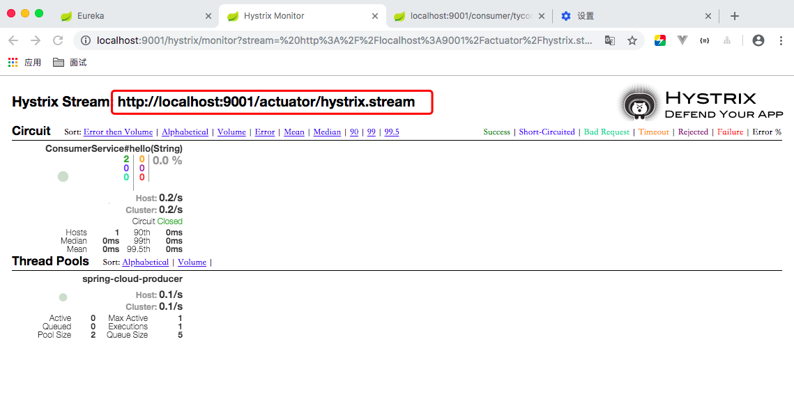
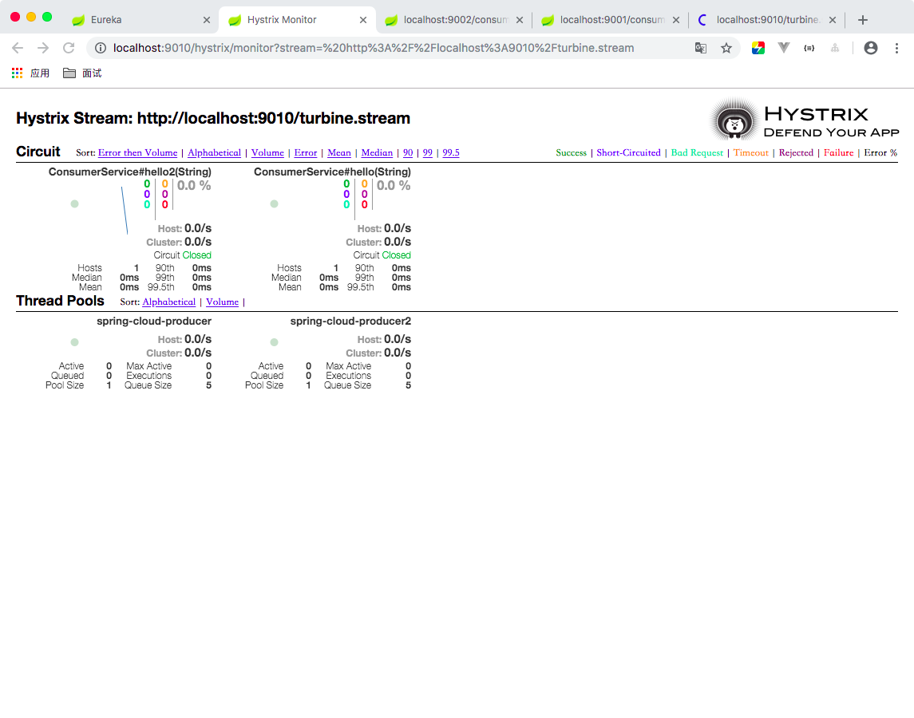

# Hystrix-dashboard 一款针对Hystrix实时监控的工具

**介绍**

| 模块名称 | 端口号 |
| --- | --- |
| spring-cloud-eureka | 8080 |
| spring-cloud-producer | 8091 |
| spring-cloud-producer2 | 8092 |
| spring-cloud-consumer2 | 9002 | 
| spring-cloud-consumer-hystrix-dashboard | 9001 |
| spring-cloud-hystrix-dashboard-turbine | 9010 |
 

**Spring Cloud Greenwich.SR1**

以上次的案例 [cloud-hystrix](https://github.com/TyCoding/spring-learn/tree/master/cloud-hystrix) 举例，拷贝该项目并命名为`cloud-hystrix-dashboard`作为这次的项目案例。

## 导入依赖

修改之前的`spring-cloud-consumer`项目模块并重命名为`spring-cloud-consumer-hystrix-dashboard`，修改其中的pom.xml：

```xml
<dependencies>
    <dependency>
        <groupId>org.springframework.boot</groupId>
        <artifactId>spring-boot-starter-actuator</artifactId>
    </dependency>
    <dependency>
        <groupId>org.springframework.cloud</groupId>
        <artifactId>spring-cloud-starter-netflix-eureka-server</artifactId>
    </dependency>
    <dependency>
        <groupId>org.springframework.cloud</groupId>
        <artifactId>spring-cloud-starter-netflix-hystrix</artifactId>
    </dependency>
    <dependency>
        <groupId>org.springframework.cloud</groupId>
        <artifactId>spring-cloud-starter-netflix-hystrix-dashboard</artifactId>
    </dependency>
    <dependency>
        <groupId>org.springframework.cloud</groupId>
        <artifactId>spring-cloud-starter-openfeign</artifactId>
    </dependency>
</dependencies>
```

注意这里使用的Spring Cloud Greenwich.SR1版本，老版本的依赖名称可能都不相同。

## 修改启动器类

```java
@SpringBootApplication
@EnableDiscoveryClient //Eureka Client支持
@EnableFeignClients //Feign 支持
@EnableHystrixDashboard //HystrixDashboard支持
@EnableCircuitBreaker //熔断器支持
public class SpringCloudConsumerApplication {

    public static void main(String[] args) {
        SpringApplication.run(SpringCloudConsumerApplication.class, args);
    }
}
```

## 启动项目

依次启动`spring-cloud-eureka`、`spring-cloud-producer`、`spring-cloud-consumer-hystrix-dashboard`模块，在浏览器访问：`localhost:9001/hystrix`



会看到这样一个界面，输入：`http://localhost:9001/hystrix/hystrix.stream`，点击Monitor Stream:



进入到这么一个界面，但始终出现`Unable to connect to Command Metric Stream`这个错误。

### 解决方案

> 方案一：在启动器类上添加这一段配置

```java
@SpringBootApplication
@EnableDiscoveryClient
@EnableFeignClients
@EnableHystrixDashboard
@EnableCircuitBreaker
public class SpringCloudConsumerApplication {

    public static void main(String[] args) {
        SpringApplication.run(SpringCloudConsumerApplication.class, args);
    }

    @Bean
    public ServletRegistrationBean getServlet() {
        HystrixMetricsStreamServlet streamServlet = new HystrixMetricsStreamServlet();
        ServletRegistrationBean registrationBean = new ServletRegistrationBean(streamServlet);
        registrationBean.setLoadOnStartup(1);
        registrationBean.addUrlMappings("/actuator/hystrix.stream");
        registrationBean.setName("HystrixMetricsStreamServlet");
        return registrationBean;
    }
}
```

默认提供的映射端口不是`/actuator/hystrix.stream`，需要手动指定。

> 方案二：修改application.yml配置文件

```yaml
feign:
  hystrix:
    enabled: true

management:
  endpoints:
    web:
      exposure:
        include: "*"
```

`include: "*""`表示暴露所有端口


> 测试

重启`spring-cloud-consumer-hystrix-dashboard`模块，访问：`localhost:9001/hystrix/`，在其中输入`http://localhost:9001/actuator/hystrix.stream`：



不再出现之前的报错。访问`http://localhost:9001/consumer/tycoding`发送一个服务调用请求。



到此，单个应用的熔断监控已经实现。

# Turbine

Turbine实现了将多个服务聚合在同一个Dashboard中显示监控信息。

为了演示，这里要创建：

* 两个消费者模块： `spring-cloud-consumer-hystrix-dashboard`,`spring-cloud-consumer2`
* 两个生产者模块： `spring-cloud-producer`, `spring-cloud-producer2`

## 新建模块

> 复制模块`spring-cloud-producer`重命名为`spring-cloud-producer2`

* 修改端口号：8092
* 修改服务名称：`spring-cloud-producer2`
* 修改映射地址：`/producer2/{name}`

> 复制模块`spring-cloud-consumer-hystrix-dashboard`重命名为`spring-cloud-consumer2`

* 修改端口号为：9002
* 修改服务名称：`consumer2`
* 将映射路径修改为`/consumer2/{name}`，同样修改`@FeignClient(name = "spring-cloud-producer2", fallback = ConsumerHystrix.class)`

### 创建turbine模块

> 引入依赖

```xml
<dependency>
    <groupId>org.springframework.boot</groupId>
    <artifactId>spring-boot-starter-actuator</artifactId>
</dependency>
<dependency>
    <groupId>org.springframework.cloud</groupId>
    <artifactId>spring-cloud-starter-netflix-hystrix-dashboard</artifactId>
</dependency>
<dependency>
    <groupId>org.springframework.cloud</groupId>
    <artifactId>spring-cloud-starter-netflix-turbine</artifactId>
</dependency>
```

> 启动器类

```java
@SpringBootApplication
@EnableHystrixDashboard
@EnableTurbine
public class SpringCloudHystrixDashboardTurbineApplication {

    public static void main(String[] args) {
        SpringApplication.run(SpringCloudHystrixDashboardTurbineApplication.class, args);
    }
}
```

> 配置文件

```yaml
server:
  port: 9010
spring:
  application:
    name: dashboard-turbine

turbine:
  app-config: consumer,consumer2
  aggregator:
    cluster-config: default
  cluster-name-expression: new String("default")

feign:
  hystrix:
    enabled: true

eureka:
  client:
    service-url:
      defaultZone: http://127.0.0.1:8080/eureka/
```

* `turbine.app-config`: 配置Eureka中的serviceId列表，表明监控哪些服务
* `turbine.aggregator.cluster-config`: 指聚合哪些集群，默认是default
* `turbine.cluster-name-expression` ： 1. `cluster-name-expression`指定集群名称，默认表达式appName；此时：`turbine.aggregator.cluster-config`需要配置想要监控的应用名称；2. 当`cluster-name-expression`: default时，`turbine.aggregator.cluster-config`可以不写，因为默认就是default；3. 当`cluster-name-expression: metadata[‘cluster’]`时，假设想要监控的应用配置了`eureka.instance.metadata-map.cluster: ABC`，则需要配置，同时`turbine.aggregator.cluster-config: ABC`

> 测试

分别启动：`spring-cloud-eureka`,`spring-cloud-producer`,`spring-cloud-producer2`,`spring-cloud-consumer-hystrix-dashboard`,`spring-cloud-consumer2`,`spring-cloud-hystrix-dashboard-turbine`这六个模块，

在浏览器上访问：`http://localhost:9010/hystrix/`，在其中输入`http://localhost:9010/turbine.stream`，注意这里输入的和之前不同。

继续发送`http://localhost:9002/consumer2/tycoding`和`http://localhost:9001/consumer/tycoding`两个消费者请求，观察监控信息：




**注意**

需要被Turbine监控的模块，都要在模块的启动器类上添加配置。而Turbine监控模块不需要添加配置但要访问`http://localhost:9010/turbine.stream`这个地址才能正常得到监控数据。如果现实`Loading`可能是你尚未发送消费者请求未产生请求。