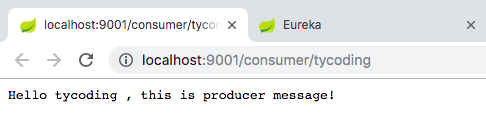
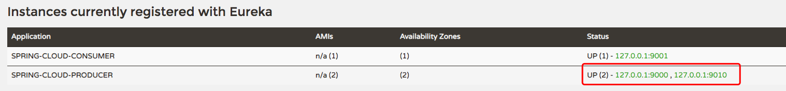
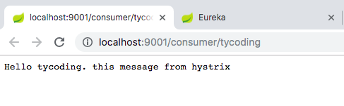

# 负载均衡

## Feign

之前案例中消费者`spring-cloud-consumer`获取生产者的URL远程地址都是要手动写URL的，但仔细看发现这些URL格式都是相同的，即使是使用了负载均衡的方式也仅是省去了端口号，但URL的其他部分还都是相同的。于是出现了`spring-cloud-starter-openfeign`，通过一个注解实现声明式服务调用。

> 1.引入依赖（因为是消费者调用的生产者，仅需在消费者中引入）

```xml
<dependency>
    <groupId>org.springframework.cloud</groupId>
    <artifactId>spring-cloud-starter-openfeign</artifactId>
</dependency>
```

> 2.开启Feign

```java
@SpringBootApplication
@EnableDiscoveryClient
@EnableFeignClients
public class SpringCloudConsumerApplication {

    public static void main(String[] args) {
        SpringApplication.run(SpringCloudConsumerApplication.class, args);
    }
}
```

> 3.修改消费者调用方式

将之前的`ConsumerService`类改变为interface，并且添加`FeignClient`注解指定生产者`spring.application.name`:

```java
@FeignClient(name = "spring-cloud-producer")
public interface ConsumerService {

    @GetMapping("/producer/{name}")
    String hello(@PathVariable("name") String name);
}
```

* `@FeignClient`注解中`name`要和生产者的`spring.application.name`值相同
* 若使用了Feign声明式注解方式调用生产者Rest服务接口，别标记的类应该是interface，且按照Rest的方式书写调用格式。
* `@GetMapping`和生产者的Rest接口格式相同，且这个`@GetMapping`对应的映射地址应该和生产者的接口地址相同。
* `@FeignClient`指明了生产者应用名称，`@GetMapping`指明了生产者的接口地址，所以Feign会根据该接口生成一个实现类调用生产者的接口获取数据。

> 4.测试

分别启动`spring-cloud-eureka`、`spring-cloud-producer`、`spring-cloud-consumer`，在浏览器访问：`localhost:9001/consumer/tycoding`:



## 实现

当项目中需要多个生产者提供服务，通常需要配置负载均衡的算法机制，以保证两个生产者能平均分配到任务。

而在Eureka中已经实现了负载均衡机制Ribbon，我们直接使用即可。

> 1.创建两个生产者

利用上一次的例子，这里创建生产者，且保证两个生产者的`spring.application.name`是相同的：

* `spring-cloud-producer`: 9000
* `spring-cloud-producer2`: 9010

* `spring-cloud-consumer`: 9001
* `spring-cloud-eureka`: 8080

> 2.修改生产者响应数据

为了将两个生产者服务区别开，将`spring-cloud-producer2`修改为：

```java
@RestController
public class ProducerController2 {

    @GetMapping("/producer/{name}")
    public String hello(@PathVariable("name") String name) {
        return "Hello " + name + " , this is producer2 message!";
    }
}
```

> 3.测试

按照Ribbon默认的负载均衡算法机制，其实已经实现了需求，分别启动`spring-cloud-eureka`、`spring-cloud-producer`、`spring-cloud-producer2`、`spring-cloud-consumer`

访问`localhost:8080`可看到Eureka Server中注册了两个生产者服务：



访问`localhost:9001/consumer/tycoding`，并且多次刷新页面，发现页面轮询显示producer和producer2的响应数据：


# Hystrix

**Hystrix**: 熔断器。

如果家用的漏电保护器，当检测到电线的某个部分漏电了会立即切断电源避免造成意外。同理熔断器也是这样，当检测到某服务出现错误，会强制该调用立即失败，不再访问服务，避免了应用不断的调用该错误服务。

## Hystrix特性

> 1.断路器机制

即当将测到服务出现错误后，Hystrix会强制该调用立即失效，断路器会自动切断请求链，避免发送大量无效的请求。

> 2.Fallback

相当于失败回滚处理机制，当请求服务出现异常后，Hystrix可以去调用Fallback中返回的值。

## Feign Hystrix

上面刚讲到Feign声明式服务调用，而刚好Feign已经依赖了Hystrix，使用起来方便很多，因为服务的调用仅存在消费端，所以修改消费端代码：

> 1.声明一个类实现消费端服务调用接口

```java
@Component
public class ConsumerHystrix implements ConsumerService {

    @Override
    public String hello(String name) {
        return "Hello " + name + ". this message from hystrix";
    }
}
```

这个类用于Hystrix遇到服务出错时调用，并返回错误信息，整个过程由Hystrix自动完成。

> 2.修改消费端服务调用接口

```java
@FeignClient(name = "spring-cloud-producer", fallback = ConsumerHystrix.class)
public interface ConsumerService {

    @GetMapping("/producer/{name}")
    String hello(@PathVariable("name") String name);
}
```

很简单，`@FeignClient`注解中提供了`fallback`属性用于检测到该服务调用失败时，Hystrix自动进行自定义（回滚）处理。

> 3.测试

分别启动`spring-cloud-eureka`、`spring-cloud-producer`、`spring-cloud-producer2`、`spring-cloud-consumer`。

访问：`loclahost:9001/consumer/tycoding`，并且多次刷新浏览器，发现页面轮询显示：

```
Hello tycoding , this is producer message!
Hello tycoding , this is producer2 message!
```

这是正常的，因为使用了Ribbon负载均衡机制。下面在IDEA上关闭`spring-cloud-producer2`服务，刷新浏览器，发现页面只显示：

```
Hello tycoding , this is producer message!
```

这也是正常的，Eureka Server检测到`spring-cloud-producer2`服务关闭后就在服务注册列表中踢出了该服务，那么就只剩下`spring-cloud-producer`服务。继续在IDEA上关闭`spring-cloud-producer`服务，刷新浏览器：



Hystrix在检测到`spring-cloud-producer`服务调用失败后，立即阻断了该服务的调用，并且根据Fallback的配置去执行自定义的回滚处理函数。