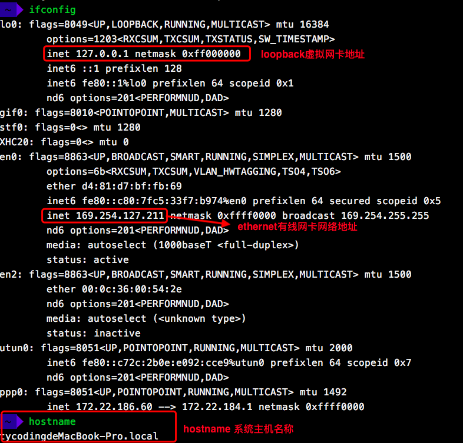
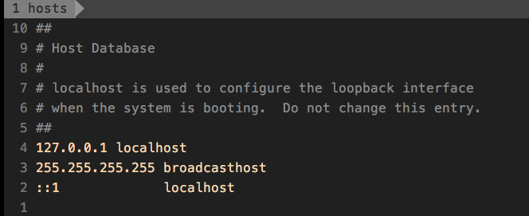
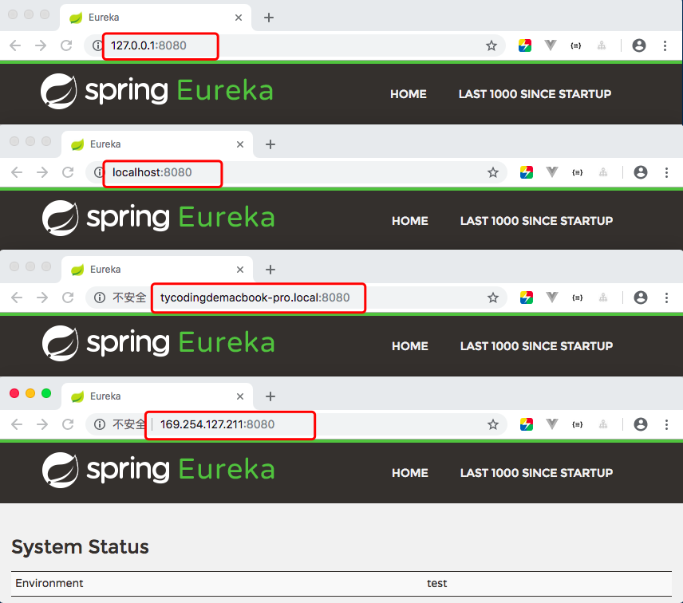
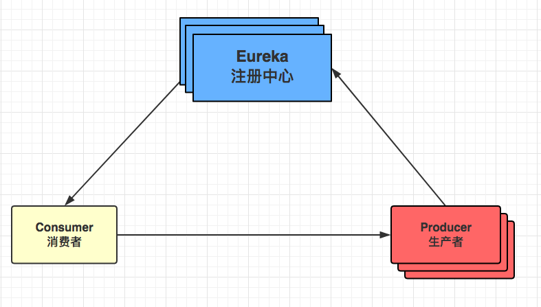
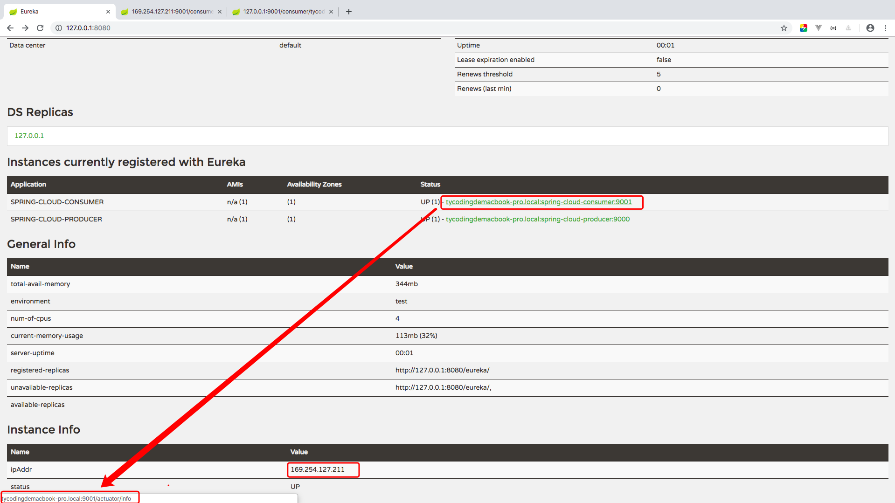
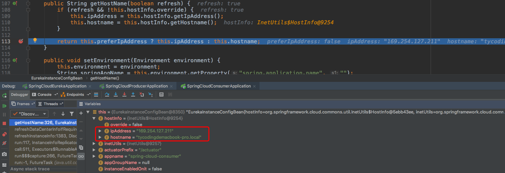
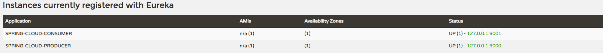
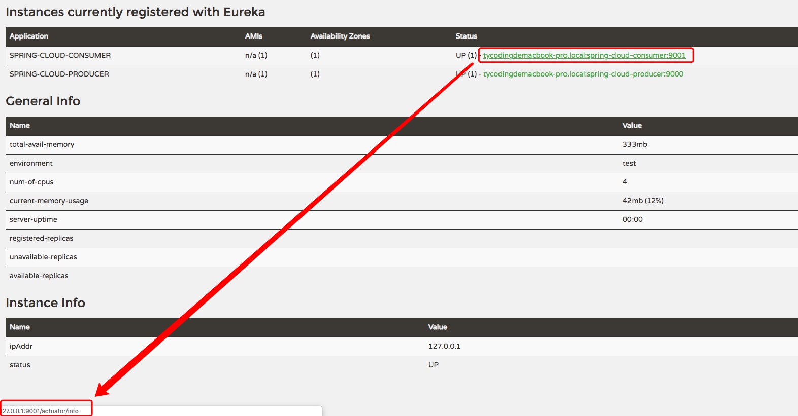

## Eureka服务注册采用主机名还是IP地址？

### 引入

首先要明确几个概念：

> **127.0.0.1**

`127.0.0.1`这个地址通常分配给**loopback**这个接口，**loopback**是一个特殊的网路接口（可理解为虚拟网卡），**用于本机中各个应用之间的网络交互**。可理解为本机一共三块网卡：**loopback**（虚拟网卡）；**ethernet**（有线网卡）；**wlan**（无线网卡）

> **localhost**

`localhost`是一个域名，他在过去指向`127.0.0.1`这个IP地址，但在操作系统支持IPv6后，他同时还指IPv6地址。在操作系统中，一般在`hosts`文件中定义了`localhost`指向`127.0.0.1`这个IP，这是可以修改的。

> **本机IP**

`本机IP`确切的指**本机物理网卡所绑定的网络协议地址**，可理解为本机一共三块网卡：**loopback**（虚拟网卡）；**ethernet**（有线网卡）；**wlan**（无线网卡）。

> **hostname**

`hostname`指系统主机的名称，用于**在系统上标识一台机器**；`IP地址`是**在TCP/IP网络中对机器的唯一标志**。

---

`Linux/Unix`可以在终端直接查看IP和HostName信息，如下：



`Linux/Unix`下编辑`etc/hosts`文件：



那么，在本机上，这四个地址都可以访问本机的Web应用：



### Eureka

Eureka又称为注册中心，用于管理各个服务模块的注册、发现等，那么他需要把各个各个服务模块注册到Eureka中：



> Eureka采用怎样的方式注册服务呢？

各个模块最基础的配置：

1. `consumer-service`

```yaml
server:
  port: 9001
spring:
  application:
    name: spring-cloud-consumer

eureka:
  client:
    # Eureka Server地址
    service-url:
      defaultZone: http://127.0.0.1:8080/eureka/
```

2. `producer-service`

```yaml
server:
  port: 9000
spring:
  application:
    name: spring-cloud-producer

eureka:
  client:
    # EurekaServer地址
    service-url:
      defaultZone: http://127.0.0.1:8080/eureka/
```

`Producer`和`Consumer`注册到`Eureka`不需要配置`register-with-eureka`，因为他默认是true，自动就注册了。

3. `eureka-server`

```yaml
server:
  port: 8080
spring:
  application:
    # 应用名称
    name: eureka-server
eureka:
  client:
    # 是否注册自己到Eureka Server
    register-with-eureka: false
    # 是否拉取其他的服务的信息，单个节点不需要拉取其他Eureka节点信息
    fetch-registry: false
    # Eureka Server地址
    service-url:
      defaultZone: http://127.0.0.1:${server.port}/eureka
```

#### 实例

启动各个模块：



可以看到：

`Eureka`实例默认注册使用的`hostname`值，查看`org.springframework.cloud.netflix.eureka.EurekaInstanceConfigBean`源码：

> 构造函数定义了hostname和ipAddress默认值

```java
private EurekaInstanceConfigBean() {
    this.dataCenterInfo = new MyDataCenterInfo(Name.MyOwn);
    this.statusPageUrlPath = this.actuatorPrefix + "/info";
    this.homePageUrlPath = "/";
    this.healthCheckUrlPath = this.actuatorPrefix + "/health";
    this.namespace = "eureka";
    this.preferIpAddress = false;
    this.initialStatus = InstanceStatus.UP;
    this.defaultAddressResolutionOrder = new String[0];
}
```

> hostname值根据`getHostName`方法获取到

```java
public String getHostName(boolean refresh) {
    if (refresh && !this.hostInfo.override) {
        this.ipAddress = this.hostInfo.getIpAddress();
        this.hostname = this.hostInfo.getHostname();
    }

    return this.preferIpAddress ? this.ipAddress : this.hostname;
}
```

因为在构造函数中定义了`preferIpAddress = false`，那么`getHostName`返回的值默认就是`hostname`的值。Debug：



### 修改Eureka实例ID

修改`spring-cloud-eureka`模块的配置文件`application.yml`，如下配置：

```yaml
eureka:
  client:
    # 是否注册自己到Eureka Server
    register-with-eureka: false
    # 是否拉取其他的服务的信息，单个节点不需要拉取其他Eureka节点信息
    fetch-registry: false
    # Eureka Server地址
    service-url:
      defaultZone: http://127.0.0.1:${server.port}/eureka
  instance:
    prefer-ip-address: true
    ip-address: 127.0.0.1
```

重启后你会发现，Eureka Server管理界面，`Instance Info`信息中`ipAddr`改变为`127.0.0.1`

### 修改`consumer`和`producer`服务实例ID

修改`spring-cloud-consumer`和`spring-cloud-producer`模块配置文件`application.yml`，如下：

```yaml
eureka:
  client:
    # Eureka Server地址
    service-url:
      defaultZone: http://127.0.0.1:8080/eureka/
  instance:
    prefer-ip-address: true
    ip-address: 127.0.0.1
    instance-id: 127.0.0.1:${server.port}
```



### IP优先注册

同样，修改`spring-cloud-consumer`和`spring-cloud-producer`模块配置文件`application.yml`，如下：

```yaml
eureka:
  client:
    # Eureka Server地址
    service-url:
      defaultZone: http://127.0.0.1:8080/eureka/
  instance:
    prefer-ip-address: true
    ip-address: 127.0.0.1
```

重启服务，发现：




