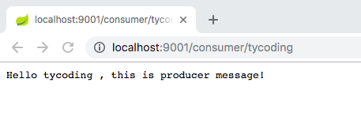
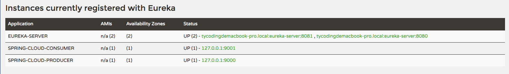
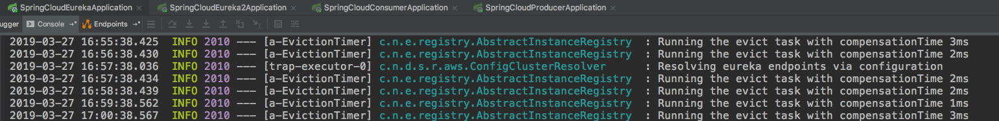

# 初识Spring Cloud

面对越来越复杂的业务，我们逐步尝试优化项目的设计，比如分层开发、抽取公共部分、封装继承。。。 以至于现在我们逐步将项目模块化，将公共模块抽取出来。比如**短信服务**这个模块，他可能被用户中心模块、后台管理模块、认证中心模块等调用，若在这些模块中都实现一遍短信服务未免太麻烦，于是我们开始将项目抽取出来：


那么这是一个最基础的架构设计，A服务调用B服务。而这存在一些问题：

* 不利于扩展
* 模块过多造成模块间关系错中复杂，不利于维护

为了解决这些问题，出现类似dubbo、zookeeper等分布式框架，通过一个**服务中心**来协调处理各个模块之间的关系：


那么Spring Cloud就将这些常用的技术整合在一起，其中就提供了**注册中心 Eureka**。通过Eureka Server可以来监控各个微服务是否正常运行。
其中涉及三个角色：

* Eureka Server: 提供服务注册与发现。
* Service Provider: 服务提供方。将自身注册到Eureka，供消费者找到
* Service Consumer: 服务消费方。从Eureka中获取服务提供方列表，从而消费服务。

**扩展**

Spring Cloud版本的命名是以A到Z为首字母的一些单词组成：

| Release Train | Boot Version |
| --- | --- |
| Greenwich | 2.1.x |
| Finchley | 2.0.x |
| Edgware | 1.5.x |
| Dalston | 1.5.x |

# 起步

## Eureka Server

创建`spring-cloud-consumer`模块

> 1.引入依赖

```xml
<properties>
    <spring-cloud.version>Greenwich.SR1</spring-cloud.version>
</properties>

<dependencies>
    <dependency>
        <groupId>org.springframework.cloud</groupId>
        <artifactId>spring-cloud-starter-netflix-eureka-server</artifactId>
    </dependency>
</dependencies>

<!-- Spring Cloud -->
<dependencyManagement>
    <dependencies>
        <dependency>
            <groupId>org.springframework.cloud</groupId>
            <artifactId>spring-cloud-dependencies</artifactId>
            <version>${spring-cloud.version}</version>
            <type>pom</type>
            <scope>import</scope>
        </dependency>
    </dependencies>
</dependencyManagement>
```

> 2.启动器类

```java
@SpringBootApplication
@EnableEurekaServer
public class SpringCloudEurekaApplication {

    public static void main(String[] args) {
        SpringApplication.run(SpringCloudEurekaApplication.class, args);
    }
}
```

如上需要在启动器类上添加`@EnableEurekaServer`注解，他会标识该服务为Eureka Server.

> 3.修改配置文件

```yaml
server:
  port: 8080
spring:
  application:
    # 应用名称
    name: eureka-server
eureka:
  client:
    # 是否注册自己到Eureka Server
    register-with-eureka: false
    # 是否拉取其他的服务的信息，单个节点不需要拉取其他Eureka节点信息
    fetch-registry: false
    # Eureka Server地址
    service-url:
      defaultZone: http://127.0.0.1:${server.port}/eureka
```

* `spring.application.name`: 标识当前微服务的名称，可以在Eureka Server管理页面看到
* `eureka.client.register-with-eureka`: 是否将自己注册到Eureka Server。默认为true
* `eureka.fetch-registry`: 是否拉取其他Eureka Server信息，比如配置的集群。默认为true
* `enreka.service-url`: 自定义与Eureka Service交互的地址
* `${server.port}`: Spring提供Spring EL表达式，可以方便的获取配置文件数据

## Producer Server

创建`spring-cloud-producer`模块

> 1.引入依赖

```xml
<dependencies>
    <dependency>
        <groupId>org.springframework.cloud</groupId>
        <artifactId>spring-cloud-starter-netflix-eureka-client</artifactId>
    </dependency>
</dependencies>

<!-- Spring Cloud -->
<dependencyManagement>
    <dependencies>
        <dependency>
            <groupId>org.springframework.cloud</groupId>
            <artifactId>spring-cloud-dependencies</artifactId>
            <version>${spring-cloud.version}</version>
            <type>pom</type>
            <scope>import</scope>
        </dependency>
    </dependencies>
</dependencyManagement>
```

> 2.启动器类

```java
@SpringBootApplication
@EnableDiscoveryClient
public class SpringCloudProducerApplication {

    public static void main(String[] args) {
        SpringApplication.run(SpringCloudProducerApplication.class, args);
    }
}
```

> 3.创建`PriducerController`

```java
@RestController
public class ProducerController {

    @GetMapping("/producer/{name}")
    public String hello(@PathVariable("name") String name) {
        return "Hello " + name + " , this is producer message!";
    }
}
```

如上，`Producer Server`暴露一个Rest接口，Spring Cloud通过`@EnableDiscoverClient`识别该模块为服务提供者，对外提供服务，Spring Cloud将该服务注册到`Eureka`中，供服务消费者调用。

> 4.修改配置文件

```yaml
server:
  port: 9000
spring:
  application:
    name: spring-cloud-producer

eureka:
  client:
    # EurekaServer地址
    service-url:
      defaultZone: http://127.0.0.1:8080/eureka/
``` 

* `eureka.client.service-url.defaultZone`: EurekaServer地址

## Consumer Server

> 1.引入依赖

```xml
<dependencies>
    <dependency>
        <groupId>org.springframework.cloud</groupId>
        <artifactId>spring-cloud-starter-netflix-eureka-client</artifactId>
    </dependency>
</dependencies>

<!-- Spring Cloud -->
<dependencyManagement>
    <dependencies>
        <dependency>
            <groupId>org.springframework.cloud</groupId>
            <artifactId>spring-cloud-dependencies</artifactId>
            <version>${spring-cloud.version}</version>
            <type>pom</type>
            <scope>import</scope>
        </dependency>
    </dependencies>
</dependencyManagement>
```

> 2.启动器类

```java
@SpringBootApplication
@EnableDiscoveryClient
public class SpringCloudConsumerApplication {

    public static void main(String[] args) {
        SpringApplication.run(SpringCloudConsumerApplication.class, args);
    }

    @Bean
    public RestTemplate restTemplate() {
        return new RestTemplate();
    }
}
```

> 3.创建ConsumerController

`Producer Service`将服务的Rest接口注册到注册中心Eureka Server，`Consumer Service`从注册中心获取想要调用的`Produce Service`接口。所以`Consumer Service`将要消费`Produce`生产的数据，并最终将封装好的数据通过一个Rest接口供前端调用。

所以创建Web层的映射接口：`ConsumerController.java`:

```java
@RestController
public class ConsumerController {

    @Autowired
    private ConsumerService consumerService;

    @GetMapping("/consumer/{name}")
    public String hello(@PathVariable("name") String name) {
        return consumerService.hello(name);
    }
}
```

> 4.创建ConsumerService

`ConsumerController`作为Web层映射接口，当然需要调用Service服务层，主要通过Consumer的Service方法从注册中心获取数据并进行业务处理，最后再交由Controller发送给前端：

```java
@Service
public class ConsumerService {

    @Autowired
    private RestTemplate restTemplate;

    @Autowired
    private DiscoveryClient discoveryClient;

    public String hello(String name) {
        //根据服务名称获取服务实例
        List<ServiceInstance> instances = discoveryClient.getInstances("spring-cloud-producer");
        //因为只有一个实例，所以直接获取
        ServiceInstance instance = instances.get(0);
        String baseUrl = "http://" + instance.getHost() + ":" + instance.getPort() + "/producer/";
        String response = restTemplate.getForObject(baseUrl + name, String.class);
        return response;
    }
}
```

* `RestTemplate`: Spring提供的一个类，其中封装了很多HTTP请求方法，可以方便的进行HTTP请求。
* `DiscoverClient`: 回想启动器类的`@EnableDiscoverClient`注解，他是Eureka客户端实例，可以从其中获取注册中心Eureka的注册信息。

> 5.修改配置文件

```yaml
server:
  port: 8080
spring:
  application:
    # 应用名称
    name: eureka-server
eureka:
  client:
    # 是否注册自己到Eureka Server
    register-with-eureka: false
    # 是否拉取其他的服务的信息，单个节点不需要拉取其他Eureka节点信息
    fetch-registry: false
    # Eureka Server地址
    service-url:
      defaultZone: http://127.0.0.1:${server.port}/eureka
```

## 测试

按照顺序依次启动：1.`EurekaApplication` 2.`ProducerApplication` 3.`ConsumerApplication`。访问`localhost:8080`:


可以看到`Eureka Server`控制台界面，其中有注册（registered）了两个实例（Instances），分别是`spring-cloud-producer`和`spring-cloud-consumer`。

**注**

* 目前配置注册到Eureka实例的`Status`栏显示的是当前系统用户名，这可以理解为等同于127.0.0.1、localhost地址
* 目前配置Eureka Server实例`ipAddr`栏显示的当前系统网络网卡IP地址

浏览器访问`localhost:9001/consumer/tycoding`，正确显示producer返回的数据：



## 服务续约

### 服务提供方

Eureka默认的服务续约时间为30秒，服务时效时间为90秒。若需要修改：

```yaml
eureka:
  instance:
    lease-expiration-duration-in-seconds: 10 # 服务时效时间
    lease-renewal-interval-in-seconds: 5 # 服务续约时间（心跳时间）
```

### 服务消费方

当服务启动后，服务消费方需要拉取服务列表，默认是30秒重新拉取一次数据，可以修改:

```yaml
eureka:
  client:
    registry-fetch-interval-seconds: 5
```

## Eureka服务注册采用主机名还是IP地址？

### 引入

首先要明确几个概念：

> **127.0.0.1**

`127.0.0.1`这个地址通常分配给**loopback**这个接口，**loopback**是一个特殊的网路接口（可理解为虚拟网卡），**用于本机中各个应用之间的网络交互**。可理解为本机一共三块网卡：**loopback**（虚拟网卡）；**ethernet**（有线网卡）；**wlan**（无线网卡）

> **localhost**

`localhost`是一个域名，他在过去指向`127.0.0.1`这个IP地址，但在操作系统支持IPv6后，他同时还指IPv6地址。在操作系统中，一般在`hosts`文件中定义了`localhost`指向`127.0.0.1`这个IP，这是可以修改的。

> **本机IP**

`本机IP`确切的指**本机物理网卡所绑定的网络协议地址**，可理解为本机一共三块网卡：**loopback**（虚拟网卡）；**ethernet**（有线网卡）；**wlan**（无线网卡）。

> **hostname**

`hostname`指系统主机的名称，用于**在系统上标识一台机器**；`IP地址`是**在TCP/IP网络中对机器的唯一标志**。

---

`Linux/Unix`可以在终端直接查看IP和HostName信息，如下：


`Linux/Unix`下编辑`etc/hosts`文件：


那么，在本机上，这四个地址都可以访问本机的Web应用：


### Eureka

Eureka又称为注册中心，用于管理各个服务模块的注册、发现等，那么他需要把各个各个服务模块注册到Eureka中：


> Eureka采用怎样的方式注册服务呢？

各个模块最基础的配置：

1. `consumer-service`

```yaml
server:
  port: 9001
spring:
  application:
    name: spring-cloud-consumer

eureka:
  client:
    # Eureka Server地址
    service-url:
      defaultZone: http://127.0.0.1:8080/eureka/
```

2. `producer-service`

```yaml
server:
  port: 9000
spring:
  application:
    name: spring-cloud-producer

eureka:
  client:
    # EurekaServer地址
    service-url:
      defaultZone: http://127.0.0.1:8080/eureka/
```

`Producer`和`Consumer`注册到`Eureka`不需要配置`register-with-eureka`，因为他默认是true，自动就注册了。

3. `eureka-server`

```yaml
server:
  port: 8080
spring:
  application:
    # 应用名称
    name: eureka-server
eureka:
  client:
    # 是否注册自己到Eureka Server
    register-with-eureka: false
    # 是否拉取其他的服务的信息，单个节点不需要拉取其他Eureka节点信息
    fetch-registry: false
    # Eureka Server地址
    service-url:
      defaultZone: http://127.0.0.1:${server.port}/eureka
```

#### 实例

启动各个模块：


可以看到：

`Eureka`实例默认注册使用的`hostname`值，查看`org.springframework.cloud.netflix.eureka.EurekaInstanceConfigBean`源码：

> 构造函数定义了hostname和ipAddress默认值

```java
private EurekaInstanceConfigBean() {
    this.dataCenterInfo = new MyDataCenterInfo(Name.MyOwn);
    this.statusPageUrlPath = this.actuatorPrefix + "/info";
    this.homePageUrlPath = "/";
    this.healthCheckUrlPath = this.actuatorPrefix + "/health";
    this.namespace = "eureka";
    this.preferIpAddress = false;
    this.initialStatus = InstanceStatus.UP;
    this.defaultAddressResolutionOrder = new String[0];
}
```

> hostname值根据`getHostName`方法获取到

```java
public String getHostName(boolean refresh) {
    if (refresh && !this.hostInfo.override) {
        this.ipAddress = this.hostInfo.getIpAddress();
        this.hostname = this.hostInfo.getHostname();
    }

    return this.preferIpAddress ? this.ipAddress : this.hostname;
}
```

因为在构造函数中定义了`preferIpAddress = false`，那么`getHostName`返回的值默认就是`hostname`的值。Debug：


### 修改Eureka实例ID

修改`spring-cloud-eureka`模块的配置文件`application.yml`，如下配置：

```yaml
eureka:
  client:
    # 是否注册自己到Eureka Server
    register-with-eureka: false
    # 是否拉取其他的服务的信息，单个节点不需要拉取其他Eureka节点信息
    fetch-registry: false
    # Eureka Server地址
    service-url:
      defaultZone: http://127.0.0.1:${server.port}/eureka
  instance:
    prefer-ip-address: true
    ip-address: 127.0.0.1
```

重启后你会发现，Eureka Server管理界面，`Instance Info`信息中`ipAddr`改变为`127.0.0.1`

### 修改`consumer`和`producer`服务实例ID

修改`spring-cloud-consumer`和`spring-cloud-producer`模块配置文件`application.yml`，如下：

```yaml
eureka:
  client:
    # Eureka Server地址
    service-url:
      defaultZone: http://127.0.0.1:8080/eureka/
  instance:
    prefer-ip-address: true
    ip-address: 127.0.0.1
    instance-id: 127.0.0.1:${server.port}
```


### IP优先注册

同样，修改`spring-cloud-consumer`和`spring-cloud-producer`模块配置文件`application.yml`，如下：

```yaml
eureka:
  client:
    # Eureka Server地址
    service-url:
      defaultZone: http://127.0.0.1:8080/eureka/
  instance:
    prefer-ip-address: true
    ip-address: 127.0.0.1
```

重启服务，发现：


# Eureka集群

当业务需要多个注册中心完成整个系统的服务调用，可以搭建Eureka Server集群。这里我们再创建一个Modules：`spring-cloud-eureka2`，和`spring-cloud-eureka`模块配置相同，但同时修改两者的配置文件：

> spring-cloud-eureka

```yaml
server:
  port: 8080
spring:
  application:
    # 应用名称
    name: eureka-server
eureka:
  client:
    # Eureka Server地址
    service-url:
      defaultZone: http://127.0.0.1:8081/eureka
```

即这个`defaultZone`指向另外一个`Eureka Server`地址，并且删除掉`register-with-eureka`和`fetch-registry`配置，因为他们默认为true，并且需要注册到`Eureka Server`，相互注册，相互发现。

> spring-cloud-eureka2

```yaml
server:
  port: 8081
spring:
  application:
    # 应用名称
    name: eureka-server
eureka:
  client:
    # Eureka Server地址
    service-url:
      defaultZone: http://127.0.0.1:8080/eureka
```

> 修改`spring-cloud-producer`和`spring-cloud-consumer`使用这个Eureka集群

修改两者的配置文件，将`defaultZone`修改为两个Eureka Server集群的地址，中间用逗号隔开

```yaml
    service-url:
      defaultZone: http://127.0.0.1:8080/eureka/,http://127.0.0.1:8081/eureka/
```



## 服务续约

仔细观察Eureka Server服务控制台打印日志，发现每隔1分钟，注册进Eureka Server的服务都会向Eureka Server请求一次，以维持会话状态。



> 修改服务续约、和服务时效时间

```yaml
eureka:
  instance:
    lease-expiration-duration-in-seconds: 10 # 每隔10秒过期
    lease-renewal-interval-in-seconds: 30 # 5秒一次请求
```

