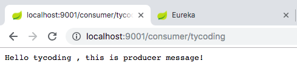
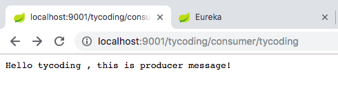
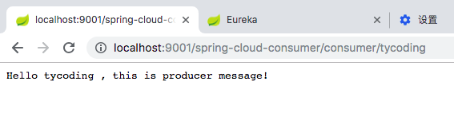
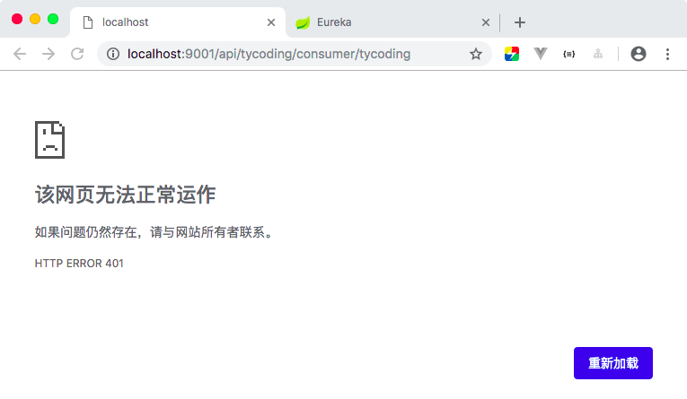
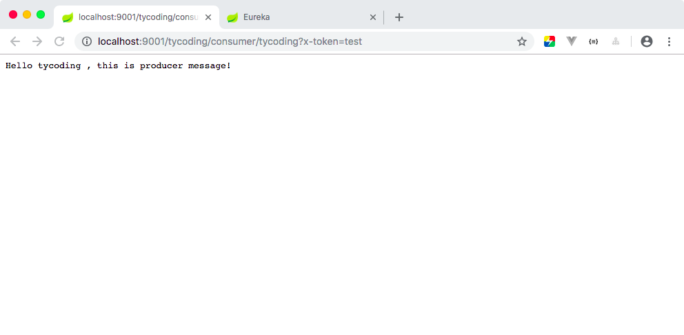

# Zuul 网关

在前面的文章介绍后，Eureka用于服务的注册与发现，Feign声明式的注解调用服务，Ribbon负载均衡机制，Hystrix服务熔断机制。

但整个过程中我们并未考虑过服务接口的安全性，于是我们可能需要实现对服务访问的权限控制。对于复杂的服务集群，我们需要大量的精力考虑服务接口的安全性以及对接口的访问控制处理。那么**Zuul网关**的出现就是为了处理这些问题。

**Zuul网关**: 一个更强大的负载均衡器服务网关。它提供了身份认证、动态路由、监控、负载均衡等服务。通过Zuul服务网关统一向外系统提供REST API。

## 入门

新创建一个项目模块：`spring-cloud-zuul`

> 1.引入依赖

```xml
<dependency>
    <groupId>org.springframework.cloud</groupId>
    <artifactId>spring-cloud-starter-netflix-zuul</artifactId>
</dependency>
```

> 2.修改启动器类

在启动器类上添加`@EnableZuulProxy`注解：

```java
@SpringBootApplication
@EnableZuulProxy
public class SpringCloudZuulApplication {

    public static void main(String[] args) {
        SpringApplication.run(SpringCloudZuulApplication.class, args);
    }
}
```

> 3.修改配置文件

```yaml
server:
  port: 10000
spring:
  application:
    name: spring-cloud-zuul
zuul:
  routes:
    # 路由ID
    tycoding:
      path: /tycoding/**
      url: http://tycoding.cn
```

如上，该项目模块的端口是：`10000`：

* `zuul.routes`: 配置路由地址信息
* `zuul.routes.tycoding`: 配置一个路由地址，名称为`tycoding`（它是自定义的）
* `zuul.routes.tycoding.path`: 该路由监听的URL，如上是拦截所有`/tycoding/`开头的所有URL
* `zuul.routes.tycoding.url`: 拦截到URL重定向的地址

> 4.测试

启动`spring-cloud-zuul`项目，浏览器访问`localhost:10000/tycoding`，页面会立即跳转到`http://tycoding.cn`这个地址

## 面向服务的路由

在上面中我们需要手动写`zuul.routes.<route>.url`地址，但实际项目往往是用来重定向到某个服务地址，直接写服务的URL地址实不可取的，于是我们可以通过写`zuul.routes.<route>.serviceId`指定重定向到哪个服务地址。

> 1.修改`spring-cloud-consumer`模块，引入Zuul依赖

```xml
<dependency>
    <groupId>org.springframework.cloud</groupId>
    <artifactId>spring-cloud-starter-netflix-zuul</artifactId>
</dependency>
```

> 2.修改启动器类

```java
@SpringBootApplication
@EnableDiscoveryClient
@EnableFeignClients
@EnableZuulProxy
public class SpringCloudConsumerApplication {

    public static void main(String[] args) {
        SpringApplication.run(SpringCloudConsumerApplication.class, args);
    }
}
```

> 3.修改配置文件

```yaml
server:
  port: 9001
spring:
  application:
    name: spring-cloud-consumer

eureka:
  client:
    # Eureka Server地址
    service-url:
      defaultZone: http://127.0.0.1:8080/eureka/
  instance:
    prefer-ip-address: true
    ip-address: 127.0.0.1
    instance-id: 127.0.0.1:${server.port}

feign:
  hystrix:
    enabled: true

zuul:
  routes:
    # 路由ID
    tycoding:
      path: /tycoding/**
      serviceId: spring-cloud-consumer
```

> 4.测试

分别启动`spring-cloud-eureka`、`spring-cloud-consumer`、`spring-cloud-producer`项目模块，在浏览器上访问`localhost:9001/consumer/tycoding/`：



访问：`localhost:9001/tycoding/consumer/tycoding/`:



发现同样可以访问到`spring-cloud-producer`生产者返回的数据。并且观察URL，Zuul仅是对符合`zuul.routes.<route>.path`条件的URL重定向到`zuul.routes.<route>.serviceId`对应的地址。那么在本例中，`localhost:9001/tycoding/`就是符合条件的URL，他将这个URL作为根URL地址重定向到`spring-cloud-consumer`这个服务，而`spring-cloud-consumer`这个模块的访问地址是：`<root>/consumer/name`。

## 简化的路由配置

以上方式通过分别指定`zuul.routes.<route>.path`和`zuul.routes.<route>.serviceId`实现路由。那么还提供一种方式：以服务名称作为路由地址和URL匹配地址：

```yaml
zuul:
  routes:
    # 路由ID
    tycoding:
      path: /tycoding/**
      serviceId: spring-cloud-consumer
    spring-cloud-consumer: /spring-cloud-consumer/**
```

注意这里的`zuul.routes.<route>`应该是服务的名称，而不能随便定义。

访问`localhost:9001/spring-cloud-consumer/consumer/tycoding`:



这种方式也是Zuul网关提供的默认路由配置，也就是说刚才的配置我们不写也是可以访问的。

### 路由前缀

```yaml
zuul:
  prefix: /api
  routes:
    # 路由ID
    tycoding:
      path: /tycoding/**
      serviceId: spring-cloud-consumer
```

那么所有的请求都要配置前缀`/api/xx`

## 过滤器

Zuul实现请求鉴权往往是通过Zuul提供的过滤器（ZuulFilter）来实现的。

### ZuulFilter

```java
public abstract ZuulFilter implements IZuulFilter{
    abstract public String filterType();
    abstract public int filterOrder();
    boolean shouldFilter();// 来自IZuulFilter
    Object run() throws ZuulException;// IZuulFilter
}
```

* `shouldFilter`: 返回一个Boolean值，判断该过滤器是否执行
* `run`: 过滤器的具体业务逻辑
* `filterOrder`: 返回int值来定义过滤器的执行顺序，数值越小优先级越高
* `filterType`: 返回字符串，代表过滤器的类型，包含以下四种：
    - `pre`: 请求在被路由之前执行
    - `routing`: 在路由请求时调用
    - `error`: 处理请求时发生的错误调用
    - `post`: 在`routing`和`error`过滤器之后调用
  
### 生命周期


> 正常流程

* 请求到达首先会经过`post`类型过滤器，而后到达`routing`类型进行路由，此时请求到达真正的服务提供者指定请求，返回结果后会到达`post`过滤器，最后返回响应
    
> 异常流程
 
* 整个过程中，`pre`或`routing`过滤器出现异常，都会直接进入`error`过滤器，当`error`过滤器处理完毕后将结果返回到`post`过滤器，最后返回响应
* 如果是`error`过滤器自己出现异常，最终也进入`post`过滤器，最后返回
* 如果是`post`过滤器异常，会跳转到`error`过滤器，最后返回响应

### 自定义过滤器

```java
@Component
public class LoginFilter extends ZuulFilter {

    @Override
    public String filterType() {
        //路由前调用
        return "pre";
    }

    @Override
    public int filterOrder() {
        //数字越大，优先级越低
        return 0;
    }

    @Override
    public boolean shouldFilter() {
        //是否执行该过滤器
        return true;
    }

    /**
     * 核心逻辑
     *
     * @return
     * @throws ZuulException
     */
    @Override
    public Object run() throws ZuulException {
        System.out.println("========zuul filter========");
        RequestContext requestContext = RequestContext.getCurrentContext();
        HttpServletRequest request = requestContext.getRequest();
        String token = request.getParameter("x-token");
        if (token == null || "".equals(token.trim())) {
            //没有token，拦截
            requestContext.setSendZuulResponse(false);
            requestContext.setResponseStatusCode(HttpStatus.UNAUTHORIZED.value());
        }
        return null;
    }
}
```

> 测试

访问`localhost:9001/tycoding/consumer/tycoding`：



访问`localhost:9001/tycoding/consumer/tycoding?x-token=test`:

