# Spring Boot整合ElasticSearch

之前我们已经学习了 [Spring Boot整合Solr](https://github.com/TyCoding/spring-boot-learn/tree/master/spring-boot-solr)。而今天学习的ElasticSearch，是一个分布式搜索和分析引擎，他可以帮你用前所未有的速度处理大规模数据，ElasticSearch是建立在Apache Lucene基础上的搜索引擎。

## 特点

1. ElasticSearch是分布式的，不需要其他组件，分发是实时的。
2. ElasticSearch完全支持Apache Lucene的接近实时的搜索
3. 缺点：不够成熟、不够自动化

## Solr和ElasticSearch

1. Solr利用Zookeeper进行分布式管理，而ElasticSearch自身带有分布式协调管理功能。
2. Solr支持更多格式的数据，而ElasticSearch仅支持JSON文件格式。
3. Solr官方提供的功能更多，而ElasticSearch本身更注重核心功能，高级功能多由第三方插件提供。
4. Solr在传统的搜索应用中效率优于ElasticSearch，但ElasticSearch更适用于新兴的实时搜索应用。

# 安装部署

直接去 [官网](https://www.elastic.co/downloads/) 下载最新版的ElasticSearch安装包，这里使用最新版-6.6.2。解压后的文件如下：

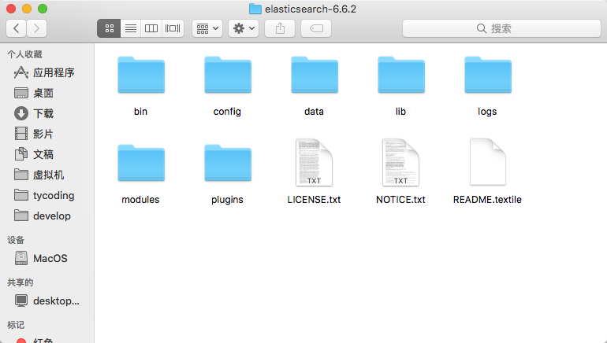

### 启动

在命令行中进入ElasticSearch安装目录的`bin`文件夹下，执行命令：

```
./elasticsearch
```


如上证明启动成功。在浏览器上访问：`127.0.0.1:9200`即会输出ElasticSearch的版本信息。

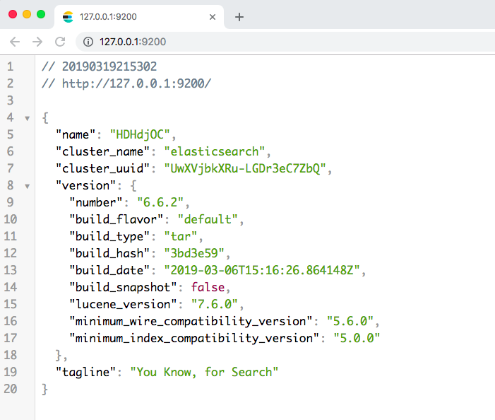

# 命令

> 新建索引

**PUT**

```
http://127.0.0.1:9200/索引名
```

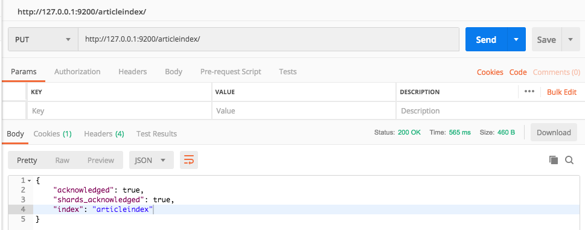

> 新建文档

**POST**

```
http://127.0.0.1:9200/索引名/文档名

body: {}
```

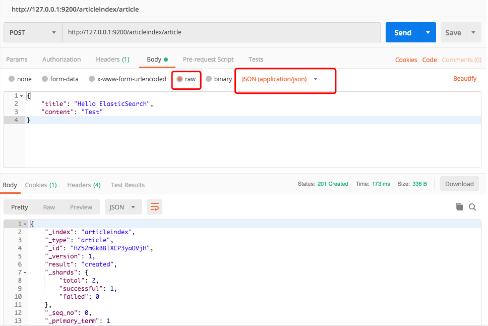

> 查询全部文档

**GET**

```
http://127.0.0.1:9200/索引名/文档名/_search
```


* `took：`本次操作花费的时间，单位为毫秒。
* `timed_out：`请求是否超时_
* `shards：`说明本次操作共搜索了哪些分片
* `hits：`搜索命中的记录
* `hits.total：` 符合条件的文档总数
* `hits.hits：`匹配度较高的前N个文档
* `hits.max_score：`文档匹配得分，这里为最高分
* `_score：`每个文档都有一个匹配度得分，按照降序排列。
* `_source：`显示了文档的原始内容。

> 修改文档

**PUT**

```
http://127.0.0.1:9200/索引名/文档名/ID
```

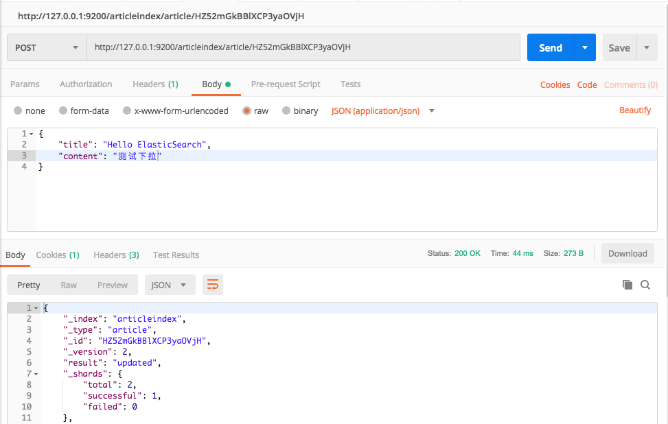

**如果该ID指定的文档不存在，就以该ID创建新的文档**


> 按ID查询

**GET**

```
http://127.0.0.1:9200/索引名/文档名/ID
```

> 基本条件查询

**GET**

```
http://127.0.0.1:9200/索引名/文档名/_search?q=条件
```

> 模糊查询

**GET**

```
http://127.0.0.1:9200/索引名/文档名/_search?q=*条件*
```

> 删除文档

**DELETE**

```
http://127.0.0.1:9200/索引名/文档名/ID
```

## 安装ElasticSearch-Head

使用Solr时，Solr自身提供了一个非常方面的可视化界面，但ElasticSearch官方并未提供，这里使用第三方插件ElasticSearch-Head来完成对ElasticSearch的可视化操作。

> 去Github下载elasticsearch-head源码

```
git clone https://github.com/mobz/elasticsearch-head.git
```

> 全局安装grunt项目构建工具

首先你的电脑要安装Node.js开发环境。

```
sudo npm install -g grunt-cli
```

> 在elasticsearch-head目录下安装依赖

```
npm install
```

> 修改ElasticSearch配置文件`/config/elasticsearch.yml`

允许跨域访问，在配置文件中增加：

```
http.cors.enabled: true
http.cors.allow-origin: "*"
```

> 启动head

```
grunt server
```

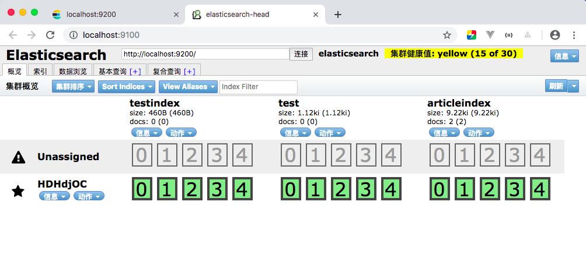

# 安装IK分词器

和Solr一样，ElasticSearch也需要安装IK分析器以实现对中文更好的分词支持。

> 去Github下载最新版elasticsearch-ik

[https://github.com/medcl/elasticsearch-analysis-ik/releases](https://github.com/medcl/elasticsearch-analysis-ik/releases)

```
git clone https://github.com/medcl/elasticsearch-analysis-ik/releases
```

> 解压文件，并将文件夹重命名为`ik`

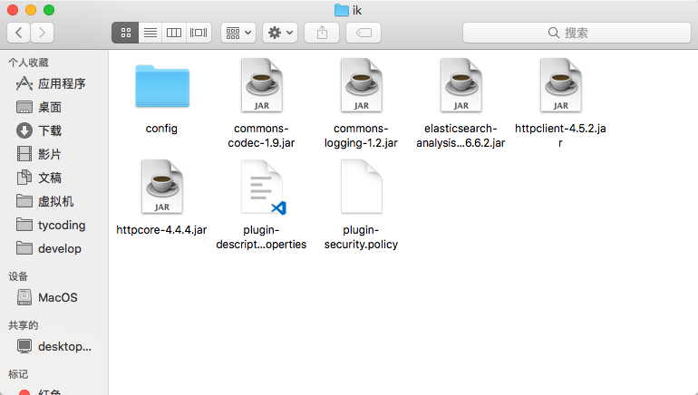

> 将`ik`文件夹放在`elasticsearch/plugins`目录下，重启elasticsearch

在ElasticSearch6之前的版本，直接访问：`http://127.0.0.1:9200/_analyze?analyzer=ik_max_word&pretty=true&text=测试IK分词器` 即可展示分词效果。

但是在ElasticSearch6开始的版本中，分词查询要用GET、POST请求，但要把请求参数写在body中，且需要JSON格式。

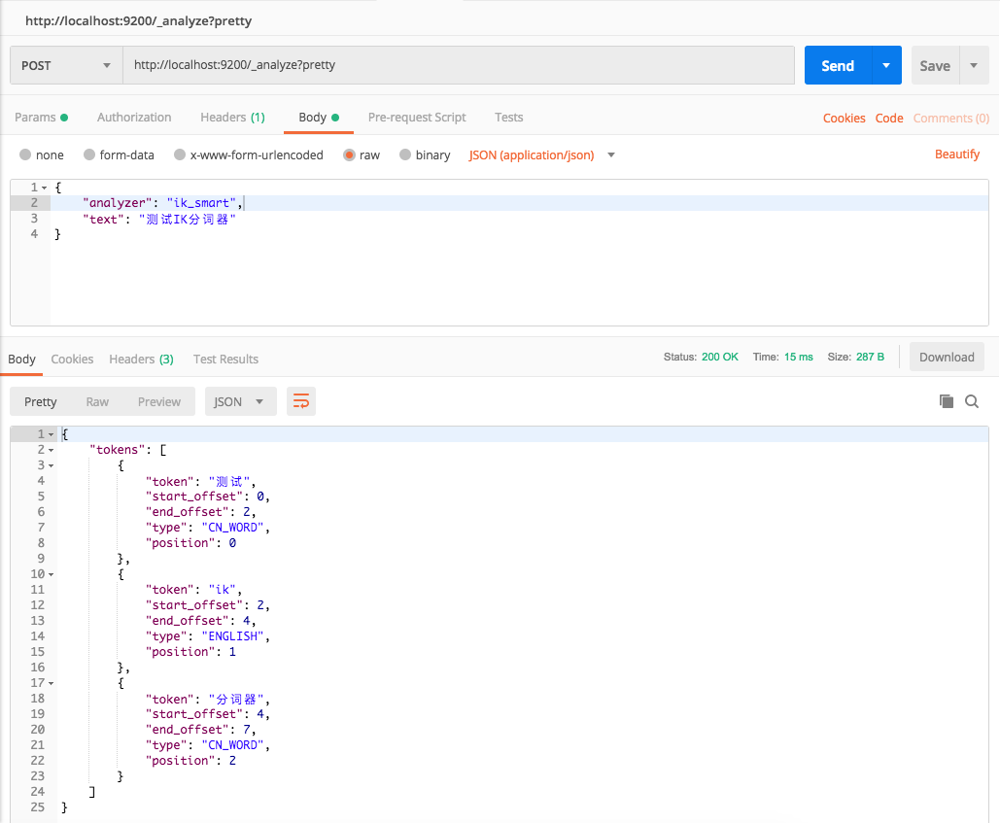

## 扩展词典

在`elasticsearch/plugins/ik/config`下新建`my.dic`文件，在`my.dic`中写入想要分词识别的文字；修改`IKAnalyzer.cfg.xml`文件，在`<entry key="ext_dict">`中指定`my.dic`。

重启elasticsearch即可看到分词效果。

# Spring Data ElasticSearch

Spring Data家族对ElasticSearch也进行了封装支持，使用**spring-data-elasticsearch**，就像使用**spring-data-jpa**,**spring-data-solr**,**spring-data-redis**,**spring-data-mongodb**等一样操作简单，他们封装的方法类似，提供的接口格式都基本相同，所以开发流程也基本是一样的。

## 导入依赖

```xml
<dependency>
    <groupId>org.springframework.boot</groupId>
    <artifactId>spring-boot-starter-data-elasticsearch</artifactId>
</dependency>
```

## 添加配置

修改`application.yml`配置文件

```yaml
spring:
  data:
    elasticsearch:
      cluster-nodes: 127.0.0.1:9300
```

## Entity

```java
@Data
@Document(indexName = "articleindex", type = "article")
public class Article implements Serializable {

    @Id
    private String id;

    @Field(index = true, analyzer = "ik_max_word", searchAnalyzer = "ik_max_word")
    private String title;

    @Field(index = true, analyzer = "ik_max_word", searchAnalyzer = "ik_max_word")
    private String content;
}
```

为避免类型转换错误，请将`id`设置为String类型。

其中`indexName`代表ES索引名称，`type`代表文档名称。

* `index=true`代表是否开启索引，即该字段数据是否能被搜索到
* `analyzer="ik_max_word"`代表搜索的时候是如何分词匹配，`ik_max_word`使用IK分词器最细颗粒度分词查询。
* `searchAnalyzer = "ik_max_word"`搜索分词的类型

## Repository

```java
public interface EsRepository extends ElasticsearchRepository<Article, String> {

    /**
     * 根据文章标题或内容模糊查询
     *
     * @param title
     * @param content
     * @param pageable
     * @return
     */
    Page<Article> findByTitleOrContentLike(String title, String content, Pageable pageable);
}
```

联想solr,redis,jpa,mongodb，基本都是依赖继承一个`XxxRepository`接口即可，并且对于IDEA，如果继承了`XxxRepository`接口，IDEA会自动提示自定义查询方法的构建：

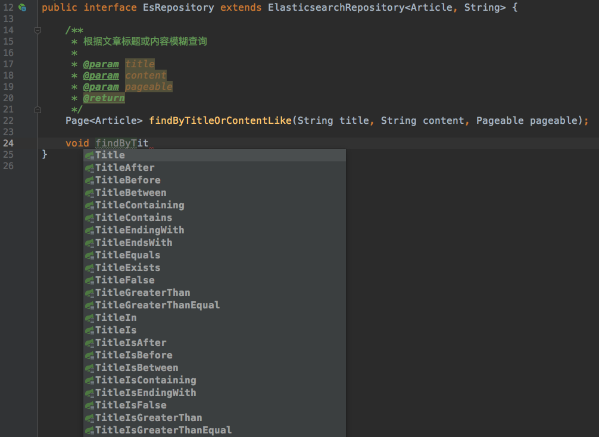

如上的`findByTitleOrContentLike`就是根据`Title`或者`Cotent`字段`Like`模糊查询。

## Service

```java
@Data
public class QueryPage {

    /**
     * 当前页
     */
    private Integer current;

    /**
     * 每页记录数
     */
    private Integer size;
}
```

```java
@Service
public class EsServiceImpl implements EsService {

    @Autowired
    private EsRepository esRepository;


    @Override
    public void add(Article article) {
        esRepository.save(article);
    }

    @Override
    public Page<Article> search(String keyword, QueryPage queryPage) {
        PageRequest pageRequest = PageRequest.of(queryPage.getCurrent() - 1, queryPage.getSize());
        return esRepository.findByTitleOrContentLike(keyword, keyword, pageRequest);
    }
}
```

* 因为，在Solr，ElasticSearch中，分页查询，默认都是从`0`索引位置开始的，和Mybatis中的分页查询不同，所以需要`current -1`。
* 其次，同Solr，用户查询的字段是不确定的，可能查询多个字段，所以需要根据用户输入的数据去ElasticSearch中模糊匹配所有字段，以此实现模糊查询。

## Test

```java
@SpringBootTest
@RunWith(SpringRunner.class)
public class EsServiceImplTest {
    private Logger logger = LoggerFactory.getLogger(this.getClass());

    @Autowired
    private EsService esService;

    @Test
    public void add() {
        Article article = new Article();
        article.setId("1");
        article.setTitle("测试添加文章索引");
        article.setContent("这是测试数据");
        esService.add(article);
    }

    @Test
    public void search() {
        QueryPage page = new QueryPage();
        page.setCurrent(1);
        page.setSize(10);
        Page<Article> list = esService.search("测试", page);
        list.forEach(article -> {
            logger.info("article ==> {}", article);
        });
    }
}
```

注意，添加时，如果指定`id`字段，这个id值如果在ES文档中有匹配的，就是更新操作，如果没有就是添加操作

# 实现Mysql导入Es

> 下载logstash

[logstash官网](https://www.elastic.co/cn/downloads/logstash)

> 解压文件，并在其根目录下创建`mysqletc`文件夹（名称随意）

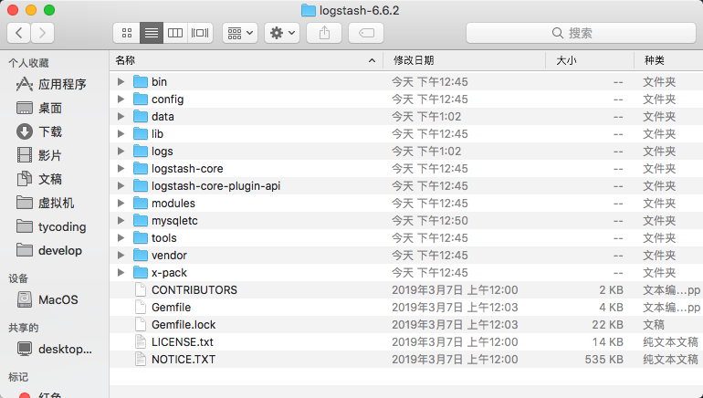

> 在`mysqletc`文件夹下创建`mysql.conf`（名称随意）

在`mysql.conf`配置文件中写入如下内容：

```
input {
  jdbc {
    # 数据库连接语句
    jdbc_connection_string => "jdbc:mysql://127.0.0.1:3306/springboot_es?characterEncoding=UTF8"
    jdbc_user => "root"
    jdbc_password => "root"
    # mysql-connection驱动的绝对路径
    jdbc_driver_library => "/develop/software/logstash-6.6.2/mysqletc/mysql-connector-java-5.1.47.jar"
    jdbc_driver_class => "com.mysql.jdbc.Driver"
    jdbc_paging_enabled => "true"
    jdbc_page_size => "50000"
    # SQL查询语句，用于将查询到的数据导入到ElasticSearch
    statement => "select id,title,content from tb_article"
    # 定时任务，各自表示：分 时 天 月 年 。全部为 * 默认每分钟执行
    schedule => "* * * * *"
  }
}
output {
  elasticsearch {
    hosts => "localhost:9200"
    # 索引名称
    index => "aritcleindex"
    # 自增ID编号
    document_id => "%{id}"
    # 文档名称
    document_type => "article"
  }
  stdout {
    # JSON格式输出
    codec => json_lines
  }
}
```

配置完成，找一个`mysql-connection.jar`包拷贝到`/mysqletc/`根目录下，并修改配置文件中的`jdbc_driver_library`路径地址。

> 创建数据库

```sql
CREATE DATABASE springboot_es DEFAULT CHARACTER utf8;
DROP TABLE IF EXISTS `tb_article`;
CREATE TABLE `tb_article` (
  `id` bigint(20) NOT NULL AUTO_INCREMENT COMMENT '主键',
  `title` varchar(255) DEFAULT NULL COMMENT '文章标题',
  `content` text COMMENT '文章内容',
  PRIMARY KEY (`id`)
) ENGINE=InnoDB AUTO_INCREMENT=3 DEFAULT CHARSET=utf8;

INSERT INTO `tb_article` VALUES (1, '测试', '测试');
INSERT INTO `tb_article` VALUES (2, '测试啊', '测试啊');
```

> 在终端中切换到`logstash`根目录下

执行`logstash -f ../mysqletc/mysql.conf`：


并且查询语句会每分钟执行一次。

# Docker中部署ElasticSearch

> 拉取elasticsearch镜像

```
docker pull elasticsearch:6.6.2
```

> 创建一个容器

```
[root@localhost ~]# docker run -di --name=vm_es -p 9200:9200 -p 9300:9300 elasticsearch:6.6.2
```

此时该容器就正在启动中，你可以稍等，在本地浏览器上访问：`http://ip:9200`地址（IP是虚拟机的IP地址），如果出现ElasticSearch的版本信息就证明启动成功

## 注意

如果访问这个地址一直显示连接不上，并且`docker ps`查看我们刚创建的`vm_es`容器并没有启动，很可能是Linux默认虚拟内存太小了，可以尝试修改：

```
[root@localhost ~]# cat /proc/sys/vm/max_map_count
65530
[root@localhost ~]# sysctl -w vm.max_map_count=262144
vm.max_map_count = 262144
```

## Docker容器中ES服务配置IK分词器

> 首先Docker elasticsearch，查看安装目录

```
[root@localhost ~]# docker exec -it vm_es /bin/bash
[root@bcf04318cdab elasticsearch]# cd ..
[root@bcf04318cdab share]# cd ..
[root@bcf04318cdab usr]# 
```

可以看到`elasticsearch`在Docker中的安装目录为：`/usr/share/elasticsearch`。
**注意**直接在宿主机上访问这个地址是不存在的，这个地址是在Docker虚拟路径下的。

```
[root@localhost ~]# cd /usr/share/elasticsearch
-bash: cd: /usr/share/elasticsearch: 没有那个文件或目录
```

> 复制本地的`ik`文件夹到远程宿主机上

发送文档到虚拟机上有很多方式，这里使用`scp`命令

```
scp /develop/software/elasticsearch/plugins/ik root@192.168.160.128:/root/
```

> 用Docker命令将宿主机上的文件拷贝到Docker-es容器中

```
[root@localhost ~]# cd /root
[root@localhost ~]# ls
anaconda-ks.cfg  ik
[root@localhost ~]# docker cp ik vm_es:/usr/share/elasticsearch
```

> 重启ES容器

```
docker restart vm_es
```

执行这个重启命令，通过`docker ps`命令发现，ES服务启动一会就又关闭了，

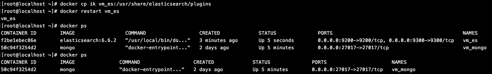

执行`docker logs vm_es`查看`vm_es`容器的日志：


此时，心里真TM一万个草泥马在奔腾。只好`docker rm vm_es`删除镜像，重新创建。

```
[root@localhost ~]# docker run -di --name=vm_es -p 9200:9200 -p 9300:9300 elasticsearch:6.6.2
```

进入到`vm_es`容器内：

```
[root@3e01ce5eb235 elasticsearch]# cd plugins 
[root@3e01ce5eb235 plugins]# ls -la 
total 0
drwxr-xr-x. 4 elasticsearch root  51 Mar  6 15:19 .
drwxrwxr-x. 1 elasticsearch root  44 Mar  6 15:20 ..
drwxr-xr-x. 2 elasticsearch root 264 Mar  6 15:19 ingest-geoip
drwxr-xr-x. 2 elasticsearch root 114 Mar  6 15:19 ingest-user-agent
```

此时看到`vm_es`内部文件夹的访问权限如上，但是查看自己上传的`ik`文件夹的权限：

```
[root@localhost ~]# ls -la
drwx------.  3 root root  243 3月  20 09:44 ik
```

明显发现权限不对，于是修改`ik`文件夹的访问权限：

```
[root@localhost ~]# chmod a+x+r ik
[root@localhost ~]# ls -la
drwx--x--x.  3 root root  243 3月  20 09:44 ik
```

然后再拷贝到Docker内ES容器`plugins`目录下，重启ES，启动成功。


# 连接远程ElasticSearch服务

上面在远程服务器Docker上部署了ElasticSearch服务，下面我们可以测试用`spring-data-elasticsearch`连接远程ES服务。

## 修改配置文件

```yaml
spring:
  data:
    elasticsearch:
      # cluster-nodes: 127.0.0.1:9300
      cluster-nodes: 192.168.160.128:9300
      cluster-name: docker-cluster
```

注意，和本地ES服务不同的除了要修改`cluster-nodes`对应的IP地址，还要指定`cluster-name`，如何查看远程ES服务的`cluster-name`值呢？

> 进入到远程Docker的ES服务中

```
[root@localhost /]# docker exec -it vm_es /bin/bash
```

这个`vm_es`是我创建的ES服务名称。

然后会进入到Docker中ES安装文件地址：

```
[root@localhost /]# docker exec -it vm_es /bin/bash
[root@bcf04318cdab elasticsearch]# ls
LICENSE.txt  NOTICE.txt  README.textile  bin  config  data  lib  logs  modules  plugins
```

> 进入到`config/`文件夹下，编辑配置文件`elasticsearch.yml`

```
我这里测试的可以直接通过`vi`命令编辑

[root@bcf04318cdab elasticsearch]# cd config
[root@bcf04318cdab config]# vi elasticsearch.yml
```

就能看到此ES服务的`cluster-name`值

## 测试

执行配置文件中的`save`方法，测试添加功能。

