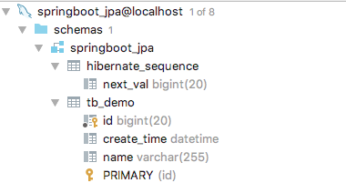
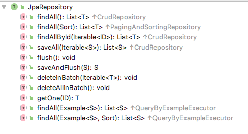
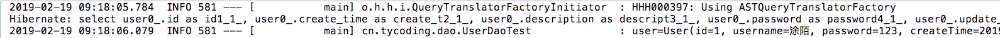
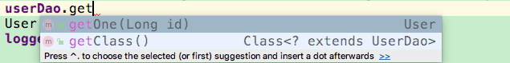
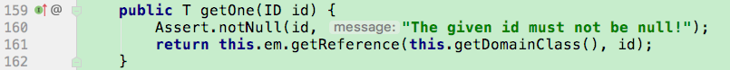
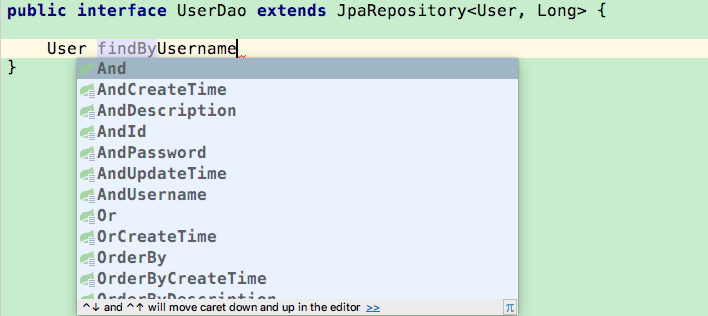

# spring-boot 整合 JPA

> Jpa(Java Persistence API)是一套规范，而Hibernate是基于Jpa实现的一套产品

# 准备

## 引入依赖

首先你需要创建一个Maven项目，并且在`pom.xml`中引入JPA依赖：

```xml
<dependency>
    <groupId>org.springframework.boot</groupId>
    <artifactId>spring-boot-starter-data-jpa</artifactId>
</dependency>
```

## 配置参数

由于使用了spring-boot开发，spring-boot能够减轻我们在XML文件中繁琐的配置，因此在spring-boot中配置JPA也格外简单

> 修改`application.yml`

（注意：新创建的spring-boot项目（使用`start.spring.io`还是IDE），默认在`resources`目录下都会有`application.properties`这个文件，我这里只是把后缀名改了。

```yaml
spring:
  datasource:
    url: jdbc:mysql://localhost:3306/springboot_jpa?characterEncoding=utf-8
    username: root
    password: root
    driver-class-name: com.mysql.cj.jdbc.Driver

  jpa:
    show-sql: true
    hibernate:
      dialect: org.hibernate.dialect.MySQL5Dialect
```

注意一点：`datasource`下的`url`数据库连接在`数据库名`后面一定要拼接`?characterEncoding=utf-8`，目的是避免调用JPA的方法存入数据库中的数据**中文乱码**

## 初始化数据库

在上面已经说到，`jpa`是一套规范，而如`hibernate`仅是基于`jpa`的一套产品。可能大家在学习hibernate的时候就知道hibernate可以根据`Entity`属性自动创建数据库，当然JPA也是可以实现的。

> 若要使用JPA自动生成表结构，修改`application.yml`

```yaml
spring:
  datasource:
    url: jdbc:mysql://127.0.0.1/springboot_jpa?useUnicode=true&characterEncoding=utf-8&serverTimezone=UTC&useSSL=true
    username: root
    password: root
    driver-class-name: com.mysql.cj.jdbc.Driver

  jpa:
    show-sql: true
    hibernate:
      dialect: org.hibernate.dialect.MySQL5Dialect
      ddl-auto: update
```

注意区分`.properties`文件的配置，在`application.,properties`中应该如下配置：

```properties
spring.datasource.url=jdbc:mysql://127.0.0.1/springboot_jpa?useUnicode=true&characterEncoding=utf-8&serverTimezone=UTC&useSSL=true
spring.datasource.username=root
spring.datasource.password=root
spring.datasource.driver-class-name=com.mysql.jdbc.Driver

spring.jpa.properties.hibernate.hbm2ddl.auto=update
spring.jpa.properties.hibernate.dialect=org.hibernate.dialect.MySQL5InnoDBDialect
spring.jpa.show-sql= true
```

**注意**，JPA不能自动帮你创建数据库，你要手动创建。

当然，如果你想手动创建表结构，就不要配置`auto=update`，并且下面有关的一些注解也就不用加了。

### 自动生成表结构

若要使用Spring-data-jpa自动生成表结构，需要：

> 1.修改配置文件（已完成了

```properties
spring.jpa.properties.hibernate.hbm2ddl.auto=update
```

`update`: 如果修改了Entity，重启项目，表结构会自动更新

> 2.创建Entity

测试用例，我们创建`Demo.java`

```java
@Data
@Entity
@Table(name = "tb_demo")
public class Demo implements Serializable {

    @Id
    @GeneratedValue
    private Long id;

    private String name;
    @Column(name = "create_time")
    private Date createTime;
}
```

| annotation | tips |
| :--- | :--- |
| @Data | Lomback的注解，需要导入lomback依赖，用于自动生成getter/setter/toString |
| @Entity | 来自`javax.persistence.*`，标记改类为Entity |
| @Table | 来自`javax.persistence.*`，该Entity对应的表名，`name`指定了表名，默认为当前Entity名的小写 |
| @Id | 来自`javax.persistence.*`，标记该字段为数据表主键Id |
| @GeneratedValue | 来自`javax.persistence.*`，标记该主键生成策略，默认递增，不配置该注解，insert数据必须手动指定id值 |
| @Column | 来自`javax.persistence.*`，标记该字段的具体数据库表字段名，`name`具体字段名 |

如果你想要Entity中的某个属性不被识别为表字段，可以用`@Transient`注解标记。

如上已经完成了配置，下面直接启动项目的`main`方法，数据表`demo`会自动生成，


发现莫名其妙的创建了一个表：`hibernate_sequence`



避免自动创建`hibernate_sequence`表，修改之前的`Test.entity`主键自增策略:

```java
@Id
@GeneratedValue(strategy = GenerationType.IDENTITY)
private Long id;
```

### 坑

**But**，细心的你会发现，Entity中定义的字段顺序和JPA生成的表字段顺序不同，JPA生成的表中按照字段首字母排序：


所以，坑，暂时没有解决，应该是Hibernate自身问题。

# 开始

## 创建User.java

```java
@Data
@Entity
@Table(name = "user")
public class User implements Serializable {

    @Id
    @GeneratedValue(strategy = GenerationType.IDENTITY)
    private Long id;
    private String username;
    private String password;

    @Column(name = "create_time")
    private Date createTime;

    @Column(name = "update_time")
    private Date updateTime;

    @Lob
    @Basic(fetch = FetchType.LAZY)
    @Column(columnDefinition = "text")
    private String description;
}
```

| annotation | tips |
| :--- | :--- |
| @Column(name = "create_time") | 定义此字段的字段名是`create_time`，`java.util.Date`类型默认生成`datetime`类型(mysql) |
| @Lob | 来自`javax.persistence.*`，被标记的字段根据`get`方法返回值不同，自动进行Clob和Blob类型转换，目的是生成`text`这种大数据 |
| @Basic(fetch = FetchType.LAZY) | 通常和`@Lob`一起使用，因为`@Lob`标记的字段数据量大，用`@Basic`规定懒加载，提高访问速度 |
| @Column(columnDefinition = "text") | 规定具体生成的表字段类型为`text` |

如果想要实现类似：

```sql
`create_time` timestamp NULL DEFAULT CURRENT_TIMESTAMP COMMENT '创建时间', 
`update_time` timestamp NULL DEFAULT CURRENT_TIMESTAMP ON UPDATE CURRENT_TIMESTAMP,
```

这种字段定义的实现：`create_time`根据自动封装创建时间、`update_time`自动更新为最新操作的时间。需要进行如下操作：

> 1.修改Entity

```java
@CreatedDate
@Column(name = "create_time")
private Date createTime;

@LastModifiedDate
@Column(name = "update_time")
private Date updateTime;
```

> 2.在Entity类上添加注解

```java
@EntityListeners(AuditingEntityListener.class)
public class User implements Serializable { ... }
```

> 3.在spring-boot启动类上添加注解：

```java
@EnableJpaAuditing
public class SpringBootJpaApplication { ... }
```

以上3步，虽然生成的的`create_time`和`update_time`仍是简单的`datetime`限定，但是使用JPA进行create、update的时候该字段会自动添加、更新。

## 创建UserDao.java

```java
public interface UserDao extends JpaRepository<User, Long> {  }
```

可能你会见到有的案例中`extends CrudRepository<T, ID>`等，其实都是可以的，翻看源码就知道，继承`JpaRepository`也可以使用`CrudRepository`的方法：


**注意**`JpaRepository<T, ID>`，要指定泛型类型，否则Spring注入这个Bean的时候发现该Bean泛型类型不定而注入失败。

下面我们看一下`JpaRepository`中提供的方法：



`CrudRepository`:


顾名思义，看了方法名应该就知道这个方法的具体作用了。

## 创建UserDaoTest.java

使用Idea的话，在`UserDao.java`接口名前按`Alt + Enter`键(mac)，快速生成测试类`UserDaoTest.java`

```java
@SpringBootTest
@RunWith(SpringRunner.class)
public class UserDaoTest {
    private Logger logger = LoggerFactory.getLogger(this.getClass());

    @Autowired
    private UserDao userDao;
}
```

# CRUD

## findAll

先插入一条记录：

```sql
insert into `user`values(1, '2019-01-19 00:00:00', '测试用例', '123', '2019-01-18 00:00:00', '涂陌');
```

```java
//查询所有
@Test
public void testFindAll() {
    List<User> list = userDao.findAll();
    list.forEach(user -> {
        logger.info("user={}", user);
    });
}
```

`list.forEach(i -> {})`是JDK8新特性



## findById

根据`Id`主键查询：

```java
//根据ID查询
@Test
public void testFindById() {
    User user = userDao.findById(1L).get();
    logger.info("user={}", user);
}
```


`findById`得到一个`Optional`对象，通过`.get()`可获取到其中封装的`User`对象。

**But**

还要一个方法：



看似`getOne()`刚好返回一个`User`对象，但是查询`getOne()`方法的实现：



可以看到这个方法其实返回一个`reference`代理对象，并不是真正的`User`对象，所以，如果你调用：

```java
User user = userDao.getOne(1L)
```

会报错：`org.hibernate.LazyInitializationException - no Session`

## 动态查询

很多时候需要动态拼接查询条件，实现条件查询，那么

```java
//动态查询。根据某个字段查询
@Test
public void testFindByExample() {
    User user = new User();
    Example<User> example = Example.of(user);
    user.setUsername("tycoding");
    List<User> list = userDao.findAll(example);
    list.forEach(u -> {
        logger.info("user={}", u);
    });
}
```

可通过构建`Example`进行查询条件的限定

## Save

```java
@Test
public void testSave() {
    User user = new User();
    user.setUsername("测试");
    user.setPassword("测试");
    userDao.save(user);
    List<User> list = userDao.findAll();
    list.forEach(u -> {
        logger.info("user={}", u);
    });
}
```

## Update

```java
@Test
public void testUpdate() {
    User user = new User();
    user.setId(1L);
    user.setUsername("涂陌呀");
    userDao.save(user);
    logger.info("user={}", userDao.findById(user.getId()).get());
}
```

如上，进行更新和保存的操作都可以调用`save()`操作，并且，如果`Id`字段有值，那么jpa就默认识别为更新操作，否则为新增操作。

## Delete

```java
@Test
public void testDelete() {
    User user = new User();
    user.setId(4L);
    userDao.delete(user);
    //userDao.deleteById(4L);
}
```

# 自定义简单查询

自定义简单查询就是根据方法名自动生成SQL。前面是用JPA内置的方法进行简单的CRUD，下面可以自定义方法名实现自定义SQL：

主要语法是：`findByXX`,`readByXX`,`queryByXX`,`countByXX`。`XX`代表属性名，如：


```java
User findByUsername(String username);
```

或者加一些关键字：



```java
User findByUsernameOrPassword(String username, String password);
```

基本上SQL体系中的关键字在JPA上都有对应的，具体的关键字和使用方法生成的SQL如下表：

| Keyword |	Sample | JPQL snippet
| :--- | :--- | :--- |
| And |	findByLastnameAndFirstname |	… where x.lastname = ?1 and x.firstname = ?2 |
| Or |	findByLastnameOrFirstname |	… where x.lastname = ?1 or x.firstname = ?2 |
| Is,Equals |	findByFirstnameIs,findByFirstnameEquals |	… where x.firstname = ?1 |
| Between |	findByStartDateBetween |	… where x.startDate between ?1 and ?2 |
| LessThan |	findByAgeLessThan |	… where x.age < ?1 |
| LessThanEqual |	findByAgeLessThanEqual |	… where x.age ⇐ ?1 |
| GreaterThan |	findByAgeGreaterThan |	… where x.age > ?1 |
| GreaterThanEqual |	findByAgeGreaterThanEqual |	… where x.age >= ?1 |
| After |	findByStartDateAfter |	… where x.startDate > ?1 |
| Before |	findByStartDateBefore |	… where x.startDate < ?1 |
| IsNull |	findByAgeIsNull |	… where x.age is null |
| IsNotNull,NotNull |	findByAge(Is)NotNull |	… where x.age not null |
| Like |	findByFirstnameLike |	… where x.firstname like ?1 |
| NotLike |	findByFirstnameNotLike |	… where x.firstname not like ?1 |
| StartingWith |	findByFirstnameStartingWith |	… where x.firstname like ?1 (parameter bound with appended %) |
| EndingWith |	findByFirstnameEndingWith |	… where x.firstname like ?1 (parameter bound with prepended %) |
| Containing |	findByFirstnameContaining |	… where x.firstname like ?1 (parameter bound wrapped in %) |
| OrderBy |	findByAgeOrderByLastnameDesc |	… where x.age = ?1 order by x.lastname desc |
| Not |	findByLastnameNot |	… where x.lastname <> ?1 |
| In |	findByAgeIn(Collection ages) |	… where x.age in ?1 |
| NotIn | 	findByAgeNotIn(Collection age) |	… where x.age not in ?1 |
| TRUE |	findByActiveTrue() |	… where x.active = true |
| FALSE |	findByActiveFalse() |	… where x.active = false |
| IgnoreCase |	findByFirstnameIgnoreCase |	… where UPPER(x.firstame) = UPPER(?1) |

# 复杂查询

## 分页查询

之前我们可能常用`Mybatis` + `PageHelper` 实现后端分页效果，而在JPA中，它本身提供了分页查询的方法，如下：

```java
@Test
public void testFindByPage() {
    int pageCode = 1; //当前页
    int pageSize = 3; //每页显示10条记录
    Sort sort = new Sort(Sort.Direction.ASC, "id");
    Pageable pageable = new PageRequest(pageCode, pageSize, sort);
    Page<User> page = userDao.findAll(pageable);
    logger.info("总记录数={}", page.getTotalElements());
    logger.info("总页数={}", page.getTotalPages());
    logger.info("记录={}", page.getContent());
}
```

**注意**，之前在用`PageHelper`的时候，默认第一页是`1`，这样查询出来就是数据库第一页的内容。**But**，使用了JPA发现它的页码是从`0`开始的，也就是说0=第一页、1=第二页...

这和PageHelper差别还是蛮大的，若：数据库一共两条记录，你查询`new PageRequest(1,3)`得到的`content`是`[]`

## 自定义SQL查询

```java
@Test
public void testFindByPassword() {
    User user = userDao.findByPassword("123");
    logger.info("user={}", user);
}
```

**UserDao.java**

```java
public interface UserDao extends JpaRepository<User, Long> {

    @Query("select u from User u where u.password = ?1")
    User findByPassword(String s);
}
```

使用自定义SQL查询用`@Query(sql)`即可，如果涉及更新、添加、删除（事务）操作需要再添加`@Modifying`注解。也可以根据需要添加`@Transactional`注解对事务的支持和、查询超时的设置等。

```java
@Test
public void testDeleteByPassword() {
    userDao.deleteByPassword("123");
    User user = userDao.findByPassword("123");
    logger.info("user={}", user);
}
```

**UserDao.java**

```java
public interface UserDao extends JpaRepository<User, Long> {

    @Query("select u from User u where u.password = ?1")
    @Transactional(timeout = 10)
    User findByPassword(String s);

    @Query("delete from User where password = ?1")
    @Modifying
    @Transactional
    void deleteByPassword(String s);
}
```

## 多表查询

实在想吐槽，JPA这样对多表查询的支持太差了，**多表查询**就必须手动写SQL，然后放在`@Query`注解中，这样SQL真的很难看，而且需要额外遵循JPA的规范。

## 其他

JPA官方规定数据表必须有主键（id），而之前权限管理项目中一些关联表（用户角色关联表）是不需要主键的，但如果使用JPA就必须配置主键，不管你用不用。

[](https://en.wikibooks.org/wiki/Java_Persistence/Identity_and_Sequencing#No_Primary_Key)