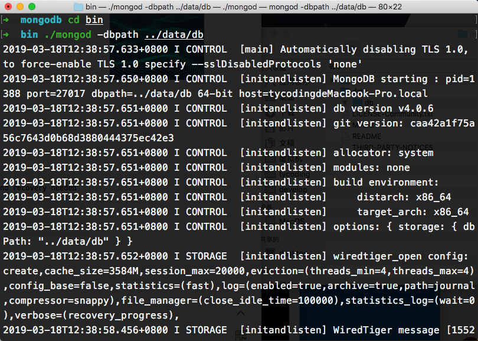
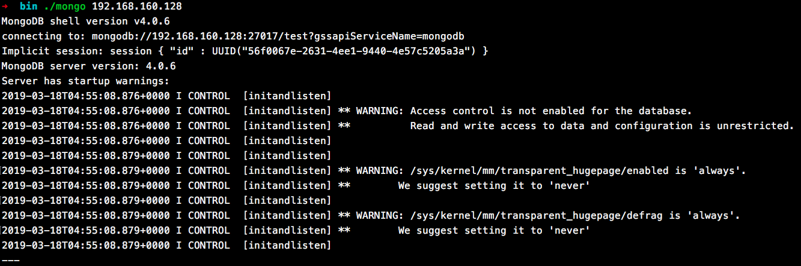

# 准备工作

## docker环境


在VMware虚拟机上搭建docker环境。

## 拉取mongo镜像

```
docker pull mongo
```

## 创建mongo服务

```
docker run -di --name=vm_mongo -p 271017:271017 mongo 
```

此时，远程服务器上的mongodb服务已经启动。

# 下载mongo

[mongodb官网下载mongo](https://www.mongodb.com/download-center/community)。下载解压后有如下文件：


> 1.重命名文件`mongodb-osx-x86_64-4.0.6` - `mongodb`

> 2.在`mongdb`文件夹下创建`data/db`两个子文件夹


# 启动

## 启动本地mongo服务

使用命令行（Linux/MacOS）进入刚才下载的`mongodb/bin`文件夹。

> 指定mongodb数据库文件地址

也就是让`mongodb`使用我们刚才创建的`data/db`文件夹作为默认的数据库启动路径

```
./mongod -dbpath ../data/db
```



如图，就会出现一堆代码，这就表明本地的mongo服务已经启动。连接本地mongo服务：

```
./mongo
```


如上就成功连接了本地的`mongodb`服务，可以直接键入命令实现操作`mongodb`数据库。

# 连接远程mongo服务

刚才我们在VMware上安装了mongodb的docker镜像，并启动了mongo服务，那么可以直接在本地mongo客户端中连接远程的mongo服务。

> 进入到本地`mongodb/bin`目录下

```
./mongo ip
```



注意，`ip`是我们远程CentOS虚拟机的ip地址，可以通过`ip addr`命令查看。

