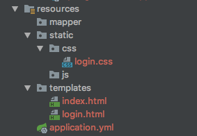

# Spring Boot整合Shiro

**写在前面**

之前有写过SSM整合Shiro的示例：[SSM权限管理示例](https://github.com/TyCoding/shiro)

而在Spring Boot中使用Shiro，就是需要把之前SSM的XML配置转换成Java代码配置，下面我举例用Spring Boot2.x + Shiro实现登录认证。

## 导入依赖

```xml
<!-- shiro -->
<dependency>
    <groupId>org.apache.shiro</groupId>
    <artifactId>shiro-spring</artifactId>
    <version>1.4.0</version>
</dependency>
```

由于Shiro本身并没有提供缓存实现，这里使用Shiro官方支持的`ehcache`缓存：

**Ehcache**:

```xml
<!-- ehcache缓存 -->
<dependency>
    <groupId>org.apache.shiro</groupId>
    <artifactId>shiro-ehcache</artifactId>
    <version>1.4.0</version>
    <exclusions>
        <exclusion>
            <groupId>org.apache.shiro</groupId>
            <artifactId>shiro-core</artifactId>
        </exclusion>
    </exclusions>
</dependency>
```

如果你想用`Redis`缓存，可以用这个封装好的插件：

**Shiro-redis**

```xml
<dependency>
    <groupId>org.crazycake</groupId>
    <artifactId>shiro-redis</artifactId>
    <version>2.4.2.1-RELEASE</version>
</dependency>
```

## 修改`application.yml`

```yaml
  datasource:
    name: springboot
    type: com.alibaba.druid.pool.DruidDataSource
    #druid相关配置
    druid:
      #mysql驱动
      driver-class-name: com.mysql.cj.jdbc.Driver
      #基本属性
      url: jdbc:mysql://127.0.0.1:3306/springboot_shiro?useUnicode=true&characterEncoding=UTF-8
      username: root
      password: root
```

更多的配置请看该项目下`src/main/resources/application.yml`

## 初始化数据库

```sql
-- create database springboot_shiro charset utf8;

DROP TABLE IF EXISTS `user`;

CREATE TABLE `user` (
  `id` int(11) NOT NULL AUTO_INCREMENT COMMENT '主键',
  `username` varchar(255) DEFAULT NULL COMMENT '用户名',
  `password` varchar(255) DEFAULT NULL COMMENT '密码',
  PRIMARY KEY (`id`)
) ENGINE=InnoDB AUTO_INCREMENT=2 DEFAULT CHARSET=utf8;
```

## 创建`ShiroConfig.java`

如之前在SSM整合Shiro框架时，Shiro的基础配置一般有如下：

* `SecurityManager`： 安全管理器，Shiro的核心

* `Realm`: Shiro从Realm中获取验证数据

* `SessionManager`: 会话管理

* ...

于是，我们就大概知道`ShiroConfig.java`中大概需要配置什么信息了：

```java
@Configuration
public class ShiroConfig {

    @Bean
    public ShiroFilterFactoryBean shiroFilterFactoryBean(SecurityManager securityManager) {
        ShiroFilterFactoryBean filterFactoryBean = new ShiroFilterFactoryBean();
        filterFactoryBean.setSecurityManager(securityManager);
        filterFactoryBean.setLoginUrl("/login");

        //自定义拦截器链
        Map<String, String> filterChainDefinitionMap = new LinkedHashMap<>();
        filterChainDefinitionMap.put("/logout", "logout");
        filterChainDefinitionMap.put("/login", "anon");

        //静态资源，对应`/resources/static`文件夹下的资源
        filterChainDefinitionMap.put("/css/**", "anon");
        filterChainDefinitionMap.put("/js/**", "anon");
        filterChainDefinitionMap.put("/lib/**", "anon");

        //其他请求一律拦截，一般放在拦截器链的最后
        //区分`user`和`authc`拦截器区别：`user`拦截器允许登录用户和RememberMe的用户访问
        filterChainDefinitionMap.put("/**", "user");

        filterFactoryBean.setFilterChainDefinitionMap(filterChainDefinitionMap);
        return filterFactoryBean;
    }

    @Bean
    public Realm realm() {
        return new AuthRealm();
    }

    @Bean
    public SecurityManager securityManager() {
        DefaultWebSecurityManager securityManager = new DefaultWebSecurityManager();
        securityManager.setRealm(realm());
        securityManager.setSessionManager(sessionManager());
        return securityManager;
    }

    @Bean
    public SessionManager sessionManager() {
        DefaultWebSessionManager sessionManager = new DefaultWebSessionManager();
        sessionManager.setGlobalSessionTimeout(60 * 60 * 10); //10分钟
        sessionManager.setSessionDAO(new EnterpriseCacheSessionDAO());
        return sessionManager;
    }
}
```

## 自定义Realm实现

上面是一个最基本的Shiro环境配置，其实这个XML中配置基本雷同的，相信你也发现了。

下面进行第二部：自定义Realm实现，创建`AuthRealm.java`

```java
public class AuthRealm extends AuthorizingRealm {

    @Autowired
    private UserService userService;

    /**
     * 权限校验相关
     *
     * @param principalCollection
     * @return
     */
    @Override
    protected AuthorizationInfo doGetAuthorizationInfo(PrincipalCollection principalCollection) {
        return null;
    }

    /**
     * 身份认证相关
     *
     * @param authenticationToken
     * @return
     * @throws AuthenticationException
     */
    @Override
    protected AuthenticationInfo doGetAuthenticationInfo(AuthenticationToken authenticationToken) throws AuthenticationException {
        /**
         * 1. 从Token中获取输入的用户名密码
         * 2. 通过输入的用户名查询数据库得到密码
         * 3. 调用Authentication进行密码校验
         */

        //获取用户名密码
        String username = (String) authenticationToken.getPrincipal();
        String password = new String((char[]) authenticationToken.getCredentials());

        User user = userService.findByUsername(username);
        if (user == null) {
            throw new UnknownAccountException();
        }
        if (!password.equals(user.getPassword())) {
            throw new IncorrectCredentialsException();
        }
        return new SimpleAuthenticationInfo(user, password, getName());
    }
}
```

对于自定义`Realm`实现，我们仅需要继承`AuthorizingRealm`，看源码发现：

```java
public abstract class AuthorizingRealm extends AuthenticatingRealm implements Authorizer, Initializable, PermissionResolverAware, RolePermissionResolverAware {}
```

继承了一个抽象类，就应该实现重写它的抽象方法：

```java
protected abstract AuthorizationInfo doGetAuthorizationInfo(PrincipalCollection var1);

protected abstract AuthenticationInfo doGetAuthenticationInfo(AuthenticationToken var1) throws AuthenticationException;
```

* `AuthorizationInfo`用于权限校验
* `AuthenticationInfo`用于身份验证

# 案例

上面配置好了Shiro环境，下面我们实践一下。

> 创建`index.html`和`login.html`两个页面：



> 创建`LoginController.java`，编写路由导航地址

```java
@Controller
public class LoginController {
    private Logger logger = LoggerFactory.getLogger(this.getClass());

    /**
     * 首页地址
     *
     * @return
     */
    @GetMapping(value = {"/", "/index"})
    public String index() {
        return "index";
    }

    /**
     * 登录地址
     *
     * @return
     */
    @GetMapping("/login")
    public String login() {
        return "login";
    }
}
```

**注意**几点：

* `@Controller`用来告诉Spring这是个处理HTTP请求的控制器。
* `@RestController`是`@ResponseBody`和`@Controller`的组合，被标记的控制器类所有`return`数据都自动封装为JSON格式。
* `@GetMapping`标记该请求是Get请求，如果用Post请求则会报错no support

启动项目，在浏览器上访问`localhost:8080`或者`localhost:8080/index`发现页面均会跳转到`/login`这个请求上：


细心地你会发现请求地址中可能会拼接一个`JSESSIONID`，并且所有的的请求中均会携带一个`Cookie= JSESSIONID`。这其实是Shiro用于身份验证用的，Shiro默认生成一个会话ID，并储存在Cookie中，这样浏览器每次的请求头中都将携带这个Cookie数据，Shiro拦截请求，发现这个Cookie值是有效的会话(Session) ID，就判定这个请求是合法的请求，然后再根据自定义拦截器链决定是否对该请求放行。

## 登录

> 编写一个form表单

```html
<!DOCTYPE html>
<html lang="en" xmlns:th="http://www.thymeleaf.org">
<head>
    <meta charset="UTF-8">
    <title>登录页</title>
    <link rel="stylesheet" th:href="@{/css/login.css}"/>
</head>
<body>

<h1>登录页</h1>

<form method="post" action="/login">
    <input type="text" name="username"/><br/>
    <input type="password" name="password"><br/>
    <input type="submit" value="登录">
</form>

<div class="info" th:text="${info}"></div>

</body>
</html>
```

> 编写后台接口 post `/login`

```java
/**
 * 登录接口
 *
 * @param username 用户名
 * @param password 密码
 * @return 状态信息或成功页面视图地址
 */
@PostMapping("/login")
public String login(String username, String password, Model model) {
    String info = null;

    //封装Token信息=用户名+密码
    UsernamePasswordToken token = new UsernamePasswordToken(username, password);
    //获取Shiro Subject实例
    Subject subject = SecurityUtils.getSubject();
    try {
        subject.login(token);
        info = String.valueOf(subject.isAuthenticated());
        model.addAttribute("info", "登录状态 ==> " + info);
        return "/index";
    } catch (UnknownAccountException e) {
        e.printStackTrace();
        info = "未知账户异常";
    } catch (AuthenticationException e) {
        e.printStackTrace();
        info = "账户名或密码错误";
    } catch (Exception e) {
        e.printStackTrace();
        info = "其他异常";
    }
    model.addAttribute("info", "登录状态 ==> " + info);
    logger.info("登录状态 ==> {}", info);
    return "/login";
}
```

如上，前台form表单中的`action="/login"`和`method="post"`决定了请求走这个地址，通过调用`subject.login(token)`，Shiro自动查询Realm实现，于是找到我们自定义的Realm实现：`AuthRealm`，进而通过`SimpleAuthenticationInfo`方法验证了登录用户的身份，如果身份认证成功，就`return "/index"`，否则就`return "/login"`。

**注**

上面出现了两个`/login`接口：

```java
@GetMapping("/login")
public String login() {
    return "login";
}
```

```java
@PostMapping("/login")
public String login(String username, String password, Model model) {}
```

这里就提现出了`@GetMapping`和`@PostMapping`的优势，利用Java的方法重载创建了两个名称相同的接口，但是根据HTTP请求方法的不同（Get还是Post）会自动寻找对应的映射方法。


## 结

更多的Shiro特性可以参看我的这个项目：[SSM权限管理示例](https://github.com/TyCoding/shiro)

同时推荐大家阅读张开涛老师的：[跟我学Shiro](https://jinnianshilongnian.iteye.com/blog/2018398)