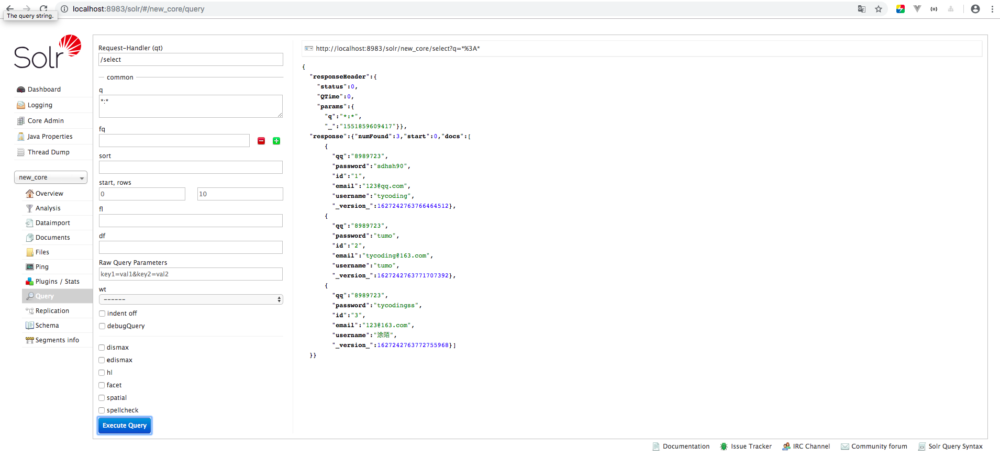
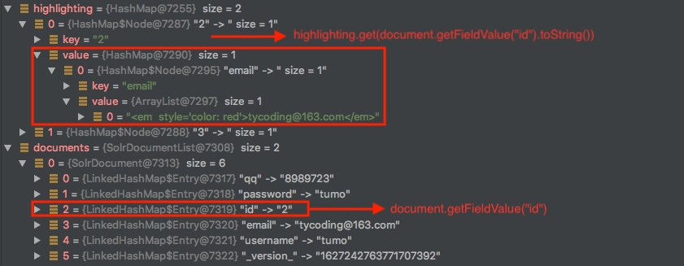
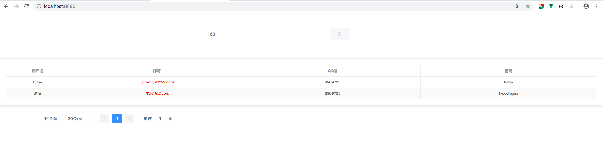
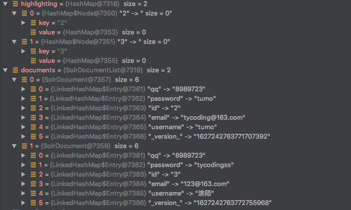
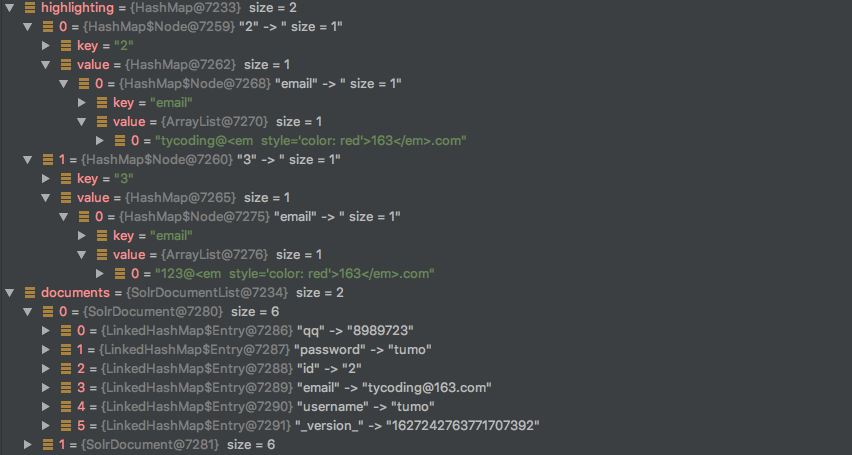

# Solr 踩坑记！

# Spring Boot整合Solr

**写在前面**

在之前我就写过一篇文档：[Solr及Spring-Data-Solr入门学习](https://tycoding.cn/2018/09/24/solr/)，这篇文章其实来自于我学习黑马项目时写的笔记，其中用的版本都比较老。而最近这两天一直在研究Solr，发现还是老版本好用（坑

而今天既然学spring-boot，发现万能的spring-boot自己又对`spring-data-solr`进行了封装简化：`spring-boot-starter-data-solr`，今天就来学习一下。

之前我使用SSM项目写了一个ssm-solr的项目，如果你想看SSM项目中如何整合Solr，可以参考这个项目：[ssm-redis-solr](https://github.com/TyCoding/ssm-redis-solr) 

**欢迎star, fork**

## 安装

如果你阅读过我的这篇文章：[Solr及Spring-Data-Solr入门学习](https://tycoding.cn/2018/09/24/solr/)。会发现其中是将下载的solr source再提取出来放到tomcat容器中，过程比较复杂，也遇到很多坑，我自己再尝试将solr放到tomcat容器中也遇到很多很多的问题。**但**，[Solr官网](http://www.apache.org/dyn/closer.lua/lucene/solr/7.7.1)提供的源码其实已经将Solr放在了Jetty容器中，我们只需要通过命令运行Jetty容器也依然可以访问Solr。

**So**，我这里推荐使用Solr自带的Jetty容器运行Solr，详细的安装文档请看：

[手摸手教你部署Solr-7.7.1](https://tycoding.cn/2019/03/05/solr-server/)

如果安装完成，启动Solr服务器，浏览器访问Solr-Admin主页，先吧数据库中的数据导入到Solr中，上面链接的文档中已经介绍了。如果你查询到了这些数据，证明Solr安装成功：



## 配置

按照 [手摸手教你部署Solr-7.7.1](https://tycoding.cn/2019/03/05/solr-server/) 这篇文章中部署好的服务器，我们可以着手创建springboot_solr项目了。

> 修改`application.yml`

```yaml
spring:
  data:
    solr:
      host: http://127.0.0.1:8983/solr/new_core
```

其中就是solr服务器的连接URL，这个路径并不是可以直接访问的，在Solr-Admin中访问`new_core`的URL地址是：`http://localhost:8983/solr/#/new_core/query`，而实际的请求地址就是`http://127.0.0.1:8983/solr/new_core`了。

### 创建Entity

首先，创建Search.java:

```java
public class Search implements Serializable {

    @Field
    @Id
    private Long id;
    @Field
    private String username;
    @Field
    private String email;
    @Field
    private String qq;
    @Field
    private String password;
    //省略getter/setter
}
```

因为我们在`solr-7.7.1/server/solr/new_core/conf/managed-schema`和`db-data-config.xml`中定义了solr和MySQL关联的配置，那么想要操控Solr数据库，就必须保证：

Solr字段约束=MySQL表字段=Entity属性

其中的`@Field`注解来自`org.apache.solr.client.solrj.beans.Field`，用于将Solr字段和Entity字段进行匹配。若名称相同直接加`@Field`，若不同加`@Field("name")`

---

> **本文中采用两种方式实现Solr的查询功能，这两种方式各自有坑，请注意！**

---

## SolrQuery

Solr提供最基本的方式就是用SolrClient完成对Solr的操作，那么必然要用`org.apache.solr.client.solrj.SolrQuery`进行查询条件封装，下面我们就用`SolrQuery`类进行操作。

### 最基本的查询

使用`SolrQuery`完成一个最基本的查询，创建测试类：`SolrQuerySearchServiceTest`：

* 1. 注入SolrClient类
* 2. 构建查询类
* 3. 封装查询条件
* 4. 查询
* 5. 从response中获取查询结果
* 6. 打印查询结果

```java
@SpringBootTest
@RunWith(SpringRunner.class)
public class SolrQuerySearchServiceTest {
    private Logger logger = LoggerFactory.getLogger(this.getClass());

    //1. 注入SolrClient类
    @Autowired
    private SolrClient solrClient;

    @Test
    public void search() {
        //2. 构建查询类
        SolrQuery query = new SolrQuery();

        //3. 封装查询条件，在solr中对应: localhost:8983/solr/new_core/select?q=keyword:*:*
        query.set("q", "keyword:*");

        try {
            //4. 查询，获取response响应数据
            QueryResponse response = solrClient.query(query);

            //5. 从response中获取查询结果
            SolrDocumentList documents = response.getResults();

            //6. 打印查询结果
            documents.forEach(document -> {
                logger.info("id={} --> username={}", document.getFieldValue("id"), document.getFieldValue("username"));
            });
        } catch (Exception e) {
            e.printStackTrace();
        }
    }
}
```

### 分页查询

通过设置`setStart()`：从哪一行开始；设置`setRows()`：查询到第几行结束，来实现分页查询。

注意：我们常用pageHelper进行数据库的分页查询，但是那里是：起始**页** --> 查询多少条记录。而在solr中起始查询的是记录，从**0**开始的。

```java
query.setStart(current);
query.setRows(rows);
```

上面两段配置在solr中实际的构建的渲染条件：

`http://localhost:8983/solr/new_core/select?start=0&rows=20`

### 高亮查询

高亮查询是**最坑的**，主要有涉及以下几个过程：

* 1.查询时构建高亮查询条件，并且限定需要高亮匹配的字段。

* 2.从response查询数据中获取被高亮的集合，类似：`[{id: 'xx', field: '<em>xx</em>'}]` 这样的结构，`field`对应的数据是被标记高亮的。

* 3.根据限定的高亮字段匹配高亮集合中对应标记高亮的数据。

* 4.遍历response中返回的总数据集合，将高亮集合中的标记的高亮数据**替换**掉原未高亮的数据，于是，就实现了高亮。

> 1.构建查询条件

```java
//高亮配置
String[] lightNames = {"username", "email", "qq"}; //设置需要高亮的域
query.setParam("hl", "true");
query.setParam("hl.fl", lightNames);
query.setHighlightSimplePre("<em  style='color: red'>");
query.setHighlightSimplePost("</em>");
```

这些条件在solr中实际查询的URL是：

```
http://localhost:8983/solr/new_core/select?start=0&rows=20&hl=true&hl.fl=username&hl.fl=email&hl.fl=qq&hl.simple.pre=<em+style=%27color:red%27>&hl.simple.post=</em>
```

> 2.从response查询数据中获取被高亮的集合，类似：`[{id: 'xx', field: '<em>xx</em>'}]` 这样的结构，`field`对应的数据是被标记高亮的。

```java
QueryResponse response = solrClient.query(query);
//获取被高亮的数据集合，其中的数据结构类似：[{id: "123", field: "<em>xxx</em>"}]
Map<String, Map<String, List<String>>> highlighting = response.getHighlighting();
```

`highlighting`数据结构：


> 3.根据限定的高亮字段匹配高亮集合中对应标记高亮的数据。

```java
QueryResponse response = solrClient.query(query);
//获取被高亮的数据集合，其中的数据结构类似：[{id: "123", field: "<em>xxx</em>"}]
Map<String, Map<String, List<String>>> highlighting = response.getHighlighting();
SolrDocumentList documents = response.getResults(); //获取匹配结果
long numFound = documents.getNumFound(); //获取匹配的数据个数
if (numFound != 0) {
    for (SolrDocument document : documents) {
        //documents中存放了匹配的所有数据（未高亮），而highlighting中存放了高亮匹配的数据（高亮）
        //通过id主键获取到id值，在highlighting中通过id值获取对应的高亮数据
        Map<String, List<String>> listMap = highlighting.get(document.getFieldValue("id").toString());
    }
}
```

首先，我们看一下查询原始数据结构`documents`:


可以看到这些数据是原始数据，并未高亮。而`document.getFieldValue("id")`就是获取到id值。

而`highlighting.get(document.getFieldValue("id").toString())`就是根据id从高亮集合中获取对应的高亮字段和值，也就是：



> 4.遍历response中返回的总数据集合，将高亮集合中的标记的高亮数据**替换**掉原未高亮的数据

```java
 String[] fields = {"username", "email", "qq", "password"}; //设置solr中定义的域

//高亮配置
String[] lightNames = {"username", "email", "qq"}; //设置需要高亮的域
query.setParam("hl", "true");
query.setParam("hl.fl", lightNames);
query.setHighlightSimplePre("<em  style='color: red'>");
query.setHighlightSimplePost("</em>");

/**
 * 设置查询关键字的域
 * 一般对应solr中的复制域(<copyFiled>)。
 * 因为用户查询的数据不确定是什么，定义在复制域中的字段，Solr会自动进行多字段查询匹配
 */
query.set("q", "keyword:*" + keyword + "*"); //在Solr中查询语句：/select?q=keyword:xxx

QueryResponse response = solrClient.query(query);
//获取被高亮的数据集合，其中的数据结构类似：[{id: "123", field: "<em>xxx</em>"}]
Map<String, Map<String, List<String>>> highlighting = response.getHighlighting();
SolrDocumentList documents = response.getResults(); //获取匹配结果
long numFound = documents.getNumFound(); //获取匹配的数据个数
if (numFound != 0) {
    List<Object> entityList = new ArrayList<>();
    for (SolrDocument document : documents) {
        //documents中存放了匹配的所有数据（未高亮），而highlighting中存放了高亮匹配的数据（高亮）
        //通过id主键获取到id值，在highlighting中通过id值获取对应的高亮数据
        Map<String, List<String>> listMap = highlighting.get(document.getFieldValue("id").toString());
        for (int i = 0; i < lightNames.length; i++) {
            if (listMap.get(lightNames[i]) != null) {
                //根据设置的高亮域，将documents中未高亮的域的值替换为高亮的值
                document.setField(lightNames[i], listMap.get(lightNames[i]).get(0));
            }
        }
        Map<String, Object> fieldMap = new HashMap<>();
        for (int i = 0; i < fields.length; i++) {
            fieldMap.put(fields[i], String.valueOf(document.getFieldValue(fields[i])));
        }
        entityList.add(fieldMap);
    }
    return new ResponseCode(entityList, numFound);
} else {
    return new ResponseCode("未搜索到任何结果");
}
```

通过`document.setField()`根据key,value将高亮的数据替换点原始未高亮的数据，实现的效果就是：


通过不断的循环替换，就能将原始未高亮的数据替换为高亮的数据，那么最终在前端页面实现的效果是：



### 结

最终的查询代码如下：

```java
private ResponseCode solrQuerySearch(String keyword, Integer current, Integer rows) {
    if (StringUtils.isEmpty(keyword)) {
        return new ResponseCode("请输入查询内容");
    }
    if (current == 1) {
        current = 0;
    } else {
        current = (current - 1) * rows;
    }
    SolrQuery query = new SolrQuery();
    query.setStart(current);
    query.setRows(rows);
    query.set("wt", "json");
    try {
        String[] fields = {"username", "email", "qq", "password"}; //设置solr中定义的域

        //高亮配置
        String[] lightNames = {"username", "email", "qq"}; //设置需要高亮的域
        query.setParam("hl", "true");
        query.setParam("hl.fl", lightNames);
        query.setHighlightSimplePre("<em  style='color: red'>");
        query.setHighlightSimplePost("</em>");

        /**
         * 设置查询关键字的域
         * 一般对应solr中的复制域(<copyFiled>)。
         * 因为用户查询的数据不确定是什么，定义在复制域中的字段，Solr会自动进行多字段查询匹配
         */
        query.set("q", "keyword:*" + keyword + "*"); //在Solr中查询语句：/select?q=keyword:xxx

        QueryResponse response = solrClient.query(query);
        //获取被高亮的数据集合，其中的数据结构类似：[{id: "123", field: "<em>xxx</em>"}]
        Map<String, Map<String, List<String>>> highlighting = response.getHighlighting();
        SolrDocumentList documents = response.getResults(); //获取匹配结果
        long numFound = documents.getNumFound(); //获取匹配的数据个数
        if (numFound != 0) {
            List<Object> entityList = new ArrayList<>();
            for (SolrDocument document : documents) {
                //documents中存放了匹配的所有数据（未高亮），而highlighting中存放了高亮匹配的数据（高亮）
                //通过id主键获取到id值，在highlighting中通过id值获取对应的高亮数据
                Map<String, List<String>> listMap = highlighting.get(document.getFieldValue("id").toString());
                for (int i = 0; i < lightNames.length; i++) {
                    if (listMap.get(lightNames[i]) != null) {
                        //根据设置的高亮域，将documents中未高亮的域的值替换为高亮的值
                        document.setField(lightNames[i], listMap.get(lightNames[i]).get(0));
                    }
                }
                Map<String, Object> fieldMap = new HashMap<>();
                for (int i = 0; i < fields.length; i++) {
                    fieldMap.put(fields[i], String.valueOf(document.getFieldValue(fields[i])));
                }
                entityList.add(fieldMap);
            }
            return new ResponseCode(entityList, numFound);
        } else {
            return new ResponseCode("未搜索到任何结果");
        }
    } catch (Exception e) {
        e.printStackTrace();
        return new ResponseCode("服务器异常");
    }
}
```

### 坑

#### `q=*xx* and type='string'`

首先我们看下我在solr的`managed-schema`中定义的域如下：

```xml
   <field name="id" type="string" indexed="true" stored="true" required="true" multiValued="false" />  
   <field name="username" type="string" indexed="true" stored="true"/>
   <field name="email" type="string" indexed="true" stored="true"/>
   <field name="qq" type="string" indexed="true" stored="true"/>
   <field name="password" type="string" indexed="true" stored="true"/>

   <field name="keyword" type="text_ik" indexed="true" stored="false" multiValued="true"/>
   <copyField source="username" dest="keyword"/>
   <copyField source="email" dest="keyword"/>
   <uniqueKey>id</uniqueKey>
```

最终渲染效果如图：


看到，实际高亮的是`tycoding@163.com`整个数据，并不是仅高亮`163`这三个字符串。

**但是**，在上面代码中，查询条件是：`http://localhost:8983/solr/new_core/select?q=keyword:*163*`，显然这是模糊查询，`*`匹配0个或多个字符。

关于Solr查询语句可以看 [Solr之精确、匹配、排序、模糊查询](https://blog.csdn.net/yelllowcong/article/details/78709435)

#### `q=xx and type='string'`

如果，我们把查询条件改为：`http://localhost:8983/solr/new_core/select?q=keyword:163`，即不加检索运算符，会怎样呢？

修改代码为：

```java
query.set("q", "keyword:" + keyword)
```



看到高亮集合中虽然有key，但是没有value。那么最终也就没法实现高亮

#### `q=xx and type='text_ik'`

修改solr配置文件`managed-schema`:

```xml
   <field name="username" type="text_ik" indexed="true" stored="true"/>
   <field name="email" type="text_ik" indexed="true" stored="true"/>
```

即让`username`和`email`域使用`text_ik`IK分词器，那么实际的效果：



并且，仅对查询的数据`163`进行了高亮显示


#### `q=*xx* and type='text_ik'`


可以看到，数据被高亮显示了，但是还是整个字段值全被标记高亮。

#### 结

综上，因为IK分词器能将查询数据分词匹配，且类似163,qq,com,cn 这些名词可以直接匹配到并可以精确到具体的字符串高亮显示。但是若solr域定义为`string`类型，就不能使用`*`运算符匹配数据。

可以看下这篇文章：[搜索引擎solr系列---高亮配置及问题总结](https://blog.csdn.net/wohaqiyi/article/details/78264117)


## SolrTemplate

使用`SolrTemplate`就相对简单很多，`org.springframework.data.solr.core.SolrTemplate`是spring-data-solr提供的一个solr模板类，类似spring-data-redis的RedisTemplate，使用SolrTemplate就像使用RedisTemplate或者spring-data-jpa一样方便的操作mysql, nosql数据库，快速实现CRUD业务。

在 [Solr及Spring-Data-Solr入门学习](https://tycoding.cn/2018/09/24/solr/) 一文中我已经详细介绍过了，对应[ssm-redis-solr](https://github.com/TyCoding/ssm-redis-solr)项目，欢迎参考，start,fork。

所以在这里就不再详细介绍，按照上面使用`SolrQuery`的查询，这里使用`SolrTemplate`模板类完成数据查询：

### 创建SolrConfig

> 创建SolrConfig.java

```java
@Configuration
public class SolrConfig {

    @Value("${spring.data.solr.host}")
    private String solrHost;

    @Bean
    public SolrClient solrClient() {
        return new HttpSolrClient.Builder(solrHost).build();
    }

    @Bean
    public SolrTemplate solrTemplate(SolrClient client) {
        return new SolrTemplate(client);
    }
}
```

目的就是根据URL创建SolrClient，并将其注入到SolrTemplate中，以便可以使用SolrTemplate模板类操作Solr数据库。

> 编写Service服务层代码实现

```java
private ResponseCode solrTemplateSearch(String keyword, Integer current, Integer rows) {
    //高亮配置
    HighlightQuery query = new SimpleHighlightQuery();
    String[] fieldNames = {"username", "email", "qq"};
    HighlightOptions highlightOptions = new HighlightOptions().addField(fieldNames); //设置高亮域
    highlightOptions.setSimplePrefix("<em style='color: red'>"); //设置高亮前缀
    highlightOptions.setSimplePostfix("</em>"); //设置高亮后缀
    query.setHighlightOptions(highlightOptions); //设置高亮选项

    if ("".equals(keyword)) {
        return new ResponseCode("请输入查询内容");
    }

    try {
        /**
         * 通过Criteria构建查询过滤条件
         * 其中这里的`keyword`等价于solr core中schema.xml配置的域，且`keyword`是复制域名
         * 因为查询的内容是不确定的，solr提供了复制域实现同时查询多个域中的数据，并返回匹配的结果
         */
        Criteria criteria = new Criteria("keyword");
        //按照关键字查询
        if (keyword != null && !"".equals(keyword)) {
            criteria.contains(keyword);
        }
        query.addCriteria(criteria);

//            //构建查询条件
//            FilterQuery filterQuery = new SimpleFilterQuery();
//            Criteria filterCriteria = new Criteria("field");
//            filterCriteria.contains(keywords);
//            filterQuery.addCriteria(filterCriteria);
//            query.addFilterQuery(filterQuery);

        if (current == null) {
            current = 1; //默认第一页
        }
        if (rows == null) {
            rows = 20; //默认每次查询20条记录
        }
        query.setOffset((long) ((current - 1) * rows)); //从第几条记录开始查询：= 当前页 * 每页的记录数
        query.setRows(rows);

        HighlightPage<Search> page = solrTemplate.queryForHighlightPage("", query, Search.class);
        //循环高亮入口集合
        for (HighlightEntry<Search> h : page.getHighlighted()) {
            Search search = h.getEntity(); //获取原实体类
            if (h.getHighlights().size() > 0) {
                h.getHighlights().forEach(light -> {
                    if (search.getUsername().contains(keyword)) {
                        search.setUsername(light.getSnipplets().get(0));
                    }
                    if (search.getEmail().contains(keyword)) {
                        search.setEmail(light.getSnipplets().get(0));
                    }
                    if (search.getQq().contains(keyword)) {
                        search.setQq(light.getSnipplets().get(0));
                    }
                });
            }
        }
        return new ResponseCode(page.getContent(), page.getTotalElements());
    } catch (Exception e) {
        e.printStackTrace();
        return new ResponseCode("查询失败");
    }
}
```

`SolrTemplate`中提供了很多封装好的类进行调用，快速获取查询数据，相比`SolrQuery`逻辑和代码量都要简化很多。


