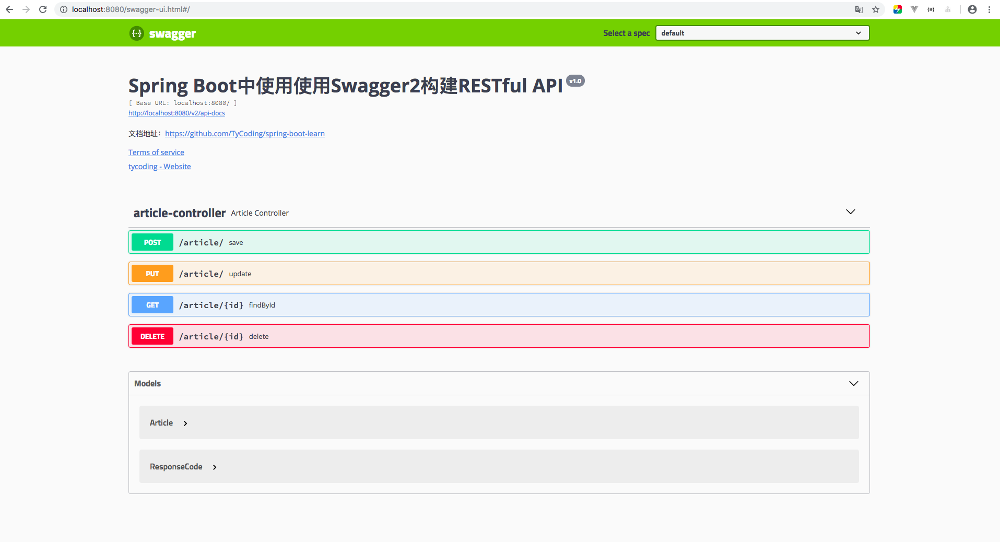
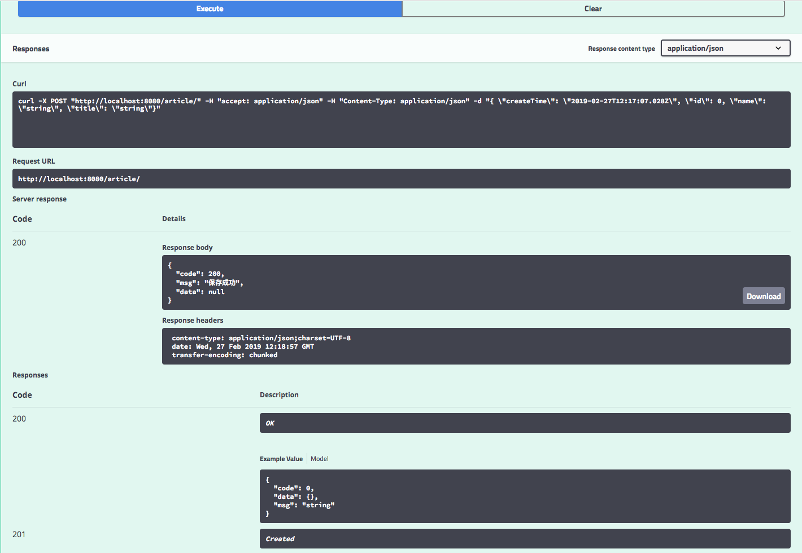
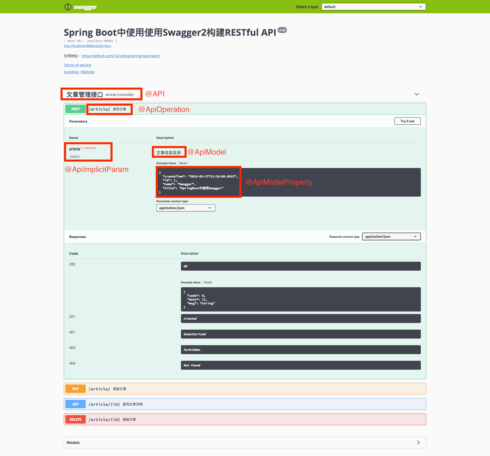

# Spring Boot2整合Swagger2.9.2

在学习或开发一些项目时，常会遇到前端需要一份详细的后端API说明文档，因此Swagger的诞生就是为了实现这个需求的。Swagger提供了非常好看的界面，并且提供了API测试工具，类似Postman工具的功能。

所以，这次我们就学习一下如何在SpringBoot项目中部署Swagger2

# 起步

## 依赖导入

相信你注意到了，这里我为什么特意强调Swagger的版本，截止2019-2-27，Swagger的最新版是2.9.2，而很多教程中Swagger还是老版本，就造成了很多注解报错或和图片中的不一样。

在这里，我采用了如下版本：

* Spring Boot 2.1.3.RELEASE
* Swagger 2.9.2

导入Swagger2依赖：

```xml
<dependency>
    <groupId>io.springfox</groupId>
    <artifactId>springfox-swagger2</artifactId>
    <version>2.9.2</version>
</dependency>
<dependency>
    <groupId>io.springfox</groupId>
    <artifactId>springfox-swagger-ui</artifactId>
    <version>2.9.2</version>
</dependency>
```

如果你用过Swagger2高版本就知道总会出现错误：`java.lang.NumberFormatException: For input string: ""`，说是`example`设置问题，但是最有效的解决办法是添加如下依赖：

```xml
<!-- 使用Swagger2最新版本2.9.2避免NumberFormatException错误要引入下列两个依赖 -->
<dependency>
    <groupId>io.swagger</groupId>
    <artifactId>swagger-annotations</artifactId>
    <version>1.5.21</version>
</dependency>
<dependency>
    <groupId>io.swagger</groupId>
    <artifactId>swagger-models</artifactId>
    <version>1.5.21</version>
</dependency>
```

## 配置

新建`/config/SwaggerConfig.java`配置类：

```java
@Configuration
@EnableSwagger2
public class SwaggerConfig {

    @Bean
    public Docket createRestApi() {
        return new Docket(DocumentationType.SWAGGER_2)
                .apiInfo(apiInfo())
                .select()
                .apis(RequestHandlerSelectors.basePackage("cn.tycoding.controller"))
                .paths(PathSelectors.regex("/.*"))
                .build();
    }

    private ApiInfo apiInfo() {
        return new ApiInfoBuilder()
                .title("Spring Boot中使用使用Swagger2构建RESTful API")
                .description("文档地址：https://github.com/TyCoding/spring-boot-learn")
                .termsOfServiceUrl("http://tycoding.cn/")
                .contact(new Contact("tycoding", "https://tycoding.cn", ""))
                .version("v1.0")
                .build();
    }
}
```

这些都是Swagger全局配置信息，其中最需要注意的有以下几点：

* Swagger生成API文档方式是通过扫描指定package下的请求映射类，根据映射接口生成API文档接口，所以关键是配置好扫描的接口类地址。

* `.apis(RequestHandlerSelectors.basePackage("cn.tycoding.controller"))`扫描请求映射类package地址。一般用SpringMVC时，我们常把请求应映射类放在`/controller/`package下。

* `.paths(PathSelectors.regex("/.*"))`扫描请求的路径，比如你想在Swagger中显示所有以`/rest`开头的接口地址（比如`rest/save`），就设置`regex("/rest/.*")`，这个`.*`就是匹配所有子级请求。这里我们配置的扫描所有请求。

看`PathSelectors`类源码：

```java
public class PathSelectors {
    private PathSelectors() {
        throw new UnsupportedOperationException();
    }

    public static Predicate<String> any() {
        return Predicates.alwaysTrue();
    }

    public static Predicate<String> none() {
        return Predicates.alwaysFalse();
    }

    public static Predicate<String> regex(final String pathRegex) {
        return new Predicate<String>() {
            public boolean apply(String input) {
                return input.matches(pathRegex);
            }
        };
    }

    public static Predicate<String> ant(final String antPattern) {
        return new Predicate<String>() {
            public boolean apply(String input) {
                AntPathMatcher matcher = new AntPathMatcher();
                return matcher.match(antPattern, input);
            }
        };
    }
}
```

发现它能支持4中方式按照路径生成API文档：1.任何路径都生成；2.任何路径都不生成；3.正则匹配路径；4.ant模式匹配。

上面我们就是配置的正则匹配路径，按照正则标准，Swagger扫描对应的API接口并生成文档。

如果你还有疑惑，可以先看一下项目整体结构：


# 详解

既然都用到了Swagger，那就必然要遵循Restful接口规范，最基本的规范：

| 前端请求方法 | 对应后端操作 |
| :--- | :--- |
| POST | 新增 |
| PUT | 更新 |
| GET | 查询 |
| DELETE | 删除 |

更多的Restful接口规范请自行百度。

通常在前后端分离项目中，后端仅负责接收和传递JSON数据，所以，我们这样创建一个Controller：

```java
@RestController
@RequestMapping("/article")
public class ArticleController {
}
```

* `@RestController`是`@ResponseBody`+`@Controller`，其控制器类下的所有方法的返回值都将被Spring转换成JSON格式。

* `@RequestMapping`是这个控制器类的父级映射地址，旗下接口方法映射地址就为：`/article/aa`, `/article/bb`

## 编写代码

### Article

为了模拟实际中业务，这里创建一个实体类`Article.java`

```java
public class Article implements Serializable {

    private Long id; //文章ID
    private String name; //文章名称
    private String title; //文章标题
    private Date createTime; //创建时间
    
    ...//省略getter/setter
}
```

### Result

通常，Controller返回的数据都应该被封装在一个结果类中，目的是保证所有请求返回结果都有固定的响应格式，比如：状态码、状态信息、返回结果。所以我们简单封装一个结果类：

```java
public class ResponseCode {

    private Long code;
    private String msg;
    private Object data;

    public ResponseCode() {
    }

    public ResponseCode(Long code, String msg, Object data) {
        this.code = code;
        this.msg = msg;
        this.data = data;
    }

    public static ResponseCode ok(String msg) {
        return new ResponseCode(200L, msg, null);
    }

    public static ResponseCode ok(String msg, Object data) {
        return new ResponseCode(200L, msg, data);
    }

    ...//省略getter/setter
}
```

### ArticleController

完善控制器类，模拟常见的CRUD业务：

```java
@RestController
@RequestMapping("/article")
public class ArticleController {
    private Logger logger = LoggerFactory.getLogger(this.getClass());

    @GetMapping(value = "/{id}", produces = "application/json")
    public ResponseCode findById(@PathVariable Long id) {
        logger.info("查询文章信息，查询的文章ID是==> {}", id);
        Article article = new Article(1L, "Swagger", "SpringBoot整合Swagger2", new Date());
        return ResponseCode.ok("查询成功", article);
    }

    @DeleteMapping(value = "/{id}", produces = "application/json")
    public ResponseCode delete(@PathVariable Long id) {
        logger.info("删除文章信息，删除的文章ID是==> {}", id);
        return ResponseCode.ok("删除成功");
    }

    @PostMapping(value = "/", produces = "application/json")
    public ResponseCode save(@RequestBody Article article) {
        logger.info("保存文章信息，文章内容==> {}", article);
        return ResponseCode.ok("保存成功");
    }

    @PutMapping(value = "/", produces = "application/json")
    public ResponseCode update(@RequestBody Article article) {
        logger.info("更新文章信息，更新内容==> {}", article);
        return ResponseCode.ok("更新成功");
    }
}
```

如上，我们完成了基础操作。

### 测试

启动项目，访问`localhost:8080/swagger-ui.html`：



是不是很神奇呢，这么炫酷漂亮的界面Swagger已经帮我们写好了，根据刚才配置的`.apis(RequestHandlerSelectors.basePackage("cn.tycoding.controller"))`Swagger扫描到了`ArticleController`这个控制器类，根据刚才配置的`.paths(PathSelectors.regex("/.*"))`Swagger扫描了这个控制器的所有请求映射路径，并且生成API文档。

更神奇的在这里：

任意点开一个接口，点击左侧的Try it out，可以直接测试这个接口，就像Postman工具一样，并且旗下有丰富的接口文档信息



可以看到我们模拟的接口请求成功，并且返回了响应数据。

## 进阶配置

> 修改`ArticleController`

```java
@RestController
@RequestMapping("/article")
@Api(value = "ArticleController", tags = {"文章管理接口"})
public class ArticleController {
    private Logger logger = LoggerFactory.getLogger(this.getClass());

    @GetMapping(value = "/{id}", produces = "application/json")
    @ApiOperation(value = "查询文章详情", notes = "文章ID大于0")
    @ApiImplicitParam(name = "id", value = "文章编号", required = true, dataType = "Long")
    public ResponseCode findById(@PathVariable Long id) {
        logger.info("查询文章信息，查询的文章ID是==> {}", id);
        Article article = new Article(1L, "Swagger", "SpringBoot整合Swagger2", new Date());
        return ResponseCode.ok("查询成功", article);
    }

    @DeleteMapping(value = "/{id}", produces = "application/json")
    @ApiOperation(value = "删除文章")
    @ApiImplicitParam(name = "id", value = "文章编号", required = true, dataType = "Long")
    public ResponseCode delete(@PathVariable Long id) {
        logger.info("删除文章信息，删除的文章ID是==> {}", id);
        return ResponseCode.ok("删除成功");
    }

    @PostMapping(value = "/", produces = "application/json")
    @ApiOperation(value = "保存文章")
    @ApiImplicitParam(name = "article", value = "文章信息实体", required = true, dataType = "Article", paramType = "body")
    public ResponseCode save(@RequestBody Article article) {
        logger.info("保存文章信息，文章内容==> {}", article);
        return ResponseCode.ok("保存成功");
    }

    @PutMapping(value = "/", produces = "application/json")
    @ApiOperation(value = "更新文章")
    @ApiImplicitParam(name = "article", value = "文章信息实体", required = true, dataType = "Article", paramType = "body")
    public ResponseCode update(@RequestBody Article article) {
        logger.info("更新文章信息，更新内容==> {}", article);
        return ResponseCode.ok("更新成功");
    }
}
```

> 修改`Article.java`

```java
@ApiModel(value = "Article", description = "文章实体对象")
public class Article implements Serializable {

    /**
     * @ApiModelProperty 用于描述实体字段
     *      value: 字段说明
     *      name: 重写字段名称
     *      dataType: 重写字段类型
     *      required: 字段是否必填
     *      example: 举例说明
     *      hidden: 是否隐藏显示
     */
    @ApiModelProperty(value = "id", example = "1", required = true)
    private Long id; //文章ID
    @ApiModelProperty(name = "name", value = "文章名称", example = "Swagger", required = true)
    private String name; //文章名称
    @ApiModelProperty(name = "title" ,value = "文章标题", example = "SpringBoot中使用Swagger", required = true)
    private String title; //文章标题
    @ApiModelProperty(name = "createTime", value = "创建时间", required = false)
    private Date createTime; //创建时间   
}
```

> 查看配置效果



如上图所示，我在图中标记了Swagger注解对应的配置效果

### 解释

> 在控制器类

* @Api: 标记在控制器类上
    - value: 控制器类名称
    - tags: 控制器类标签

* @ApiOperation: 标记在映射方法上
    - value: 接口说明，展示在接口列表
    - notes：接口详细说明，展示在接口的详情页。
    - tags：接口的标签，相同标签的接口会在一个标签页下展示。
    - httpMethod：支持的HTTP的方法。
    
* @ApiImplicitParam: 请求参数属性配置
    - name：参数名称
    - value：参数说明
    - required：是否必须
    - dataType：数据类型　　
    
注意`@ApiImplicitParams`是`@ApiImplicitParam`的容器，通过`@ApiImplicitParam`可以配置请求参数个各自的属性，但是若请求参数是一个实体对象，`@ApiImplicitParam`也可以直接指向对象(`dataType`=`@ApiModel`的`value`值)，然后在实体对象中对字段进行限定。

> 在实体类上

* @ApiModel是对整个类的属性的配置：
    - value：类的说明
    - description：详细描述

* @ApiModelProperty是对具体每个字段的属性配置：
    - name：字段名称
    - value：字段的说明
    - required：是否必须
    - example：示例值
    - hidden：是否显示

