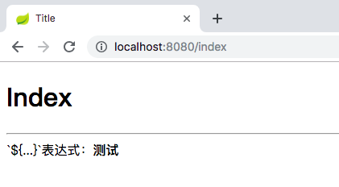
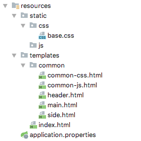
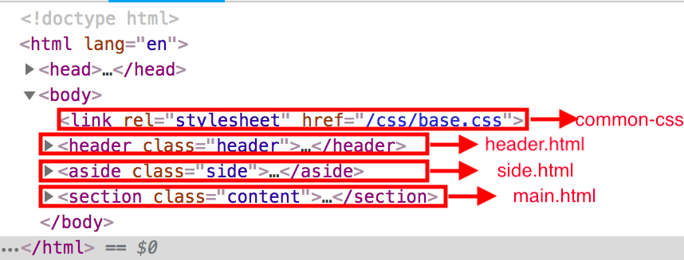

# Spring Boot整合Thymeleaf

Thymeleaf 是一个跟 Velocity、FreeMarker 类似的模板引擎，它可以完全替代 JSP 。也就是说JSP中的特性在Thymeleaf几乎都有对应的支持。Thymeleaf支持HTML原型，通过Thymeleaf特殊的标签可以基本实现JSP中动态数据的展示效果。

## 配置

> 使用Thymeleaf受限要引入其依赖

```xml
<dependency>
    <groupId>org.springframework.boot</groupId>
    <artifactId>spring-boot-starter-thymeleaf</artifactId>
</dependency>
```

Thymeleaf 支持渲染HTML，因此通常我们使用的页面模板也就是HTML，同时它需要遵循一定的规则：

1. 比如在spring boot项目中，通常我们将Thymeleaf渲染的页面放在`resources/templates`目录下，这样Thymeleaf会默认识别。

2. 若想要在HTML页面中使用Thymeleaf，需要修改`<html lang="en">`为`<html lang="en" xmlns:th="http://www.thymeleaf.org">`

3. 在spring boot项目中`resources/static`目录下的文件可通过浏览器直接访问，而`resources/templates`下的HTML不能通过浏览器直接访问，而需要`Spring Mvc`这样的框架映射到那个页面地址。

> 修改`application.properties`

```properties
spring.thymeleaf.mode = LEGACYHTML5
spring.thymeleaf.encoding=UTF-8
spring.thymeleaf.content-type=text/html
spring.thymeleaf.suffix=.html
#开发时关闭缓存,不然没法看到实时页面
spring.thymeleaf.cache=false
```

其中`spring.thymeleaf.mode = LEGACYHTML5`配置thymeleaf的模式，不要使用`spring.thymeleaf.mode = HTML5`，因为严格遵循HTML5规范会对非严格的报错，例如`<meta charset="UTF-8">`，`<meta>`标签没有结束`<meta />`就会报错。

### Demo

> 在`main/java`目录下新建`RouterController.java`

```java
@Controller
public class RouterController {

    @GetMapping("/index")
    public String index() {
        return "index";
    }
}
```

这个`return "index"`中`index`是`templates`根目录下的`index.html`，如果是`templates/common/main.html`页面，就应该`return "/common/main.html"`

> 在`main/resources/templates`目录下新建`index.html`

```html
<!DOCTYPE html>
<html lang="en" xmlns:th="http://www.thymeleaf.org">
<head>
    <meta charset="UTF-8">
    <title>Title</title>
</head>
<body>
<h1>Index</h1>
</body>
</html>
```


> 执行`main/java/ThymeleafApplication.java`启动类，用浏览器访问`localhost:8080/index`


# 常用表达式

## 变量表达式

变量表达式级即OGNL表达式或Spring EL表达式（在Spring术语中也叫做model attributes），例如:

```html
${user.username}
```

> 1.修改`RouterController.java`

```java
@Controller
public class RouterController {

    @GetMapping("/index")
    public String index(Model model) {
        model.addAttribute("demo", "测试");
        return "index";
    }
}
```

> 2.修改`index.html`

```html
<!DOCTYPE html>
<html lang="en" xmlns:th="http://www.thymeleaf.org">
<head>
    <meta charset="UTF-8">
    <title>Title</title>
</head>
<body>
<h1>Index</h1>
<hr/>
`${...}`表达式：<b th:text="${demo}"></b><br/>
</body>
</html>
```



## 选择*号表达式

如果`model.addAttribute()`的是一个对象而不是字符串，就可以用`*`表达式分别获取`model`对象中的元素，如：

```java
public class User implements Serializable {

    private String username;
    private String password;

    public String getUsername() {
        return username;
    }

    public void setUsername(String username) {
        this.username = username;
    }

    public String getPassword() {
        return password;
    }

    public void setPassword(String password) {
        this.password = password;
    }
}
```

```java
@Controller
public class RouterController {

    @GetMapping("/index")
    public String index(Model model) {
        model.addAttribute("demo", "测试");
        
        User user = new User();
        user.setUsername("tycoding");
        user.setPassword("123");
        model.addAttribute("user", user);
        return "index";
    }
}
```

HTML页面获取`user`对象中的元素：

```html
`*{...}`表达式：
<b th:object="${user}">
    <span th:text="*{username}"></span>
    <span th:text="*{password}"></span>
</b>
```

**注意**

使用`*{...}`表达式必须保证`*{}`在`th:object="${...}`标签的包裹下，且`*{...}`必须是`${...}`下的一个元素，否则报错。例如这样写是获取不到元素的：

```html
`*{...}`表达式：
<b th:object="${user}">
    <span th:text="*{username}"></span>
    <span th:text="*{password}"></span>
</b>
错误实例：<span th:text="*{username}"></span>
```

**另外**

如果页面需要不在`th:object`包裹下获取对象中的元素，可以使用如下：

```html
<span th:text="${user.username}"></span>
```

## URL表达式

例如：

```html
<script th:src="@{/css/base.css}"></script>
```

会自动引入`resources/statis/css/`下的`base.css`文件，这和JSP页面中使用:

```html
<script src="${pageContext.request.contextPath}/css/base.css"></script>
```

是一个道理。

同理：

```html
<link rel="stylesheet" th:href="@{/css/base.css}"/>
```

## 表达式支持的语法

**字面（Literals）**

* 文本文字（Text literals）: 'one text', 'Another one!',…
* 数字文本（Number literals）: 0, 34, 3.0, 12.3,…
* 布尔文本（Boolean literals）: true, false
* 空（Null literal）: null
* 文字标记（Literal tokens）: one, sometext, main,…

**文本操作（Text operations）**

* 字符串连接(String concatenation): +
* 文本替换（Literal substitutions）: |The name is ${name}|

**算术运算（Arithmetic operations）**

* 二元运算符（Binary operators）: +, -, *, /, %
* 减号（单目运算符）Minus sign (unary operator): -

**布尔操作（Boolean operations）**

* 二元运算符（Binary operators）:and, or
* 布尔否定（一元运算符）Boolean negation (unary operator):!, not

**比较和等价(Comparisons and equality)**

* 比较（Comparators）: >, <, >=, <= (gt, lt, ge, le)
* 等值运算符（Equality operators）:==, != (eq, ne)

**条件运算符（Conditional operators）**

* If-then: (if) ? (then)
* If-then-else: (if) ? (then) : (else)
* Default: (value) ?: (defaultvalue)

所有这些特征可以被组合并嵌套：

```
'User is of type ' + (${user.isAdmin()} ? 'Administrator' : (${user.type} ?: 'Unknown'))
```

## 常用的th标签


# 案例

## 字符串拼接

```html
<b>字符串拼接</b>
<span th:text="'hello ' + ${user.username} + '!'"></span>
简洁用法：<span th:text="|hello ${user.username}!|"></span>
```

## if/unless条件判断

`th:if` 条件成立时显示

`th:unless` 条件不成立时显示

```html
<b>if/unless条件判断</b>
<span th:if="${user.username == 'tycoding'}">tycoding</span>
<span th:unless="${user.username == 'admin'}">tycoding</span>
```

## for循环

```java
List<String> list = new ArrayList<>();
list.add("循环1");
list.add("循环2");
list.add("循环3");
model.addAttribute("list", list);
```

```html
<b>for循环</b>
<ol th:each="item,property : ${list}">
    <li th:text="${property.index}"></li>
    <li th:text="${item}"></li>
</ol>
```

`property`称作状态变量，属性有：

* index:当前迭代对象的index（从0开始计算）
* count: 当前迭代对象的index(从1开始计算)
* size:被迭代对象的大小
* current:当前迭代变量
* even/odd:布尔值，当前循环是否是偶数/奇数（从0开始计算）
* first:布尔值，当前循环是否是第一个
* last:布尔值，当前循环是否是最后一个


## 内联JS

有时，我们需要在`javascript`中使用`model`中的元素，而在`javascript`中无法用`th`标签，那么就可以这样使用：

```html
<b>内联JS</b>
<script th:inline="javascript">
    var username = [[${user.username}]];
    console.log(username);
</script>
```

使用内联JS，要在`<script>`标签中使用`th:inline="javascript"`。并且内联JS仅可以在当前HTML页面中获取到，在外置JS文件中是无法获取的。

## 内嵌变量

为了模板更加易用，Thymeleaf还提供了一系列Utility对象（内置于Context中），可以通过#直接访问：

    dates ： java.util.Date的功能方法类。
    calendars : 类似#dates，面向java.util.Calendar
    numbers : 格式化数字的功能方法类
    strings : 字符串对象的功能类，contains,startWiths,prepending/appending等等。
    objects: 对objects的功能类操作。
    bools: 对布尔值求值的功能方法。
    arrays：对数组的功能类方法。
    lists: 对lists功能类方法
    sets
    maps
    …
    
下面用一段代码来举例一些常用的方法：
    
**dates**

```
/*
 * Format date with the specified pattern
 * Also works with arrays, lists or sets
 */
${#dates.format(date, 'dd/MMM/yyyy HH:mm')}
${#dates.arrayFormat(datesArray, 'dd/MMM/yyyy HH:mm')}
${#dates.listFormat(datesList, 'dd/MMM/yyyy HH:mm')}
${#dates.setFormat(datesSet, 'dd/MMM/yyyy HH:mm')}

/*
 * Create a date (java.util.Date) object for the current date and time
 */
${#dates.createNow()}

/*
 * Create a date (java.util.Date) object for the current date (time set to 00:00)
 */
${#dates.createToday()}
```

**strings**

```
/*
 * Check whether a String is empty (or null). Performs a trim() operation before check
 * Also works with arrays, lists or sets
 */
${#strings.isEmpty(name)}
${#strings.arrayIsEmpty(nameArr)}
${#strings.listIsEmpty(nameList)}
${#strings.setIsEmpty(nameSet)}

/*
 * Check whether a String starts or ends with a fragment
 * Also works with arrays, lists or sets
 */
${#strings.startsWith(name,'Don')}                  // also array*, list* and set*
${#strings.endsWith(name,endingFragment)}           // also array*, list* and set*

/*
 * Compute length
 * Also works with arrays, lists or sets
 */
${#strings.length(str)}

/*
 * Null-safe comparison and concatenation
 */
${#strings.equals(str)}
${#strings.equalsIgnoreCase(str)}
${#strings.concat(str)}
${#strings.concatReplaceNulls(str)}

/*
 * Random
 */
${#strings.randomAlphanumeric(count)}
```

# 使用Thymeleaf布局

## 介绍

一个网页通常可以分为几部分：1.头部 2.侧边栏 3.主要区域 4.尾部

那么为了每个页面的代码不那么臃肿，我们可以将这些不同的区域分别提取出来，然后通过Thymeleaf的`th`标签将这些页面再重新组合在一起。

因此，我们划分了以下几个部分：



其中`common-css.html`和`common-js.html`分别存放页面公共的css/js引入标签。

## 关于子页面

上面说到将页面划分了几部分，其实换分的几部分仅仅是将不同的`<div>`标签存放在不同的html中，如下：



所以，看`header.html`代码：

```html
<header class="header">
    <div class="header-logo">
        <h1><a href="#">后台模板</a></h1>
    </div>
</header>
```

无需`<html>`的基础结构。

**关于子页面使用`th`标签**

因为子页面无需`<html>`的结构，也就没有`<html lang="en" xmlns:th="http://www.thymeleaf.org">`这个标签库，直接在子页面中用`th:text=""`可能IDE会报错，但是实际上是语法正确，因为在`main.html`中使用了这个标签库。

另外，也可以这样使用避免IDE的报错：

`common-css.html`:

```html
<link rel="stylesheet" data-th-href="@{/css/base.css}">
```

## 常见布局

```html
<!DOCTYPE html>
<html lang="en" xmlns:th="http://www.thymeleaf.org">
<head>
    <meta charset="UTF-8">
    <title>Title</title>
</head>
<body>
<div th:replace="common/common-css"></div>
<div th:replace="common/header"></div>
<div th:replace="common/side"></div>

<section class="content">
    <header class="content-title">
        <ol class="breadcrumb">
            <li class="breadcrumb-item">主页</li>
        </ol>
    </header>
    <div class="main-content">
        <h1>我是main.html</h1>
    </div>
</section>

</body>
</html>
```

那么，这就是一个基础布局，通过在主页面（main.html）中引入其他子页面（header,side,css）：


## 使用iframe布局

在以往的开发中，我们很经常遇到这样的问题（需求）：


这里就用到了`<frameset>`、`<iframe>`了，他就是实现将B页面嵌套到A页面的指定区域内。

> 修改`main.html`

```html
<!DOCTYPE html>
<html lang="en" xmlns:th="http://www.thymeleaf.org">
<head>
    <meta charset="UTF-8">
    <title>Title</title>
</head>
<body>
<div th:replace="common/common-css"></div>
<div th:replace="common/header"></div>
<div th:replace="common/side"></div>

<section class="content">
    <header class="content-title">
        <ol class="breadcrumb">
            <li class="breadcrumb-item">主页</li>
        </ol>
    </header>
    <div class="main-content">
        <iframe src="/index" width="100%" height="100%" name="iframe" frameborder="0"></iframe>
    </div>
</section>

</body>
</html>
```

> 修改`index.html`

```html
<h1>Index</h1>
<hr/>
`${...}`表达式：<b th:text="${demo}"></b><br/>
`*{...}`表达式：
<b th:object="${user}">
    <span th:text="*{username}"></span>
    <span th:text="*{password}"></span>
</b>
错误实例：<span th:text="*{username}"></span>
另一种获取方式：<span th:text="${user.username}"></span><br/>

<b>字符串拼接</b>
<span th:text="'hello ' + ${user.username} + '!'"></span>
简洁用法：<span th:text="|hello ${user.username}!|"></span><br/>

<b>if/unless条件判断</b>
<span th:if="${user.username == 'tycoding'}">tycoding</span>
<span th:unless="${user.username == 'admin'}">tycoding</span><br/>

<b>for循环</b>
<ol th:each="item,property : ${list}">
    <li th:text="${property.index}"></li>
    <li th:text="${item}"></li>
</ol>
<br/>
<br/>

<b>内联JS</b>
<script th:inline="javascript">
    var username = [[${user.username}]];
    console.log(username);
</script>
```

> 修改`RouterController.java`

```html
@GetMapping("/")
public String main() {
    return "/common/main";
}
```


如果想要点击左侧菜单，在`content`区域显示菜单对应页面内容，还需要修改`side.html`：

```html
<aside class="side">
    <div class="scrollbar-inner">
        <div class="navigation">
            <div>
                <span><a href="/index" target="iframe">系统管理</a></span>
            </div>
            <div>
                <span>用户管理</span>
            </div>
            <div>
                <span>任务调度</span>
            </div>
        </div>
    </div>
</aside>
```

`<a>`标签中的`target`指向`<iframe>`中的`name`值。

